# Architecture

System design for **AI-Agentic-Studio** v1 — reflecting only what is implemented today.

> **New to AI?** See **[LEARNING-GUIDE.md](LEARNING-GUIDE.md)** for a simpler four-layer diagram and step-by-step call flows (`studio ask`, `studio agent`, `studio ingest`, chat).

---

## High-level system diagram

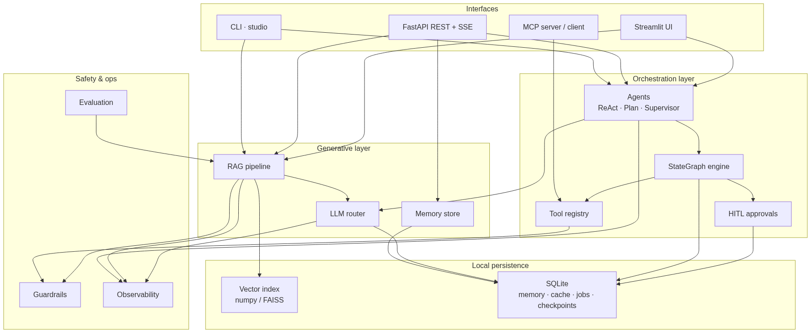

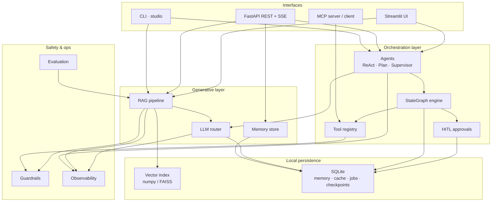

---

## Layer responsibilities

| Layer | Package | Responsibility |
|-------|---------|----------------|
| **Core** | `agentic_studio/core/` | Shared types, errors, settings |
| **LLM** | `agentic_studio/llm/` | Provider abstraction, routing, caching, structured output |
| **RAG** | `agentic_studio/rag/` | Ingestion, retrieval stack, grounded generation |
| **Agents** | `agentic_studio/agents/` | Graph engine, agent modes, built-in tools |
| **Memory** | `agentic_studio/memory/` | Durable threads and summarizing context window |
| **Guardrails** | `agentic_studio/guardrails/` | PII, moderation, injection, tool policy |
| **Observability** | `agentic_studio/observability/` | Logs, metrics, traces |
| **Evaluation** | `agentic_studio/evaluation/` | Metrics, datasets, runner |
| **API** | `agentic_studio/api/` | HTTP surface, auth, jobs, streaming |
| **UI** | `agentic_studio/ui/` | Streamlit playground |
| **MCP** | `agentic_studio/mcp_bridge/` | External tool interoperability |

---

## RAG pipeline architecture

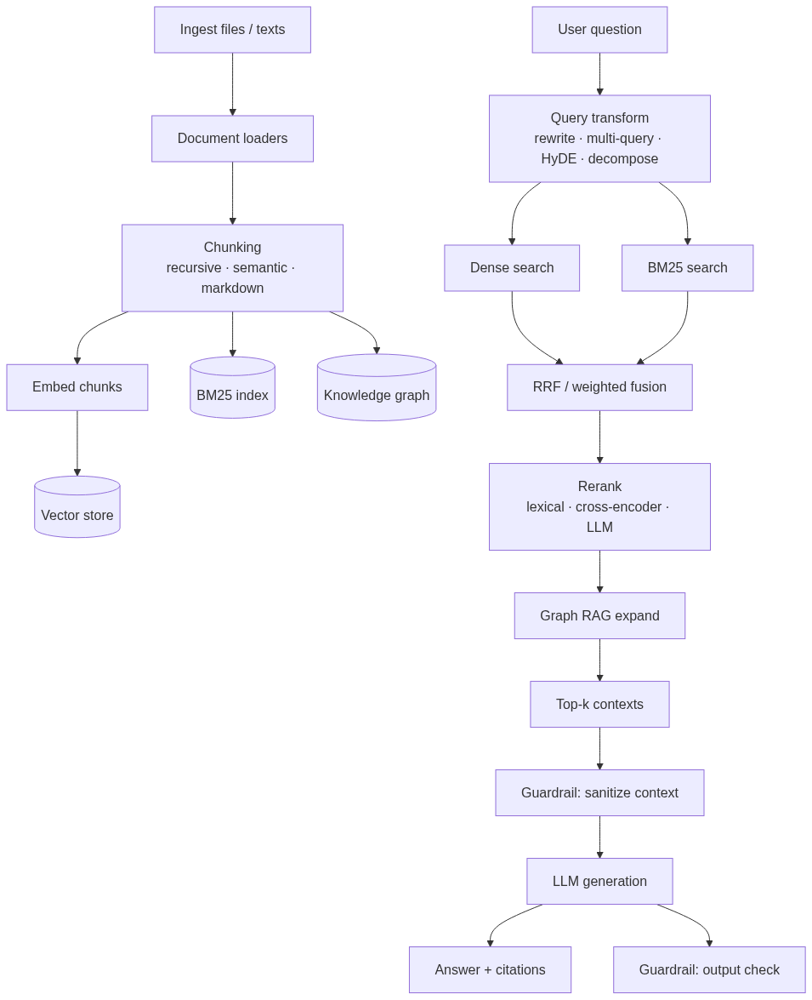

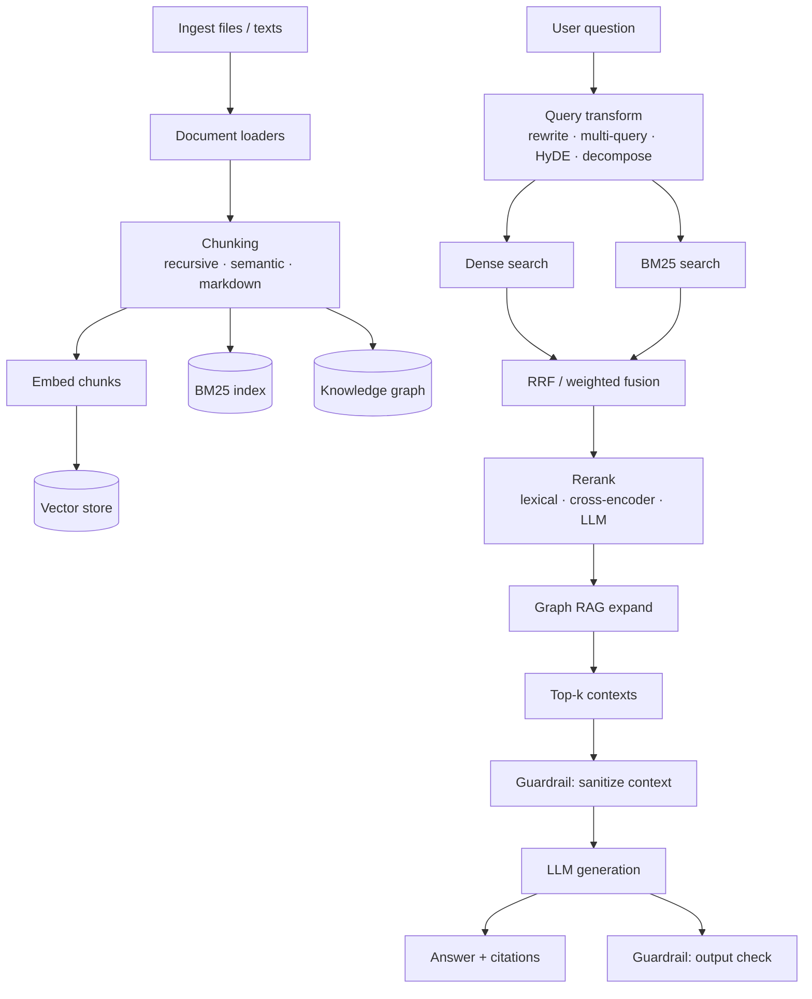

### Retrieval configuration (environment)

| Variable | Default | Effect |
|----------|---------|--------|
| `STUDIO_HYBRID_ENABLED` | `true` | Combine dense + BM25 |
| `STUDIO_GRAPH_RAG_ENABLED` | `true` | Entity graph expansion |
| `STUDIO_RERANKER` | `lexical` | Reranking strategy |
| `STUDIO_QUERY_TRANSFORM` | `multi-query` | Query expansion |
| `STUDIO_RETRIEVAL_TOP_K` | `8` | Final context count |

---

## LLM router architecture

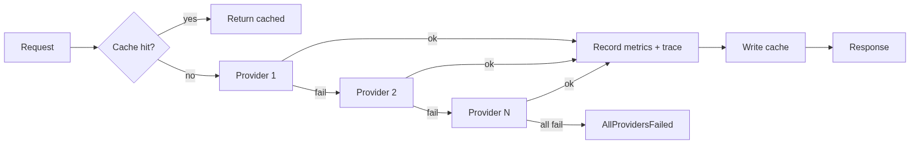

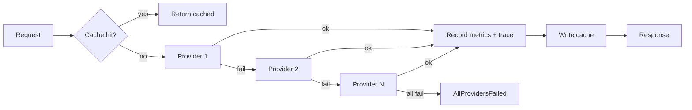

Provider chain is set by `STUDIO_LLM_PROVIDERS` (comma-separated). Default: `echo` (offline).

Implemented providers:

| Provider | Backend | Offline? |
|----------|---------|----------|
| `echo` | Deterministic extractive answers | Yes |
| `scripted` | Fixed response script (tests) | Yes |
| `openai` | OpenAI-compatible HTTP API | No |
| `anthropic` | Anthropic Messages API | No |
| `gemini` | Google Gemini API | No |
| `ollama` | Local Ollama HTTP | Local |
| `llamacpp` | GGUF via llama-cpp-python | Local |

---

## Agent architecture

### StateGraph engine

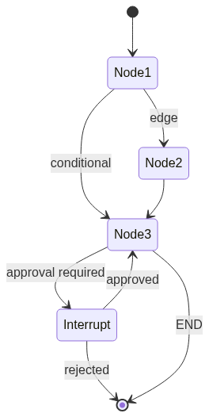

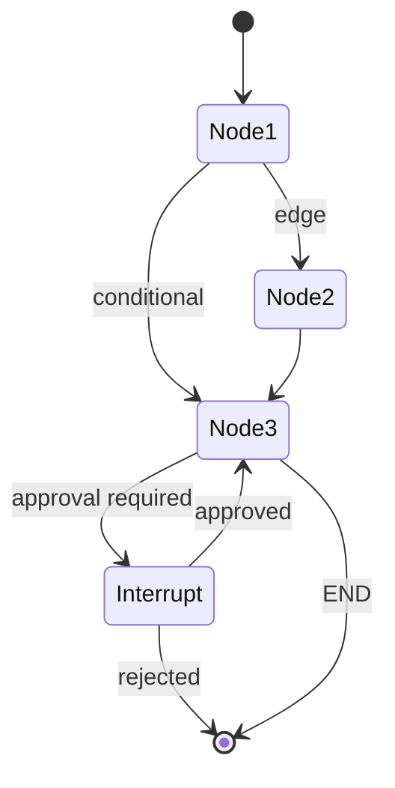

Features implemented:

- Named nodes with state reducers (e.g. `add_messages`)
- Conditional edges based on state
- SQLite or in-memory checkpointing
- Interrupt / resume for human-in-the-loop
- `stream()` yields per-node events

### Agent modes

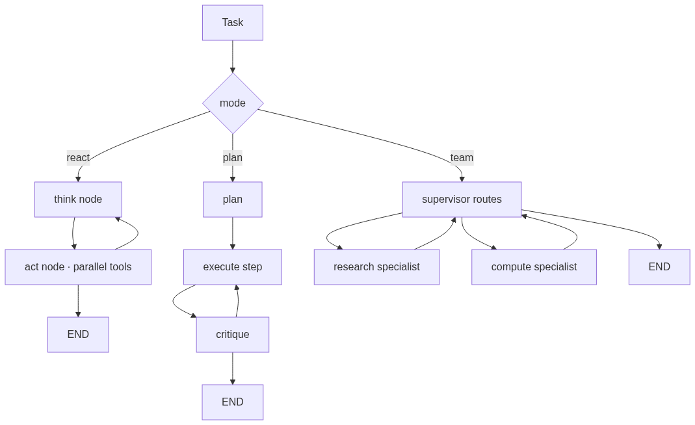

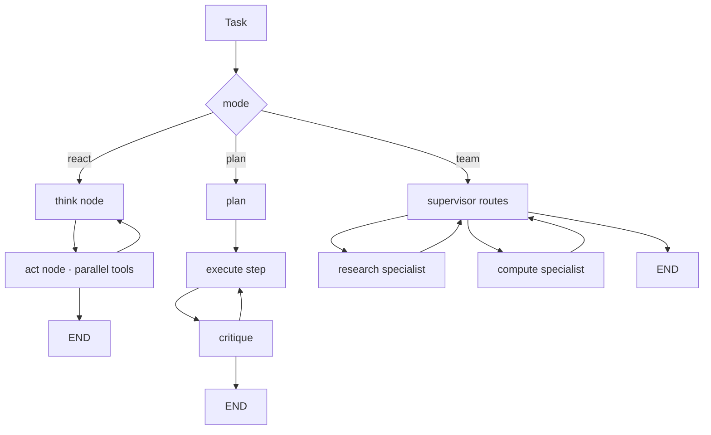

### Tool execution flow

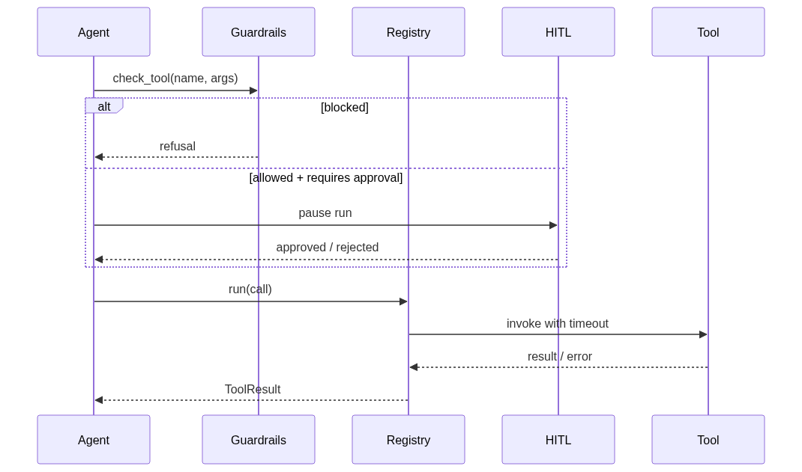

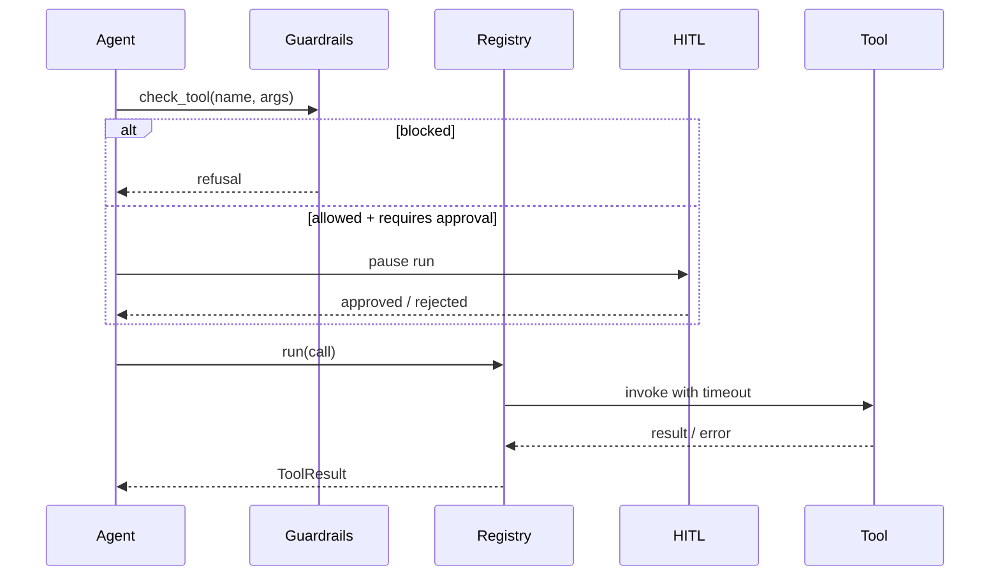

---

## Guardrail boundaries

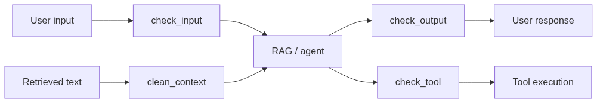

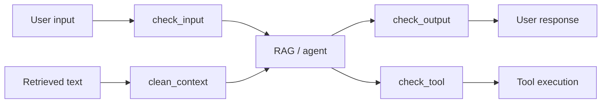

| Boundary | Checks |
|----------|--------|
| Input | Length, moderation, injection hints, PII redact/block |
| Context | Instruction defanging in retrieved documents |
| Output | Moderation, PII redaction |
| Tool | Allowlist, blocked tools, argument moderation |

---

## API architecture

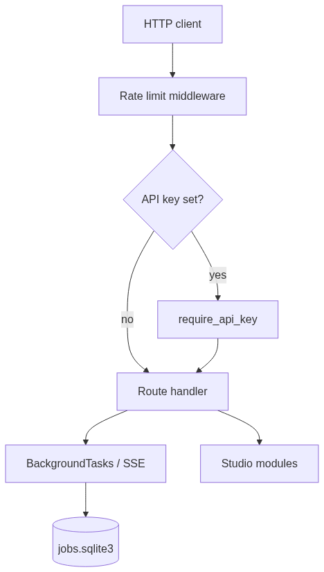

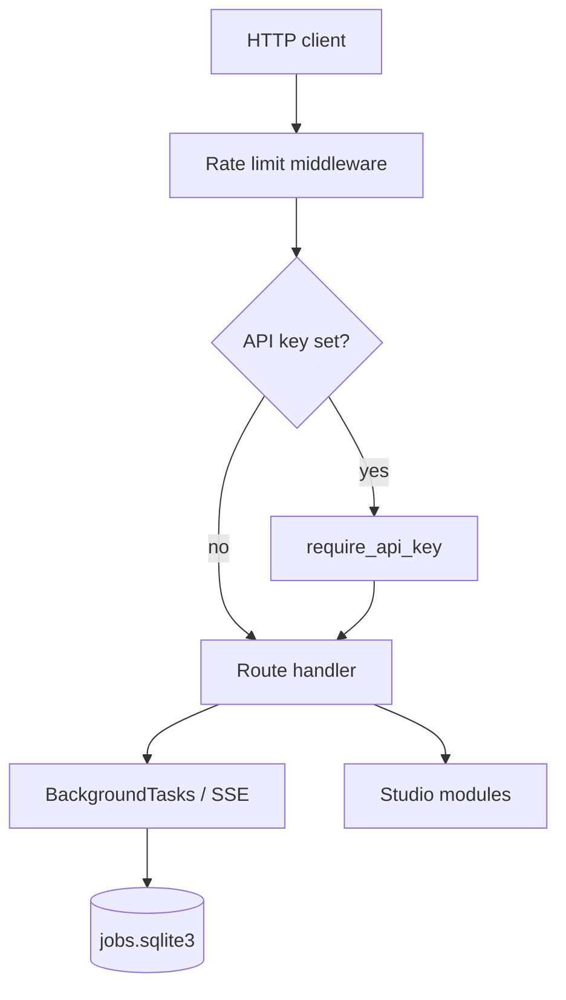

Key route groups:

- **System**: `/health`, `/providers`, `/metrics`, `/traces`, `/jobs`
- **RAG**: `/ingest`, `/rag/query`, `/rag/search`, `/rag/stream`
- **Chat**: `/chat`, `/chat/stream`, `/threads`
- **Agents**: `/agent`, `/agent/stream`, `/agent/approvals`
- **Evaluation**: `/eval/run`

---

## Data flow: end-to-end RAG question

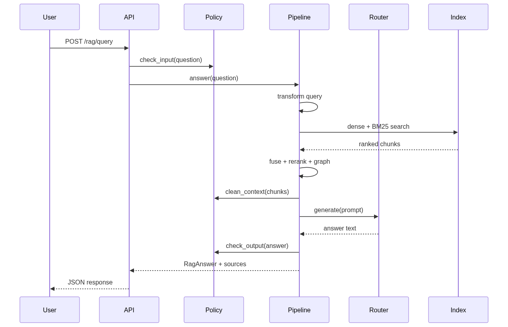

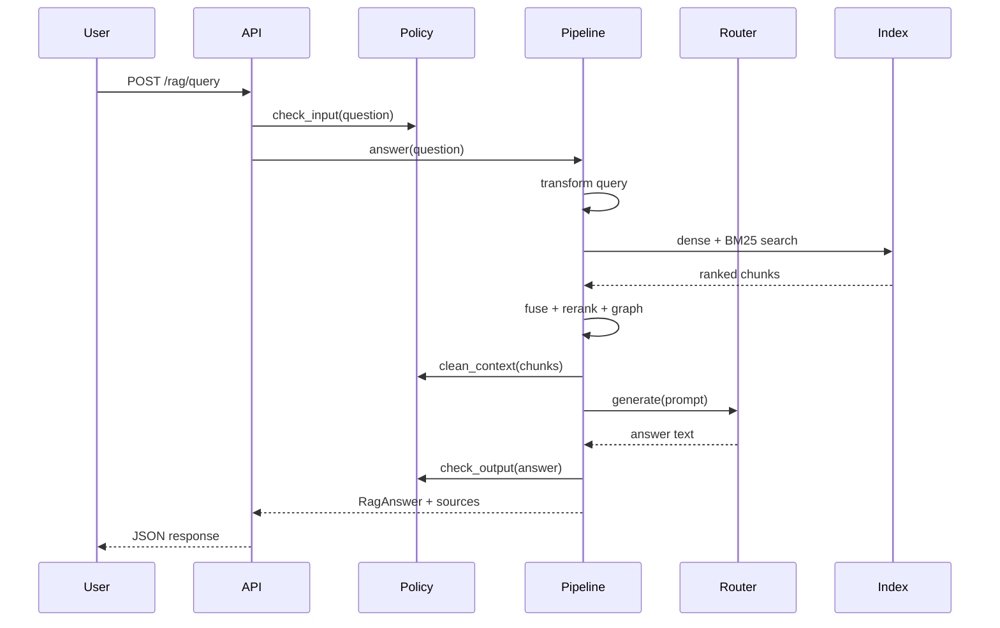

---

## Directory → responsibility map

```
agentic_studio/
├── core/           Types, errors, settings
├── llm/            Providers, router, cache
├── rag/            Full retrieval + generation stack
├── agents/         Graph, agents, tools
├── memory/         Conversation persistence
├── guardrails/     Safety policy
├── observability/  Logs, metrics, traces
├── evaluation/     Quality measurement
├── api/            HTTP interface
├── ui/             Streamlit playground
├── mcp_bridge/     MCP interoperability
└── cli.py          Command-line entry
```

---

## Design principles (as implemented)

1. **Offline-first** — `echo` + `hashing` work with zero network and zero keys.
2. **Single configuration surface** — all behaviour driven by `settings.py` / `.env`.
3. **Layered modularity** — RAG, agents, and LLM are independent; agents call RAG via tools.
4. **Defence in depth** — guardrails at input, context, output, and tool boundaries.
5. **Observable by default** — every LLM call, tool run, and agent step is traced and metered.
6. **Testable** — pytest fixtures isolate state; no shared disk between tests.
