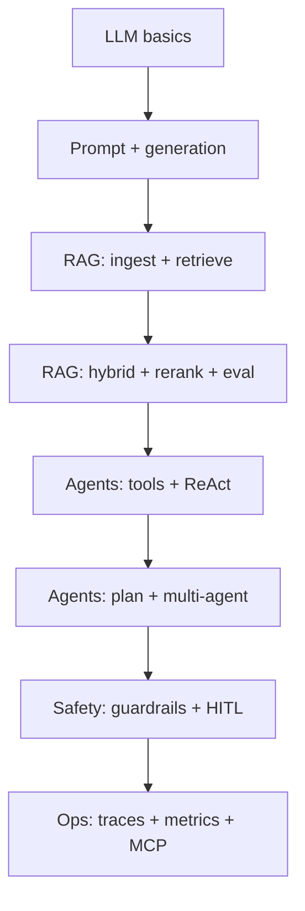

# Concepts: Generative AI + Agentic AI

A **complete concept map** for learning with AI Agentic Studio. Every term below is either **implemented in this project** or noted as *external* (learn elsewhere).

Use this with:
- [LEARNING-PATH.md](LEARNING-PATH.md) — **4-week structured beginner journey**
- [START-HERE.md](../START-HERE.md) — run commands
- [CONCEPT-CAPSULES.md](CONCEPT-CAPSULES.md) — bite-sized learning cards (66 capsules)
- [LEARNING-GUIDE.md](LEARNING-GUIDE.md) — labs and call flows
- [ARCHITECTURE.md](ARCHITECTURE.md) — diagrams

---

## How to read this document

| Column | Meaning |
|--------|---------|
| **Concept** | Term you should know |
| **What it means** | Plain-English definition |
| **In this project** | Module, command, or setting |
| **Try it** | Hands-on command (optional) |

---

# Part A — Generative AI fundamentals

Generative AI = models that **create** content (mostly text here).

| Concept | What it means | In this project | Try it |
|---------|---------------|-----------------|--------|
| **LLM** | Large language model; predicts text from context | `agentic_studio/llm/` · provider `echo`, `openai`, … | `studio doctor` |
| **Prompt** | Instructions + context sent to the model | Built in `rag/prompts.py`, agent system messages | `studio ask "..."` |
| **System prompt** | Hidden instructions that shape behaviour | Agent and RAG templates | Read `rag/prompts.py` |
| **Completion / generation** | Model writes the answer token by token | `LLMRouter.generate()` | `studio ask "..."` |
| **Streaming** | Answer arrives piece by piece, not all at once | `stream_answer`, `/rag/stream`, UI Chat tab | `studio ui` → Chat |
| **Token** | Small unit of text the model reads/writes | `Usage` in responses; `observability/metrics.py` | `studio ask --json` → `usage` |
| **Temperature** | Randomness (0 = deterministic, higher = creative) | `STUDIO_LLM_TEMPERATURE` in `.env` | Change `.env`, re-run ask |
| **Max tokens** | Cap on how long the answer can be | `STUDIO_LLM_MAX_TOKENS` | `.env` |
| **Context window** | Maximum text the model can see at once | Limited by provider; memory summarizes old chat | Long chat in `studio ui` |
| **Provider** | Backend that runs the LLM (OpenAI, Ollama, echo, …) | `llm/providers/` · `STUDIO_LLM_PROVIDERS` | `studio doctor` |
| **Failover** | If provider A fails, try B automatically | `llm/router.py` | Set `STUDIO_LLM_PROVIDERS=echo,openai` |
| **Caching** | Reuse identical (or similar) answers | `llm/cache.py` · exact + semantic | Run same `studio ask` twice |
| **Structured output** | Force JSON matching a schema | `llm/structured.py` | Used internally by agents/planner |
| **Hallucination** | Model states facts not in sources | Reduced by **RAG** and **faithfulness** eval | `studio eval` |
| **Grounding** | Answer tied to real documents | RAG pipeline + citations `[1]` | `studio ask "..."` |
| **Citation** | Reference to a source chunk | `[1]`, `[2]` in answers | `studio ask "BM25"` |
| **Multimodal** | Text + images (vision) | `multimodal/vision.py` | Wire images into `Message.images` |
| **Fine-tuning** | Train model on your data | *Not in this project* — see parent `MiniGPT/` | — |

---

# Part B — RAG (Retrieval-Augmented Generation)

RAG = **retrieve** relevant text, then **generate** an answer from it.

## B.1 Pipeline stages

| Concept | What it means | In this project | Try it |
|---------|---------------|-----------------|--------|
| **Ingest** | Load files into the index | `rag/ingest.py` | `studio ingest data/raw` |
| **Document loader** | Read PDF, MD, TXT, CSV, HTML | `rag/loader.py` | Add a `.txt` to `data/raw/` |
| **Chunking** | Split long docs into pieces | `rag/chunking.py` | `STUDIO_CHUNK_STRATEGY` |
| **Recursive chunk** | Split by paragraphs/sentences | Default strategy | `.env` |
| **Semantic chunk** | Split when meaning shifts | `chunk_strategy=semantic` | `.env` |
| **Parent document** | Small chunk for search, large chunk for context | `chunking.py` + retrieval | Read handbook in `data/raw/` |
| **Embedding** | Text → vector of numbers | `rag/embeddings.py` | `STUDIO_EMBEDDING_BACKEND` |
| **Vector store** | Database of chunk embeddings | `rag/vector_store.py` | `var/index/` |
| **Dense retrieval** | Search by embedding similarity | Vector store search | `studio search "..."` |
| **Top-k / fetch-k** | How many results to return / consider | `STUDIO_RETRIEVAL_TOP_K`, `FETCH_K` | `.env` |

## B.2 Advanced retrieval

| Concept | What it means | In this project | Try it |
|---------|---------------|-----------------|--------|
| **BM25** | Keyword / lexical search | `rag/lexical.py` | `studio search "BM25 identifiers"` |
| **Hybrid retrieval** | Dense + BM25 together | Default on | Lab 3 in LEARNING-GUIDE |
| **Fusion (RRF)** | Merge ranked lists without comparing scores | `rag/fusion.py` | Read `retrieval-handbook.md` |
| **Reranking** | Re-order top candidates for precision | `rag/rerank.py` | `STUDIO_RERANKER=lexical` |
| **Cross-encoder** | Reranker that scores query+doc together | Optional with `[retrieval]` extra | `STUDIO_RERANKER=cross-encoder` |
| **Query transform** | Rewrite or expand the question | `rag/query_transform.py` | `STUDIO_QUERY_TRANSFORM` |
| **Multi-query** | Search with several query variants | Default transform | `queries_used` in JSON output |
| **HyDE** | Hypothetical document embedding | Transform option `hyde` | `.env` |
| **Query decomposition** | Break complex question into sub-queries | Transform option `decompose` | `.env` |
| **Graph RAG** | Use entity graph to expand retrieval | `rag/graph_rag.py` | Tool `graph_explore` |
| **Metadata filter** | Search only matching docs | Vector store `where` | API `metadata_filter` |
| **Conversational RAG** | Use chat history to improve retrieval | `rag/conversational.py` | `studio ui` → Chat |

## B.3 RAG outputs and quality

| Concept | What it means | In this project | Try it |
|---------|---------------|-----------------|--------|
| **Faithfulness** | Answer supported by retrieved text | `evaluation/metrics.py` | `studio eval` |
| **Answer relevance** | Answer addresses the question | Eval metric | `studio eval` |
| **Context precision** | Retrieved chunks are on-topic | Eval metric | `studio eval` |
| **Context recall** | Retrieval found what reference needs | Eval metric | `studio eval` |
| **Golden dataset** | Known Q&A for testing | `data/eval/golden.jsonl` | `studio eval` |

---

# Part C — Agentic AI fundamentals

Agentic AI = LLM + **loop** + **tools** + **state** (can act over multiple steps).

## C.1 Core agent ideas

| Concept | What it means | In this project | Try it |
|---------|---------------|-----------------|--------|
| **Agent** | Autonomous loop that uses tools to complete a task | `agents/react.py`, `planner.py`, `supervisor.py` | `studio agent "..."` |
| **Tool / function calling** | Model requests a named function with arguments | `agents/tools/registry.py` | `studio tools` |
| **Tool schema** | JSON description of tool parameters | Auto-inferred from Python types | `GET /tools` |
| **ReAct** | Reason then act (think → tools → think) | `ToolCallingAgent` | `studio graph` |
| **Plan-execute** | Write plan first, then run steps | `PlanExecuteAgent` | `--mode plan` |
| **Critic** | Review draft answer before finishing | In planner loop | `--mode plan` |
| **Supervisor** | Router agent delegates to specialists | `SupervisorAgent` | `--mode team` |
| **Multi-agent** | Several agents with different roles | Supervisor + specialists | `--mode team` |
| **Max steps** | Limit loop iterations | `STUDIO_AGENT_MAX_STEPS` | API `max_steps` |
| **Parallel tools** | Run independent tools at once | `registry.run_many()` | Default on |
| **Tool timeout / retry** | Safety on slow or flaky tools | `ToolRegistry.run()` | See `test_tools.py` |

## C.2 State and memory

| Concept | What it means | In this project | Try it |
|---------|---------------|-----------------|--------|
| **State** | Data passed between agent steps | `StateGraph` state dict | `studio agent --json` |
| **StateGraph** | Nodes + edges orchestration engine | `agents/graph.py` | `studio graph` |
| **Checkpoint** | Save state to resume later | `agents/checkpoint.py` | HITL resume |
| **Thread** | Persistent conversation id | `memory/store.py` | Chat in UI |
| **Memory** | Past messages in a thread | SQLite `var/memory.sqlite3` | Lab 5 |
| **Summarizing memory** | Compress old turns to fit context | `memory/summarizing.py` | Long chat in UI |
| **Interrupt / resume** | Pause graph, continue later | `graph.py` + HITL | Approve tool in UI |

## C.3 Human-in-the-loop (HITL)

| Concept | What it means | In this project | Try it |
|---------|---------------|-----------------|--------|
| **HITL** | Human approves risky actions | `agents/hitl.py` | `write_file`, `python_exec` |
| **Approval gate** | Run pauses until decision | `ApprovalStore` | UI sidebar / `POST /agent/approvals` |
| **Side-effect tools** | Tools that change state or run code | `requires_approval=True` | `studio tools` |

## C.4 Agent + RAG together

| Concept | What it means | In this project | Try it |
|---------|---------------|-----------------|--------|
| **RAG as a tool** | Agent searches corpus via tool | `rag_search`, `rag_answer` | Lab 6 |
| **Research agent** | Agent with search + RAG tools | `research_tools()` | `studio agent` |
| **Offline search** | Web search falls back to corpus | `web_search` provider `offline` | Default |

---

# Part D — Safety, ops, and production patterns

| Concept | What it means | In this project | Try it |
|---------|---------------|-----------------|--------|
| **Guardrails** | Policy on input, output, tools, context | `guardrails/policy.py` | Lab 8 |
| **PII redaction** | Mask emails, phones, cards | `guardrails/pii.py` | `STUDIO_PII_MODE` |
| **Moderation** | Block harmful content | `guardrails/moderation.py` | Unsafe prompt in Lab 8 |
| **Prompt injection** | Malicious text tries to hijack model | Detection + `sanitize_retrieved` | Read `moderation.py` |
| **Tool allowlist** | Only named tools permitted | `GuardrailPolicy.check_tool` | Lab 7 |
| **HTTP allowlist** | Block SSRF on outbound HTTP | `agents/tools/http.py` | `STUDIO_HTTP_ALLOWED_HOSTS` |
| **Sandbox** | Restricted code/filesystem | `python_exec`, `filesystem` tools | `var/sandbox/` |
| **Tracing** | Record spans per LLM/tool/agent step | `observability/tracing.py` | `GET /traces` |
| **Metrics** | Counters, latency, token cost | `observability/metrics.py` | `GET /metrics` |
| **Evaluation** | Measure quality on golden set | `evaluation/runner.py` | `studio eval` |
| **LLM-as-judge** | Second model scores answers | `evaluation/judge.py` | `studio eval --judge` |
| **MCP** | Standard protocol for external tools | `mcp_bridge/` | `studio mcp-serve` |
| **API key auth** | Protect HTTP API | `api/security.py` | `STUDIO_API_KEYS` |
| **Rate limiting** | Throttle requests per minute | `api/security.py` | `STUDIO_RATE_LIMIT_PER_MINUTE` |
| **Background jobs** | Long tasks async | `api/jobs.py` | `POST /ingest` directory |
| **SSE** | Stream events over HTTP | `api/streaming.py` | `/rag/stream` |

---

# Part E — Concept coverage checklist

Use this to track your learning. ✅ = covered in this project + docs.

### Generative AI
- ✅ LLM, prompt, generation, streaming, tokens
- ✅ Temperature, max tokens, providers, failover
- ✅ Caching, structured output, grounding, citations
- ✅ Hallucination (mitigation via RAG + eval)
- ⚠️ Fine-tuning (*parent repo MiniGPT only*)
- ⚠️ Image generation (*not in this project*)
- ✅ Multimodal input helpers (vision wiring)

### RAG
- ✅ Ingest, chunk, embed, vector store
- ✅ Dense + BM25 + hybrid + RRF + rerank
- ✅ Query transforms (multi-query, HyDE, decompose)
- ✅ Graph RAG, metadata filters, conversational RAG
- ✅ Evaluation metrics (faithfulness, precision, recall)

### Agentic AI
- ✅ Tools, function calling, ReAct
- ✅ Plan-execute-critic, supervisor multi-agent
- ✅ StateGraph, checkpointing, interrupt/resume
- ✅ HITL, parallel tools, tool safety
- ✅ Memory + summarization
- ✅ RAG-as-tool, MCP bridge

### Production patterns
- ✅ Guardrails, observability, evaluation
- ✅ API, auth, rate limits, jobs, streaming
- ⚠️ Kubernetes / cloud deploy (*roadmap*)
- ⚠️ Enterprise vector DB (*local index only*)

---

# Part F — Suggested study order

| Week | Focus | Docs | Labs |
|------|-------|------|------|
| 1 | Gen AI + RAG basics | Part A, B.1 · START-HERE | Labs 1–2 |
| 2 | Advanced RAG | Part B.2–B.3 · ARCHITECTURE | Labs 3–5, 9 |
| 3 | Agents | Part C · agent-handbook.md | Labs 6–8, 12 |
| 4 | Production | Part D · USER-GUIDE | Labs 10–11 |

---

# Part G — Where concepts live in code

| If you want to understand… | Read this file first |
|----------------------------|----------------------|
| End-to-end RAG | `agentic_studio/rag/pipeline.py` |
| Retrieval only | `agentic_studio/rag/lexical.py`, `fusion.py`, `rerank.py` |
| LLM calls | `agentic_studio/llm/router.py` |
| ReAct agent | `agentic_studio/agents/react.py` |
| Plan agent | `agentic_studio/agents/planner.py` |
| Team agent | `agentic_studio/agents/supervisor.py` |
| Tools | `agentic_studio/agents/tools/` |
| Safety | `agentic_studio/guardrails/policy.py` |
| Chat memory | `agentic_studio/memory/summarizing.py` |
| Quality scores | `agentic_studio/evaluation/metrics.py` |
| HTTP API | `agentic_studio/api/main.py` |

---

**Bottom line:** This project implements the **core concepts needed for a production-shaped Generative + Agentic AI playground**. This document lists them all. Fine-tuning, image generation, and cloud deployment are the main topics **not** covered here — use the parent repo or [ROADMAP.md](ROADMAP.md) for those.
