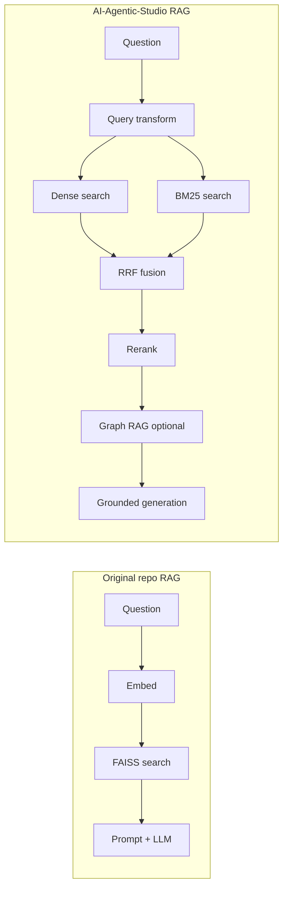
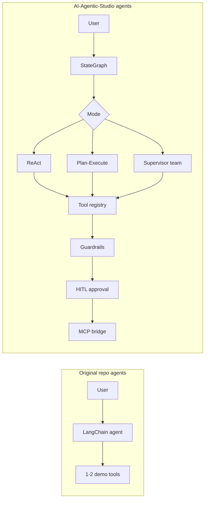

# Gap Analysis

This document compares the **original `AI_ML_GENAI` repository** with **`AI-Agentic-Studio`** — the new implementation built to close generative and agentic AI gaps.

Scope: only gaps that **AI-Agentic-Studio actually addresses** in its current v1 implementation.

---

## Context

The parent repo (`AI_ML_GENAI`) is a learning playground with:

- Basic RAG chatbots (Streamlit + FAISS)
- LangChain tool-calling demos
- OpenAI / local GGUF examples
- MiniGPT (from-scratch GPT + fine-tuning)

It is strong for **getting started**, but missing several patterns expected in a **production-shaped** generative + agentic system. `AI-Agentic-Studio` was created as a differentiated, self-contained package to fill those gaps without rewriting the original examples.

---

## Gap matrix

| Gap in original repo | What was missing | AI-Agentic-Studio solution | Status |
|----------------------|------------------|----------------------------|--------|
| **Retrieval quality** | Single dense retriever only | Hybrid BM25 + dense, RRF fusion, reranking, query transforms | Done |
| **Graph / structured retrieval** | No knowledge-graph retrieval | Entity co-occurrence graph RAG (`graph_rag.py`) | Done |
| **Parent-document context** | Small chunks lose surrounding context | Parent-chunk linking in chunking + retrieval | Done |
| **Metadata filtering** | No filter predicates on retrieval | `$contains`, `$eq`, `$lte` filters on vector store | Done |
| **Conversational RAG** | Single-turn only | `ConversationalRag` + SQLite memory + summarizing window | Done |
| **LLM abstraction** | Per-script provider code | Unified router with failover across 7 providers | Done |
| **Response caching** | No cache layer | Exact + semantic SQLite cache | Done |
| **Structured output** | Ad-hoc JSON parsing | Schema-driven `structured.py` | Done |
| **Agent orchestration** | LangChain chains only | Custom `StateGraph` with checkpointing and interrupts | Done |
| **Agent architectures** | One ReAct-style demo | ReAct, plan-execute-critique, supervisor multi-agent | Done |
| **Human-in-the-loop** | None | Approval store; graph pauses on dangerous tools | Done |
| **Real tool suite** | Calculator / search stubs | 14 tools: search, RAG, filesystem, SQL, HTTP, Python sandbox | Done |
| **Tool safety** | No sandbox or allowlists | Sandboxed paths, HTTP allowlist, SSRF checks, approval gates | Done |
| **MCP integration** | None | MCP server (expose tools) + client (bridge external tools) | Done |
| **Guardrails** | None | PII redaction, moderation, injection detection, tool policy | Done |
| **Observability** | Print statements | Structured logs, metrics, hierarchical tracing, optional LangSmith/OTel | Done |
| **Evaluation** | None | RAG metrics, LLM-as-judge, golden JSONL datasets, comparison runner | Done |
| **API layer** | FastAPI stubs or none | Full REST API with streaming, jobs, auth, rate limits | Done |
| **Unified CLI** | Scattered scripts | Single `studio` command with 12 subcommands | Done |
| **Playground UI** | Multiple disconnected UIs | One Streamlit app covering chat, retrieval, agents, eval | Done |
| **Offline / testability** | Requires API keys for most flows | `echo` provider + `hashing` embedder; full pytest suite offline | Done |
| **Configuration** | Hardcoded or per-script | Central `settings.py` + `.env.example` | Done |
| **Documentation** | README per sub-project | Architecture, user guide, implementation status (this docs set) | Done |

---

## What the original repo still does better (by design)

These remain in the parent repo and are **not duplicated** in AI-Agentic-Studio:

| Capability | Where |
|------------|-------|
| From-scratch GPT implementation | `MiniGPT/` |
| Llama fine-tuning walkthrough | `MiniGPT/` |
| Minimal LangChain hello-world | Various small scripts |
| GGUF local chat one-liners | `local_llm/` examples |

AI-Agentic-Studio **complements** these; it does not replace hands-on ML training content.

---

## Before vs after (retrieval)

---

## Before vs after (agents)

---

## Conclusion

All generative and agentic gaps identified for the v1 playground scope are **closed in AI-Agentic-Studio**. The parent repo remains the entry point for ML fundamentals; AI-Agentic-Studio is the place to explore production-shaped RAG, agents, guardrails, and evaluation.
