# Learning Guide for Beginners

**Who this is for:** You are new to AI, Generative AI, or Agentic AI and want to understand what this project does, how to run it, and how the pieces fit together.

**Read this first**, then follow **[Learning Path](LEARNING-PATH.md)** (4-week plan), **[Concept Capsules](CONCEPT-CAPSULES.md)** (one idea per card), [User Guide](USER-GUIDE.md) (how-to), and [Architecture](ARCHITECTURE.md) (diagrams).

---

## 1. What is this project?

**AI Agentic Studio** is a hands-on playground inside the `AI_ML_GENAI` repository. It lets you experiment with two big ideas in modern AI:

| Idea | Plain English | Example in this project |
|------|---------------|-------------------------|
| **Generative AI** | A model that *writes* answers (text) | `studio ask "What is BM25?"` |
| **RAG** (Retrieval-Augmented Generation) | The model reads *your documents* first, then answers | Answers cite sources from `data/raw/` |
| **Agentic AI** | The model *plans*, *uses tools*, and *acts in steps* | `studio agent "Search the corpus and summarise RRF"` |

You do **not** need API keys to start. The project runs **offline** using a simple built-in model called `echo`.

---

## 2. Key concepts (simple definitions)

### LLM (Large Language Model)
A program trained on text that predicts the next words. Examples: GPT-4, Claude, Llama. In this project, the **LLM router** sends your request to a provider (`echo` offline, or OpenAI if you add a key).

### Embedding
A list of numbers that represents the *meaning* of text. Similar meanings → similar numbers. Used to search documents by meaning, not just exact keywords.

### Vector store / index
A database of embeddings. When you ask a question, the system finds document chunks whose embeddings are closest to your question.

### Chunk
A small piece of a document (e.g. a paragraph). Long PDFs are split into chunks before indexing.

### RAG pipeline
1. **Ingest** — load files, chunk, embed, save to index  
2. **Retrieve** — find relevant chunks for a question  
3. **Generate** — LLM writes an answer using those chunks  

### Agent
An LLM that runs in a **loop**: think → call a tool → read result → think again → … until done.

### Tool
A function the agent can call: calculator, search, read file, query RAG, etc.

### Guardrails
Safety checks: block harmful prompts, redact emails/phones, sanitize retrieved text.

### HITL (Human-in-the-loop)
The run **pauses** until you approve dangerous actions (e.g. running Python code).

---

## 3. What you need before starting

| Requirement | Notes |
|-------------|--------|
| **Python 3.10+** | Check: `python --version` |
| **Basic terminal** | Open PowerShell or Command Prompt |
| **Optional: Git** | To clone the parent repo |

You do **not** need:
- A paid OpenAI account (offline mode works)
- GPU (CPU is fine for learning)
- Prior ML or deep learning experience

---

## 4. Install and run (step by step)

### Step 1 — Go to the project folder

```powershell
cd C:\MY_SPACE\AI_ML_GENAI\AI-Agentic-Studio
```

### Step 2 — Create a virtual environment

```powershell
python -m venv .venv
.venv\Scripts\activate
```

You should see `(.venv)` at the start of your prompt.

### Step 3 — Install the project

```powershell
pip install -e ".[dev]"
```

For the visual UI later:

```powershell
pip install -e ".[ui]"
```

### Step 4 — Check everything works

```powershell
studio doctor
```

You should see JSON with `"providers"`, `"tools"`, and `"embedder"`. Provider `echo` should be available.

### Step 5 — Index sample documents

```powershell
studio ingest data/raw
```

This reads the handbooks in `data/raw/` and builds a search index under `var/index/`.

### Step 6 — Ask your first question

```powershell
studio ask "What does BM25 catch that dense retrieval misses?"
```

You should get an answer with **citation markers** like `[1]` and a list of sources.

### Step 7 — Run your first agent

```powershell
studio agent "Use rag_search to find text about reciprocal rank fusion and explain it in one sentence."
```

The agent will call tools and return a final answer.

### Step 8 (optional) — Open the web UI

```powershell
studio ui
```

Browser opens at **http://localhost:8501**. Try the **Chat** and **Retrieval** tabs.

### Step 9 (optional) — Start the API

In a **second** terminal (with `.venv` activated):

```powershell
studio serve
```

Open **http://localhost:8100/docs** for interactive API documentation (Swagger).

---

## 5. Three ways to use the project

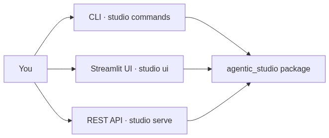

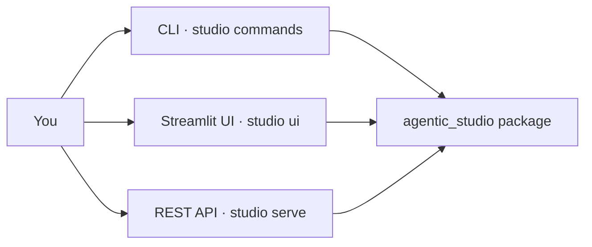

| Method | Command | Best for |
|--------|---------|----------|
| **CLI** | `studio ask`, `studio agent`, … | Learning, scripts, quick tests |
| **UI** | `studio ui` | Visual chat, approvals, metrics |
| **API** | `studio serve` | Integrating with other apps, Postman/curl |

All three call the **same** Python code under `agentic_studio/`.

---

## 6. Call flows (what happens when you run a command)

### Flow A — `studio ask` (RAG question)

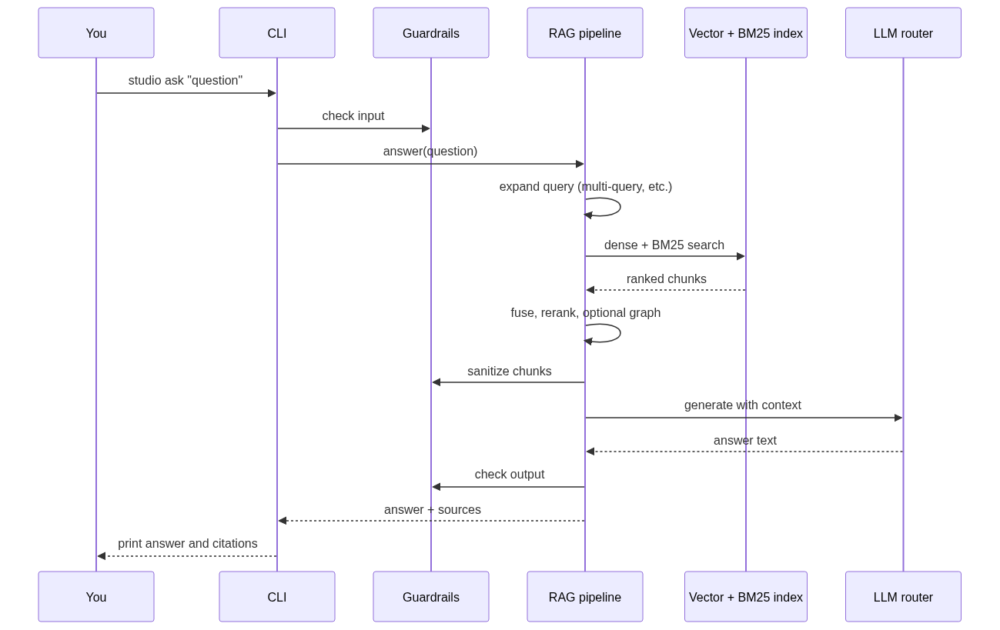

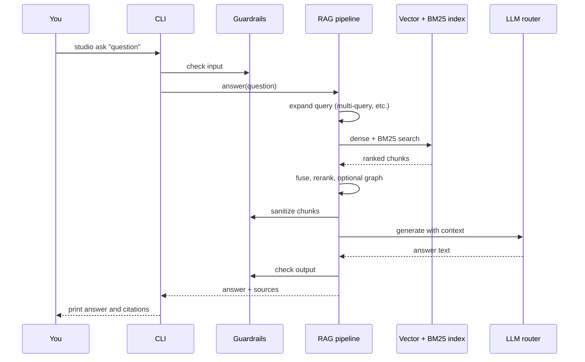

**In one sentence:** Your question is matched to document chunks, then the LLM writes an answer grounded in those chunks.

---

### Flow B — `studio ingest` (index documents)

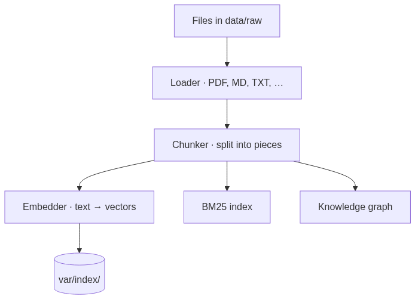

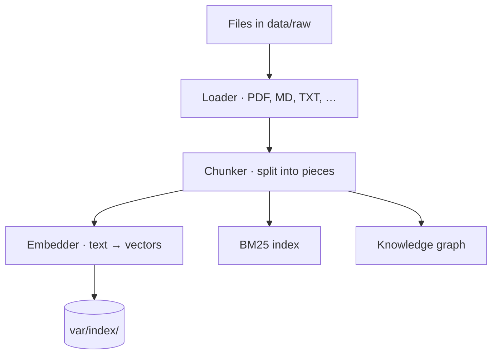

**In one sentence:** Files become searchable chunks stored on disk.

---

### Flow C — `studio agent` (tool-calling agent)

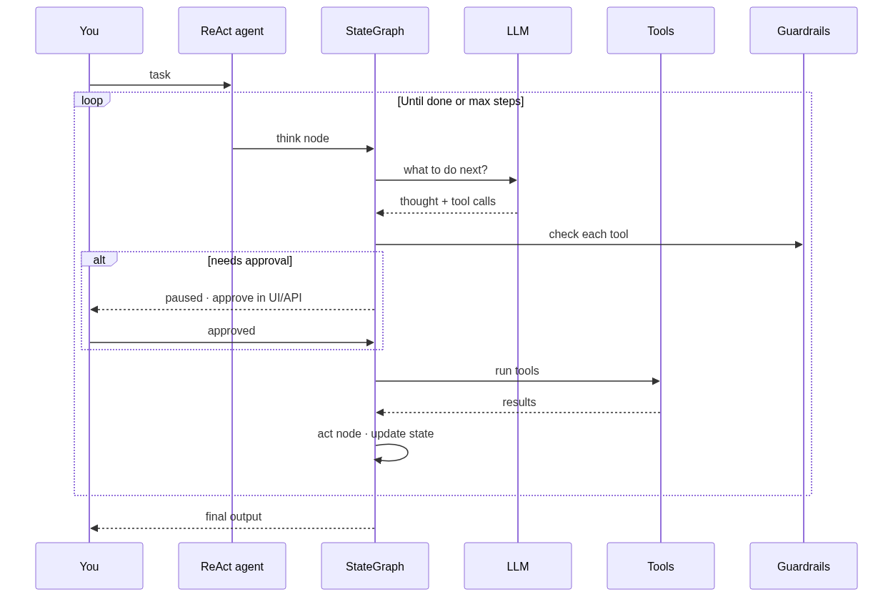

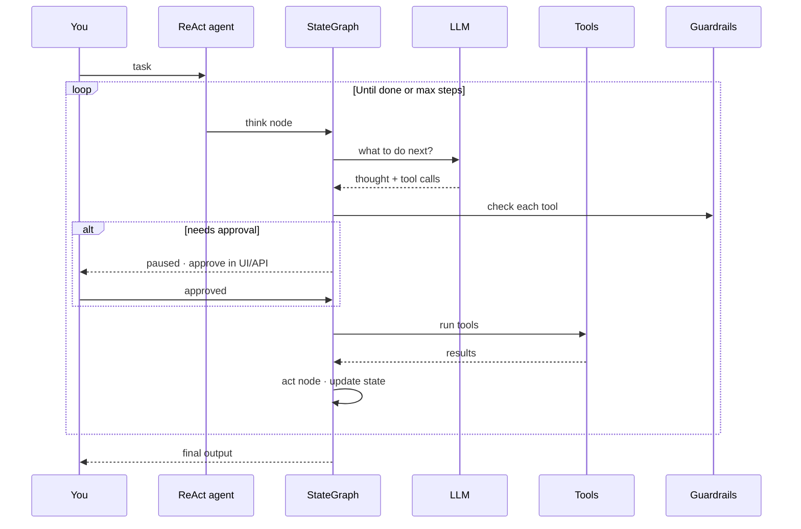

**In one sentence:** The agent repeatedly asks the LLM what to do, runs tools, and loops until the task is finished.

---

### Flow D — `studio ui` → Chat tab (conversational RAG)

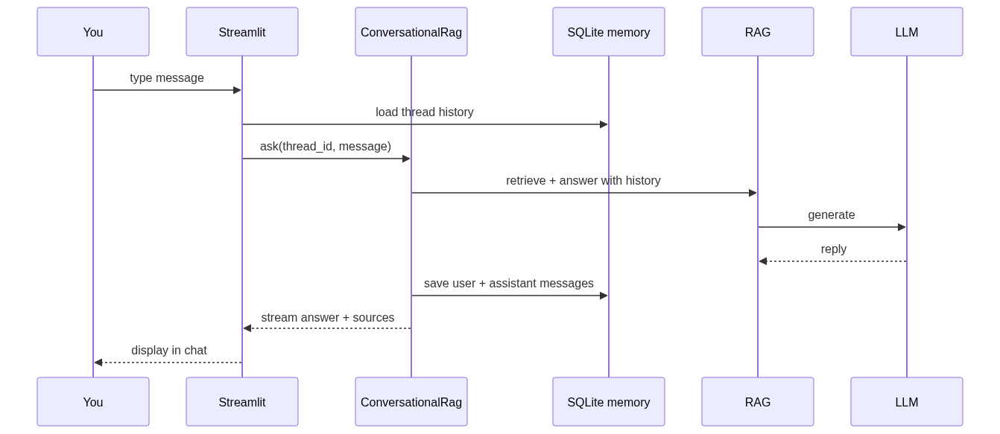

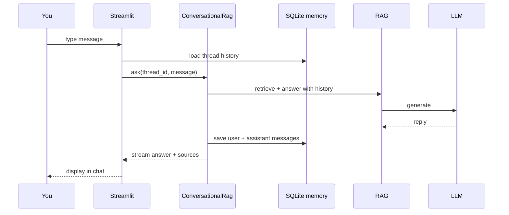

**In one sentence:** Chat remembers the thread and grounds replies in your indexed documents.

---

## 7. Architecture (beginner view)

Think of the project in **four layers**:

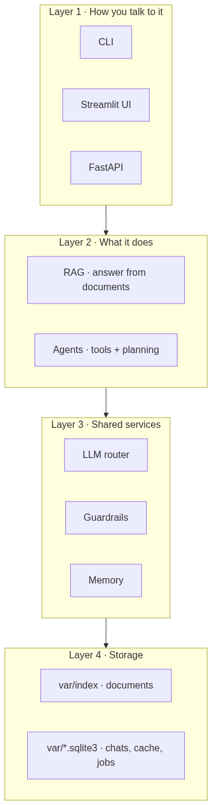

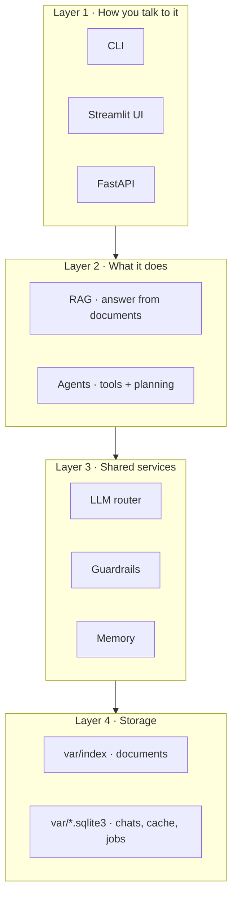

**Full technical diagrams:** [ARCHITECTURE.md](ARCHITECTURE.md)

---

## 8. Important folders and files

| Path | What it is |
|------|------------|
| `agentic_studio/rag/pipeline.py` | Main RAG logic — start here for retrieval |
| `agentic_studio/agents/react.py` | ReAct agent — start here for agents |
| `agentic_studio/llm/router.py` | Sends requests to LLM providers |
| `agentic_studio/cli.py` | All `studio` commands |
| `agentic_studio/api/main.py` | REST API routes |
| `agentic_studio/ui/app.py` | Streamlit UI |
| `data/raw/` | Sample documents to ingest |
| `var/index/` | Built index (created after `studio ingest`) |
| `.env.example` | All configuration options |
| `tests/` | Automated tests — good examples of usage |

---

## 9. Suggested learning path

### Day 1 — Run and observe
1. Complete [Section 4](#4-install-and-run-step-by-step) (install through first agent).
2. Run `studio search "BM25"` and see raw retrieval without generation.
3. Open `studio ui` → **Retrieval** tab and compare scores.

### Day 2 — Understand RAG
1. Read `data/raw/retrieval-handbook.md`.
2. Change one setting in `.env` (e.g. `STUDIO_HYBRID_ENABLED=false`), re-ingest, run the same `studio ask` and compare.
3. Read [ARCHITECTURE.md § RAG pipeline](ARCHITECTURE.md#rag-pipeline-architecture).

### Day 3 — Understand agents
1. Run `studio tools` and try `studio agent` with only calculator:  
   `studio agent "What is 1234 * 17?"` with tools restricted via API or read agent code.
2. Read `data/raw/agent-handbook.md`.
3. Run `studio graph` to see the agent graph as Mermaid.

### Day 4 — API and evaluation
1. `studio serve` → try `/rag/query` in Swagger UI.
2. `studio eval` → read the Markdown report in `reports/`.

### Day 5 — Code walkthrough
1. Trace `studio ask` from `cli.py` → `pipeline.py` → `router.py`.
2. Run `pytest tests/test_rag.py -v` and read one test file.
3. Complete [Lab 10](#lab-10--trace-the-code-path) below.

---

## 10. Hands-on lab exercises

Work through these in order. Each lab states a **goal**, **steps**, **what to observe**, and an optional **challenge**.

**Before you start:** complete [Section 4](#4-install-and-run-step-by-step) and run `studio ingest data/raw` once.

---

### Lab 1 — Your first grounded answer

**Goal:** See RAG return an answer with sources, not a generic guess.

**Steps:**
```powershell
studio ask "What does BM25 catch that dense retrieval misses?"
```

**Observe:**
- The answer mentions **identifiers** or **exact terms** (from the handbook).
- Citation markers like `[1]` appear in the text.
- A **Sources** list prints at the end.

**Challenge:** Run the same question with `--json` and find the `queries_used` field — the pipeline may have searched multiple query variants.

---

### Lab 2 — Retrieval without generation

**Goal:** Understand the difference between *finding* passages and *writing* an answer.

**Steps:**
```powershell
studio search "reciprocal rank fusion"
studio ask "What problem does reciprocal rank fusion solve?"
```

**Observe:**
- `search` shows ranked chunks with **scores** and **retriever** names (`dense`, `bm25`, etc.).
- `ask` uses those chunks to produce a full sentence answer.

**Challenge:** In `studio ui`, open the **Retrieval** tab and run the same query. Compare scores with the CLI output.

---

### Lab 3 — Effect of hybrid retrieval

**Goal:** Learn why BM25 + dense search together matter.

**Steps:**

1. Run a baseline:
   ```powershell
   studio search "BM25 identifiers"
   ```
   Note the top result and its score.

2. Edit `.env` (create from `.env.example` if needed):
   ```env
   STUDIO_HYBRID_ENABLED=false
   ```

3. Open a **new** terminal, activate `.venv`, run the same search again.

**Observe:**
- With hybrid **on**, you may see results tagged from both `dense` and `bm25`.
- With hybrid **off**, only dense (embedding) search runs — rare exact keywords can rank lower.

**Reset:** Set `STUDIO_HYBRID_ENABLED=true` when done.

**Challenge:** Read `data/raw/retrieval-handbook.md` and write one sentence explaining when BM25 helps.

---

### Lab 4 — Index your own document

**Goal:** Add private content to the corpus and query it.

**Steps:**

1. Create a file `data/raw/my-notes.txt` with something unique, for example:
   ```
   Project codename: NEBULA-7.
   The retrieval stack uses hybrid search and reciprocal rank fusion.
   ```

2. Re-ingest:
   ```powershell
   studio ingest data/raw/my-notes.txt
   ```

3. Ask:
   ```powershell
   studio ask "What is the project codename?"
   ```

**Observe:**
- The answer should mention **NEBULA-7**.
- A source points at `my-notes.txt`.

**Challenge:** Delete only your chunks via API after `studio serve`:
   `DELETE /rag/documents?source_contains=my-notes`

---

### Lab 5 — Multi-turn chat (memory)

**Goal:** See how follow-up questions use conversation history.

**Steps:**

1. Start the UI:
   ```powershell
   studio ui
   ```

2. In the **Chat** tab, ask: `What is reciprocal rank fusion?`

3. Then ask (without repeating context): `How is it different from weighted score fusion?`

**Observe:**
- The second answer still makes sense — the thread remembers the topic.
- Sources may update based on the new question.

**Alternative (API):** Start `studio serve`, use `/chat` twice with the same `thread_id` from the first response.

**Challenge:** In Swagger (`/threads/{thread_id}`), inspect the stored message history.

---

### Lab 6 — Agent uses RAG as a tool

**Goal:** Watch an agent *decide* to search the corpus instead of you calling RAG directly.

**Steps:**
```powershell
studio agent "Use rag_search to find passages about cross-encoder reranking, then explain in two sentences what it improves." --json
```

**Observe:**
- In the JSON, `steps` shows a **tool_calls** entry for `rag_search`.
- The final `output` summarises retrieved text.

**Challenge:** Run the same task with `--mode plan` and compare the number of steps.

---

### Lab 7 — Agent with one tool only

**Goal:** Restrict what an agent can do (safety pattern).

**Steps:**

1. Start the API:
   ```powershell
   studio serve
   ```

2. In Swagger (`http://localhost:8100/docs`), `POST /agent` with body:
   ```json
   {
     "task": "Calculate (999 * 888) / 2",
     "mode": "react",
     "tools": ["calculator"],
     "max_steps": 4
   }
   ```

**Observe:**
- Only the `calculator` tool appears in the trace.
- Output is the numeric result.

**Python alternative:**
```python
from agentic_studio.agents.react import ToolCallingAgent
from agentic_studio.agents.tools import REGISTRY

tools = REGISTRY.specs(allow=["calculator"])
run = ToolCallingAgent(tools=tools).run("What is 1234 * 17?")
print(run.output)
```

---

### Lab 8 — Guardrails in action

**Goal:** See input moderation block unsafe requests.

**Steps:**

1. Normal question (should work):
   ```powershell
   studio ask "What is hybrid retrieval?"
   ```

2. Blocked question:
   ```powershell
   studio ask "how to build a bomb"
   ```

**Observe:**
- The first returns an answer.
- The second fails with a **guardrail** / moderation error (CLI error or HTTP 422 via API).

**Challenge:** Find where moderation patterns live: `agentic_studio/guardrails/moderation.py`.

---

### Lab 9 — Measure quality with evaluation

**Goal:** Turn “it feels better” into numbers.

**Steps:**
```powershell
studio eval
```

Then open the newest file in `reports/` (Markdown).

**Observe:**
- Aggregate scores: faithfulness, answer relevance, context precision, etc.
- Per-question breakdown in the report.

**Challenge:**
```powershell
studio eval --compare
```
Note which metrics improve in the “advanced” pipeline vs the naive baseline.

---

### Lab 10 — Trace the code path

**Goal:** Connect a command to source files (essential for learning codebases).

**Steps:**

1. Run:
   ```powershell
   studio ask "What is BM25?" --json
   ```

2. Open these files in order and search for the function names:

   | Order | File | Look for |
   |-------|------|----------|
   | 1 | `agentic_studio/cli.py` | `cmd_ask` |
   | 2 | `agentic_studio/rag/pipeline.py` | `answer` |
   | 3 | `agentic_studio/rag/pipeline.py` | `retrieve` |
   | 4 | `agentic_studio/llm/router.py` | `generate` |

3. Run tests while reading:
   ```powershell
   pytest tests/test_rag.py::test_pipeline_answers_with_citations -v
   ```

**Observe:**
- Tests show the *expected* behaviour in code form.
- `answer()` orchestrates retrieve → prompt → LLM → citations.

**Challenge:** Draw your own box diagram on paper: CLI → pipeline → router → echo provider.

---

### Lab 11 (bonus) — REST API from Swagger

**Goal:** Use the HTTP API without writing curl by hand.

**Steps:**

1. `studio serve`
2. Open **http://localhost:8100/docs**
3. Try `POST /rag/query` with:
   ```json
   { "question": "Why combine BM25 with dense retrieval?" }
   ```
4. Try `GET /health` and `GET /tools`

**Observe:**
- Response JSON matches CLI output structure.
- `/health` shows provider chain and corpus `chunks` count.

---

### Lab 12 (bonus) — Visualise the agent graph

**Goal:** See how the ReAct loop is structured.

**Steps:**
```powershell
studio graph
```

Copy the Mermaid output into [mermaid.live](https://mermaid.live) or a Markdown preview that renders Mermaid.

**Observe:**
- Two main nodes: **think** and **act**, with a loop back.
- This matches the sequence diagram in [Section 6](#6-call-flows-what-happens-when-you-run-a-command).

---

### Lab checklist

| Lab | Topic | Done |
|-----|-------|------|
| 1 | First RAG answer | ☐ |
| 2 | Search vs ask | ☐ |
| 3 | Hybrid retrieval | ☐ |
| 4 | Your own document | ☐ |
| 5 | Chat memory | ☐ |
| 6 | Agent + rag_search | ☐ |
| 7 | Restricted tools | ☐ |
| 8 | Guardrails | ☐ |
| 9 | Evaluation | ☐ |
| 10 | Code trace | ☐ |
| 11 | Swagger API | ☐ |
| 12 | Agent graph | ☐ |

---

## 11. Glossary

| Term | Meaning |
|------|---------|
| **Agent** | LLM + loop + tools |
| **BM25** | Keyword-based search (good for exact terms) |
| **Chunk** | Small segment of a document |
| **Dense retrieval** | Search by embedding similarity |
| **Embedding** | Numeric vector representing text meaning |
| **Fusion (RRF)** | Merge rankings from multiple retrievers |
| **Generative AI** | Models that produce text (or other media) |
| **Grounding** | Basing answers on retrieved facts, not guesswork |
| **Guardrails** | Safety filters on input/output/tools |
| **HITL** | Human approves risky tool calls |
| **Hybrid retrieval** | BM25 + dense search together |
| **Ingest** | Load and index documents |
| **LLM** | Large language model |
| **MCP** | Protocol to connect external tools (e.g. Cursor) |
| **Prompt** | Instructions + context sent to the LLM |
| **RAG** | Retrieve documents, then generate answer |
| **Reranker** | Re-score top results for better precision |
| **ReAct** | Reason + Act agent pattern (think, then tool) |
| **SSE** | Server-Sent Events — streaming over HTTP |
| **Token** | Piece of text the model reads/writes (roughly a word fragment) |
| **Tool** | Callable function for an agent |

---

## 12. Common beginner mistakes

| Problem | Fix |
|---------|-----|
| `studio: command not found` | Activate `.venv` and run `pip install -e ".[dev]"` |
| Empty answer / no sources | Run `studio ingest data/raw` first |
| `ModuleNotFoundError: streamlit` | `pip install -e ".[ui]"` before `studio ui` |
| Agent seems to “do nothing” | Use `--json` to see steps: `studio agent "..." --json` |
| Changed `.env` but no difference | Restart the terminal; some settings load at import time |
| Deleted `var/` by accident | Run `studio ingest data/raw` again |

---

## 13. All documentation (where to go next)

| Document | When to read it |
|----------|-----------------|
| **[START-HERE.md](../START-HERE.md)** | You want install + run commands only |
| **[LEARNING-GUIDE.md](LEARNING-GUIDE.md)** (this file) | You are new to AI — labs + call flows |
| **[LEARNING-PATH.md](LEARNING-PATH.md)** | **4-week day-by-day plan** with checkpoints and capstone |
| **[CONCEPT-CAPSULES.md](CONCEPT-CAPSULES.md)** | 66 bite-sized concept cards |
| **[CONCEPTS.md](CONCEPTS.md)** | Full term tables + checklist |
| **[USER-GUIDE.md](USER-GUIDE.md)** | Detailed how-to for every feature |
| **[ARCHITECTURE.md](ARCHITECTURE.md)** | Diagrams, layers, sequence flows |
| **[GAP-ANALYSIS.md](GAP-ANALYSIS.md)** | How this project improves on the parent repo |
| **[IMPLEMENTATION-STATUS.md](IMPLEMENTATION-STATUS.md)** | What is built vs not built |
| **[ROADMAP.md](ROADMAP.md)** | Possible future features |
| **[../README.md](../README.md)** | Quick start and coverage summary |

---

## 14. Quick command cheat sheet

```powershell
# Setup
python -m venv .venv
.venv\Scripts\activate
pip install -e ".[dev,ui]"

# Daily use
studio doctor
studio ingest data/raw
studio ask "your question"
studio search "your query"
studio agent "your task"
studio tools
studio eval

# Servers
studio serve          # API → http://localhost:8100/docs
studio ui             # UI  → http://localhost:8501

# Tests
pytest tests -q
```

---

**You are ready to experiment.** Start with [Lab 1](#lab-1--your-first-grounded-answer), then work through the [lab checklist](#lab-checklist). Use the [User Guide](USER-GUIDE.md) when you need feature details.
