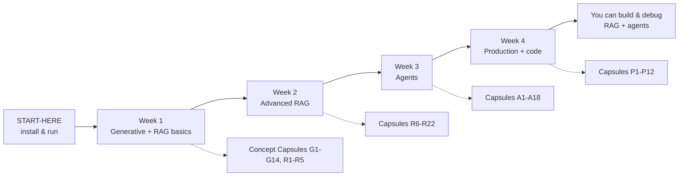

# Beginner Learning Path

A **step-by-step journey** from zero to confident with Generative AI and Agentic AI — using only **AI Agentic Studio**.

Designed for:
- No prior AI/ML experience required
- **Hands-on first** — every step has a command or lab to run
- **Offline-friendly** — no API keys needed until Week 4 (optional)

---

## How this path is organized



| Resource | Role in this path |
|----------|-------------------|
| [START-HERE.md](../START-HERE.md) | Day 0 setup |
| [CONCEPT-CAPSULES.md](CONCEPT-CAPSULES.md) | Read 2–4 capsules before each session |
| [LEARNING-GUIDE.md](LEARNING-GUIDE.md) | Labs 1–12 (hands-on) |
| [ARCHITECTURE.md](ARCHITECTURE.md) | Diagrams when a week introduces new flows |
| [CONCEPTS.md](CONCEPTS.md) | Lookup tables anytime |
| [USER-GUIDE.md](USER-GUIDE.md) | Deep reference when stuck |

**Time commitment:** ~30–45 minutes per day × 4 weeks (flexible).

---

## Before you start (Day 0)

### Goals
- Project installed and running
- You can ask one grounded question and get sources back

### Do this

| Step | Action | Doc |
|------|--------|-----|
| 0.1 | Install Python 3.10+, create venv, `pip install -e ".[dev,ui]"` | [START-HERE §1](../START-HERE.md) |
| 0.2 | `studio doctor` — confirm `echo` provider | [START-HERE §1](../START-HERE.md) |
| 0.3 | `studio ingest data/raw` | [START-HERE §2](../START-HERE.md) |
| 0.4 | `studio ask "What does BM25 catch?"` | [START-HERE §3](../START-HERE.md) |

### Checkpoint ✅
- [ ] `studio doctor` shows tools and embedder
- [ ] `studio ask` returns answer **with** `[1]` citations and a Sources list
- [ ] You know where `data/raw/` and `var/index/` live

### If stuck
| Problem | Fix |
|---------|-----|
| `studio` not found | Activate `.venv` · `pip install -e ".[dev]"` |
| No sources | Run `studio ingest data/raw` again |

---

# Week 1 — Generative AI & RAG foundations

**Theme:** *How does the model answer from **my** documents?*

**By end of week you will:** Explain LLM, RAG, ingest, search vs ask, and run the Streamlit UI.

---

### Day 1 — What is Generative AI?

| Read (15 min) | Capsules [G1](CONCEPT-CAPSULES.md), [G2](CONCEPT-CAPSULES.md), [G3](CONCEPT-CAPSULES.md) |
| Hands-on (20 min) | [Lab 1](LEARNING-GUIDE.md#lab-1--your-first-grounded-answer) · `studio ask` with `--json` |
| Reflect | What is the difference between the model “knowing” vs reading your files? |

**Commands:**
```powershell
studio ask "What does BM25 catch that dense retrieval misses?"
studio ask "What does BM25 catch?" --json
```

**Checkpoint ✅**
- [ ] Can explain **Generative AI** in one sentence
- [ ] Can point to `usage` in JSON output

---

### Day 2 — RAG pipeline overview

| Read (15 min) | Capsules [R1](CONCEPT-CAPSULES.md), [R2](CONCEPT-CAPSULES.md), [R3](CONCEPT-CAPSULES.md), [R4](CONCEPT-CAPSULES.md) |
| Hands-on (25 min) | [Lab 2](LEARNING-GUIDE.md#lab-2--retrieval-without-generation) · read `data/raw/retrieval-handbook.md` |
| Diagram | [ARCHITECTURE — RAG pipeline](ARCHITECTURE.md#rag-pipeline-architecture) |

**Commands:**
```powershell
studio search "reciprocal rank fusion"
studio ask "What problem does reciprocal rank fusion solve?"
```

**Checkpoint ✅**
- [ ] Can name the 3 RAG steps: ingest → retrieve → generate
- [ ] Can explain why `search` ≠ `ask`

---

### Day 3 — Embeddings & vector store

| Read (15 min) | Capsules [R6](CONCEPT-CAPSULES.md), [R7](CONCEPT-CAPSULES.md), [G4](CONCEPT-CAPSULES.md) |
| Hands-on (20 min) | `studio doctor` → note `chunks`, `embedder` · peek at `var/index/chunks.json` (first 20 lines) |
| Optional read | `agentic_studio/rag/embeddings.py` (first 40 lines) |

**Commands:**
```powershell
studio doctor
studio search "hybrid retrieval"
```

**Checkpoint ✅**
- [ ] Can explain **embedding** without math jargon
- [ ] Know what `var/index/` stores

---

### Day 4 — Your own documents

| Read (15 min) | Capsules [R2](CONCEPT-CAPSULES.md), [G11](CONCEPT-CAPSULES.md), [G13](CONCEPT-CAPSULES.md) |
| Hands-on (30 min) | [Lab 4](LEARNING-GUIDE.md#lab-4--index-your-own-document) — create `my-notes.txt`, ingest, ask |

**Checkpoint ✅**
- [ ] Indexed your own file and got a correct answer from it
- [ ] Understand **grounding** and **citations**

---

### Day 5 — Visual playground (UI)

| Read (10 min) | [LEARNING-GUIDE §5](LEARNING-GUIDE.md#5-three-ways-to-use-the-project) |
| Hands-on (30 min) | `studio ui` → **Chat** tab + **Retrieval** tab |
| Optional | [Lab 5](LEARNING-GUIDE.md#lab-5--multi-turn-chat-memory) if time |

**Commands:**
```powershell
studio ui
```

**Week 1 review ✅**
- [ ] Completed Labs 1, 2, 4
- [ ] Used UI at least once
- [ ] Can draw on paper: Question → Index → Chunks → LLM → Answer

---

# Week 2 — Advanced RAG

**Theme:** *Why one search strategy is not enough.*

**By end of week you will:** Tune retrieval, understand hybrid search, and measure quality with evaluation.

---

### Day 6 — BM25 & hybrid retrieval

| Read (15 min) | Capsules [R8](CONCEPT-CAPSULES.md), [R9](CONCEPT-CAPSULES.md), [R10](CONCEPT-CAPSULES.md) |
| Hands-on (30 min) | [Lab 3](LEARNING-GUIDE.md#lab-3--effect-of-hybrid-retrieval) — toggle `STUDIO_HYBRID_ENABLED` |

**Checkpoint ✅**
- [ ] Can explain when **keywords** beat **meaning** search
- [ ] Saw different results with hybrid on vs off

---

### Day 7 — Reranking & query transforms

| Read (15 min) | Capsules [R11](CONCEPT-CAPSULES.md), [R12](CONCEPT-CAPSULES.md), [R13](CONCEPT-CAPSULES.md) |
| Hands-on (25 min) | `studio ask --json` → study `queries_used` · try `STUDIO_QUERY_TRANSFORM=none` in `.env`, restart, compare |

**Commands:**
```powershell
studio ask "Why combine BM25 with dense retrieval?" --json
```

**Checkpoint ✅**
- [ ] Know what **multi-query** does
- [ ] Can find `queries_used` in output

---

### Day 8 — Graph RAG & metadata

| Read (15 min) | Capsules [R15](CONCEPT-CAPSULES.md), [R16](CONCEPT-CAPSULES.md) |
| Hands-on (20 min) | `studio doctor` → `graph_entities` · `studio tools` → find `graph_explore` |
| Read | `data/raw/retrieval-handbook.md` — Graph RAG section |

**Checkpoint ✅**
- [ ] Know graph RAG is **optional expansion**, not a separate database product

---

### Day 9 — Conversational RAG & memory

| Read (15 min) | Capsules [R17](CONCEPT-CAPSULES.md), [A14](CONCEPT-CAPSULES.md), [G5](CONCEPT-CAPSULES.md) |
| Hands-on (30 min) | [Lab 5](LEARNING-GUIDE.md#lab-5--multi-turn-chat-memory) in UI |
| Diagram | [Flow D — Chat](LEARNING-GUIDE.md#flow-d--studio-ui--chat-tab-conversational-rag) |

**Checkpoint ✅**
- [ ] Asked a follow-up question that depends on the first answer
- [ ] Understand why **context window** limits exist

---

### Day 10 — Evaluation (measure, don’t guess)

| Read (15 min) | Capsules [R20](CONCEPT-CAPSULES.md), [R21](CONCEPT-CAPSULES.md), [G12](CONCEPT-CAPSULES.md) |
| Hands-on (30 min) | [Lab 9](LEARNING-GUIDE.md#lab-9--measure-quality-with-evaluation) · open `reports/*.md` |

**Commands:**
```powershell
studio eval
studio eval --compare
```

**Week 2 review ✅**
- [ ] Completed Labs 3, 5, 9
- [ ] Can name 3 eval metrics (faithfulness, relevance, precision)
- [ ] Changed at least one `.env` retrieval setting and observed a difference

---

# Week 3 — Agentic AI

**Theme:** *The model that **does** things, not only **says** things.*

**By end of week you will:** Run ReAct, plan, and team agents; understand tools, HITL, and guardrails.

---

### Day 11 — What is an agent?

| Read (15 min) | Capsules [A1](CONCEPT-CAPSULES.md), [A2](CONCEPT-CAPSULES.md), [A3](CONCEPT-CAPSULES.md) |
| Hands-on (25 min) | `studio tools` · [Lab 6](LEARNING-GUIDE.md#lab-6--agent-uses-rag-as-a-tool) with `--json` |
| Diagram | [Flow C — Agent](LEARNING-GUIDE.md#flow-c--studio-agent-tool-calling-agent) |

**Commands:**
```powershell
studio agent "Search the corpus for BM25 and explain in one sentence." --json
studio graph
```

**Checkpoint ✅**
- [ ] Can explain think → act loop
- [ ] Inspected `steps` in JSON output

---

### Day 12 — Tools deep dive

| Read (15 min) | Capsules [A4](CONCEPT-CAPSULES.md), [A12](CONCEPT-CAPSULES.md), [A18](CONCEPT-CAPSULES.md) |
| Hands-on (30 min) | [Lab 7](LEARNING-GUIDE.md#lab-7--agent-with-one-tool-only) · try `calculator` via API |
| Read | `data/raw/agent-handbook.md` |

**Checkpoint ✅**
- [ ] Listed all tools with `studio tools`
- [ ] Know which tools need **approval**

---

### Day 13 — Plan-execute & multi-agent

| Read (15 min) | Capsules [A5](CONCEPT-CAPSULES.md), [A6](CONCEPT-CAPSULES.md), [A7](CONCEPT-CAPSULES.md) |
| Hands-on (30 min) | Compare three modes on the **same** task |

**Commands:**
```powershell
studio agent "Summarise hybrid retrieval from the corpus." --mode react --json
studio agent "Summarise hybrid retrieval from the corpus." --mode plan --json
studio agent "Research RRF and calculate 1234*17." --mode team --json
```

**Checkpoint ✅**
- [ ] Can say when to use react vs plan vs team (roughly)

---

### Day 14 — StateGraph, checkpoint, HITL

| Read (15 min) | Capsules [A8](CONCEPT-CAPSULES.md), [A9](CONCEPT-CAPSULES.md), [A10](CONCEPT-CAPSULES.md), [A11](CONCEPT-CAPSULES.md) |
| Hands-on (25 min) | `studio ui` → **Agents** tab · read approval flow in [USER-GUIDE §5](USER-GUIDE.md) |
| Diagram | [ARCHITECTURE — Agent architecture](ARCHITECTURE.md#agent-architecture) |

**Checkpoint ✅**
- [ ] Understand why `python_exec` and `write_file` pause for approval

---

### Day 15 — Safety & guardrails

| Read (15 min) | Capsules [P1](CONCEPT-CAPSULES.md), [P2](CONCEPT-CAPSULES.md), [P3](CONCEPT-CAPSULES.md), [P4](CONCEPT-CAPSULES.md) |
| Hands-on (20 min) | [Lab 8](LEARNING-GUIDE.md#lab-8--guardrails-in-action) |
| Optional | Skim `agentic_studio/guardrails/policy.py` |

**Week 3 review ✅**
- [ ] Completed Labs 6, 7, 8, 12
- [ ] Ran all three agent modes
- [ ] Can explain HITL in plain English

---

# Week 4 — Production patterns & code confidence

**Theme:** *From user to builder — API, observability, and reading the codebase.*

**By end of week you will:** Use the REST API, read traces/metrics, trace code paths, and optionally connect a real LLM.

---

### Day 16 — REST API

| Read (10 min) | [USER-GUIDE §8](USER-GUIDE.md#8-rest-api) |
| Hands-on (35 min) | [Lab 11](LEARNING-GUIDE.md#lab-11-bonus--rest-api-from-swagger) · try `/rag/query`, `/chat`, `/agent` |

**Commands:**
```powershell
studio serve
# Open http://localhost:8100/docs
```

**Checkpoint ✅**
- [ ] Called `/health` and `/rag/query` from Swagger
- [ ] Know API docs URL

---

### Day 17 — Observability

| Read (15 min) | Capsules [P7](CONCEPT-CAPSULES.md), [P8](CONCEPT-CAPSULES.md) |
| Hands-on (25 min) | Run agent → `GET /metrics` · `GET /traces` · UI **Observability** tab |

**Checkpoint ✅**
- [ ] Found at least one tool span in traces after an agent run

---

### Day 18 — MCP & tool ecosystem

| Read (15 min) | Capsule [P12](CONCEPT-CAPSULES.md) |
| Hands-on (20 min) | Read `mcp_bridge/config.json` · `studio mcp-serve` (if `[mcp]` installed) |
| Optional | [USER-GUIDE §10](USER-GUIDE.md#10-mcp-integration) |

**Checkpoint ✅**
- [ ] Understand MCP = standard way to plug tools into external apps

---

### Day 19 — Read the code

| Read (20 min) | [LEARNING-GUIDE §8](LEARNING-GUIDE.md#8-important-folders-and-files) |
| Hands-on (40 min) | [Lab 10](LEARNING-GUIDE.md#lab-10--trace-the-code-path) · `pytest tests/test_rag.py -v` |

**Files to open in order:**
1. `cli.py` → `cmd_ask`
2. `rag/pipeline.py` → `answer`, `retrieve`
3. `agents/react.py` → `ToolCallingAgent`

**Checkpoint ✅**
- [ ] Traced one `studio ask` from CLI to LLM
- [ ] Ran at least one pytest test successfully

---

### Day 20 — Capstone project (hands-on)

**Build your own mini use-case** — no new code required, only configuration + your documents.

| Step | Task |
|------|------|
| 1 | Create a folder `data/raw/my-project/` with 3+ `.txt` or `.md` files about a topic you care about (notes, FAQs, summaries) |
| 2 | `studio ingest data/raw/my-project` |
| 3 | Write 5 questions a user might ask; run `studio ask` for each — note citations |
| 4 | `studio eval` — add 2 of your questions to `data/eval/my-golden.jsonl` (copy format from `golden.jsonl`) |
| 5 | `studio agent "Answer these three questions using rag_search: ..."` with `--json` |
| 6 | Write half a page: what retrieval settings helped most? |

**Capstone checklist ✅**
- [ ] Custom corpus indexed
- [ ] 5 successful grounded answers
- [ ] 1 agent run with tool trace inspected
- [ ] 1 eval report generated
- [ ] Short written reflection (even bullet points)

---

### Day 21 (optional) — Connect a real LLM

| Read (10 min) | [START-HERE §8](../START-HERE.md) · Capsules [G8](CONCEPT-CAPSULES.md), [G9](CONCEPT-CAPSULES.md) |
| Hands-on | Set `OPENAI_API_KEY` · `STUDIO_LLM_PROVIDERS=openai,echo` · repeat capstone asks |

**Note:** Offline `echo` is fine for learning mechanics; a real model shows better language and tool choice.

---

# Master checklist (entire path)

## Skills

| Skill | Week |
|-------|------|
| Install & run project | 0 |
| Explain Generative AI vs RAG vs Agents | 1–3 |
| Ingest documents & query with citations | 1 |
| Use CLI, UI, and API | 1, 4 |
| Tune retrieval via `.env` | 2 |
| Run evaluation & read metrics | 2 |
| Run ReAct / plan / team agents | 3 |
| Explain guardrails & HITL | 3 |
| Read traces and trace code | 4 |
| Build a small custom corpus project | 4 |

## Labs completed

| Lab | Topic | Week |
|-----|-------|------|
| 1 | First RAG answer | 1 |
| 2 | Search vs ask | 1 |
| 3 | Hybrid retrieval | 2 |
| 4 | Own document | 1 |
| 5 | Chat memory | 2 |
| 6 | Agent + RAG | 3 |
| 7 | Restricted tools | 3 |
| 8 | Guardrails | 3 |
| 9 | Evaluation | 2 |
| 10 | Code trace | 4 |
| 11 | Swagger API | 4 |
| 12 | Agent graph | 3 |

## Capsules progress

Track in [CONCEPT-CAPSULES.md — Capsule index](CONCEPT-CAPSULES.md#capsule-index-quick-lookup):
- [ ] Track 1: G1–G14
- [ ] Track 2: R1–R22
- [ ] Track 3: A1–A18
- [ ] Track 4: P1–P12

---

# Study tips for beginners

1. **Always run the Try command** in each capsule — reading alone is not enough.
2. **Use `--json`** on `studio ask` and `studio agent` to see what happens under the hood.
3. **Change one `.env` setting at a time** — then re-run the same question to see the effect.
4. **When confused**, ask: is it a **retrieval** problem (`studio search`) or a **generation** problem (`studio ask`)?
5. **When an agent fails**, read `steps` in JSON before changing the task wording.
6. **Keep a learning journal** — one paragraph per day: what you ran, what surprised you.

---

# Quick daily template

Copy into your notes each study day:

```
Date: ___________
Week/Day: ___________
Capsules read: ___________
Commands run: ___________
Lab #: ___________
One thing I learned: ___________
One thing still unclear: ___________
Tomorrow: ___________
```

---

# Where to go after this path

| Goal | Next step |
|------|-----------|
| Deeper RAG theory | Parent repo handbooks + papers linked in `retrieval-handbook.md` |
| Train your own model | `AI_ML_GENAI/MiniGPT/` |
| Ship to production | [ROADMAP.md](ROADMAP.md) — Docker, vector DBs |
| API integration | [USER-GUIDE.md](USER-GUIDE.md) full reference |
| Interview prep | Explain each capsule without looking — use CONCEPT-CAPSULES as flashcards |

---

**Start now:** [Day 0 — Before you start](#before-you-start-day-0) → then [Week 1, Day 1](#day-1--what-is-generative-ai).
