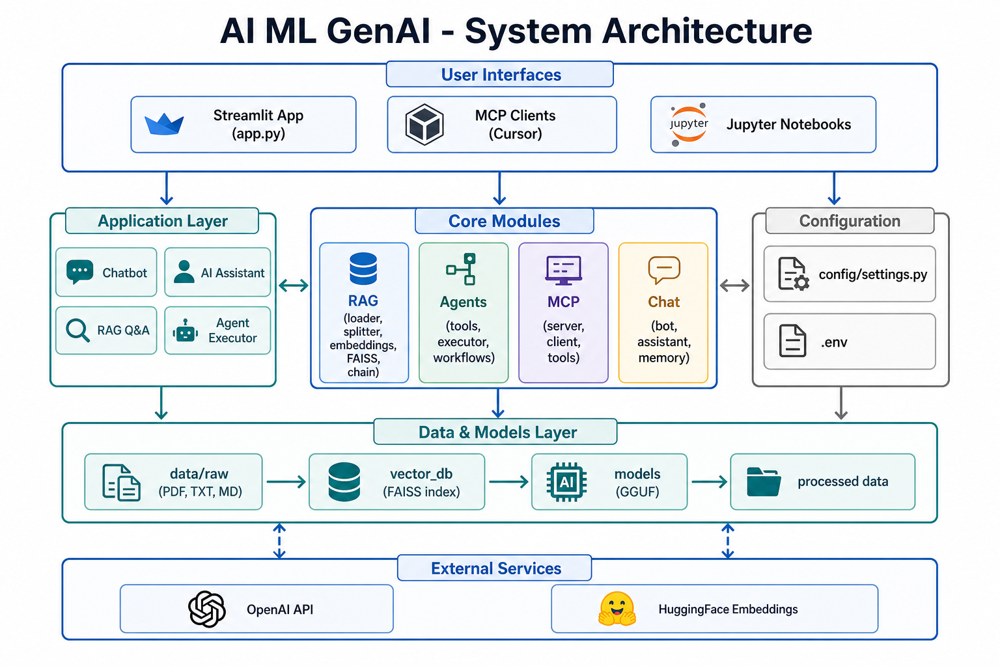

# Architecture

System design and module responsibilities for the AI / ML / GenAI workspace.

## High-level architecture



The project follows a **layered modular architecture**:

| Layer | Components | Role |
|-------|------------|------|
| Presentation | `app.py`, Streamlit, Jupyter | User interaction |
| Application | Chat, RAG, Agents, MCP | Business logic |
| Core modules | `rag/`, `agents/`, `mcp_server/`, `chat/` | Reusable AI capabilities |
| Configuration | `config/settings.py`, `.env` | Centralized settings |
| Data & models | `data/`, `vector_db/`, `models/` | Storage and artifacts |
| External | OpenAI API, HuggingFace | Optional cloud services |

---

## Directory structure

```
AI_ML_GENAI/
├── app.py              # Streamlit UI — routes to all modes
├── ingest.py           # Offline index builder
├── config/
│   └── settings.py     # Paths, env vars, defaults
├── rag/                # RAG pipeline
├── agents/             # Tool-calling agents
├── mcp_server/            # MCP server/client
├── chat/               # Chatbot & assistant
├── data/
│   ├── raw/            # Source documents
│   └── processed/      # Optional exports
├── models/             # Local GGUF weights
├── vector_db/          # FAISS index (generated)
├── tests/              # Unit tests
├── notebooks/          # Experiments
└── docs/               # This documentation
```

---

## Module: `config/`

**File:** `config/settings.py`

Central configuration loaded from environment variables via `python-dotenv`.

| Setting | Purpose |
|---------|---------|
| `DATA_RAW_DIR` | Source document path |
| `VECTOR_DB_DIR` | FAISS index path |
| `MODELS_DIR` | Local model weights |
| `EMBEDDING_MODEL` | HuggingFace embedding model name |
| `LLM_MODEL_PATH` | Path to GGUF file |
| `USE_API_LLM` | Toggle API vs local LLM |
| `CHUNK_SIZE` / `CHUNK_OVERLAP` | Text splitting |
| `TOP_K` | Retrieval count |
| `AGENT_MAX_ITERATIONS` | Agent loop limit |

All modules import from here — no hardcoded paths in business logic.

---

## Module: `rag/`

Retrieval-Augmented Generation pipeline.

| File | Responsibility |
|------|----------------|
| `loader.py` | Load PDF, TXT, MD from `data/raw/` |
| `splitter.py` | Chunk documents with overlap |
| `embeddings.py` | HuggingFace sentence embeddings |
| `vector_store.py` | FAISS build, save, load |
| `llm.py` | LlamaCpp (local) or ChatOpenAI (API) |
| `retriever.py` | Top-K similarity search |
| `prompt.py` | RAG prompt template |
| `chain.py` | LangChain RetrievalQA chain |
| `utils.py` | Logging and path helpers |

**Design choice:** RAG is isolated so it can be used by `app.py`, `chat/assistant.py`, and future APIs without duplication.

---

## Module: `agents/`

Tool-calling AI agents.

| File | Responsibility |
|------|----------------|
| `base.py` | Build LangChain agent executor |
| `tools.py` | Tool definitions (calculator, word_count) |
| `executor.py` | Run single agent tasks |
| `workflows.py` | Multi-step agent pipelines |

**Design choice:** Agents use LangChain's `create_tool_calling_agent` pattern. Tools are registered in one place for easy extension.

---

## Module: `mcp_server/`

Model Context Protocol integration.

| File | Responsibility |
|------|----------------|
| `server.py` | FastMCP server exposing tools |
| `client.py` | Connect to external MCP servers |
| `config.json` | Client configuration template |
| `tools/example_tool.py` | Example tool helpers |

**Design choice:** MCP runs as a separate process, enabling integration with Cursor and other MCP-compatible clients without modifying the main app.

---

## Module: `chat/`

Conversational interfaces.

| File | Responsibility |
|------|----------------|
| `bot.py` | Simple chatbot with memory |
| `assistant.py` | Assistant with optional RAG |
| `memory.py` | ConversationBufferMemory wrapper |

**Design choice:** Chat and RAG are composable — `AIAssistant` optionally loads the RAG chain when `vector_db/` exists.

---

## Data flow summary

| Flow | Path |
|------|------|
| Ingestion | `data/raw` → `ingest.py` → `vector_db/` |
| RAG query | User → `app.py` → `chain.py` → FAISS → LLM → response |
| Chat | User → `app.py` → `bot.py` → LLM + memory |
| Agent | User → `executor.py` → LLM ↔ tools → response |
| MCP | Client → `server.py` → tool → response |

See [Flow Diagrams](flow-diagrams.md) for detailed step-by-step flows.

---

## Technology stack

| Component | Technology |
|-----------|------------|
| Language | Python 3.10+ |
| Package manager | uv |
| LLM framework | LangChain |
| Embeddings | sentence-transformers / HuggingFace |
| Vector store | FAISS |
| Local LLM | llama-cpp-python (optional) |
| API LLM | OpenAI via langchain-openai |
| UI | Streamlit |
| MCP | mcp (FastMCP) |
| Testing | pytest |

---

## Extension points

| Want to add… | Where to start |
|--------------|----------------|
| New document type | `rag/loader.py` |
| New agent tool | `agents/tools.py` |
| New MCP tool | `mcp_server/server.py` |
| New UI mode | `app.py` |
| REST API | New `api/` module using existing `rag/`, `chat/`, `agents/` |
| New embedding model | `.env` → `EMBEDDING_MODEL` |
