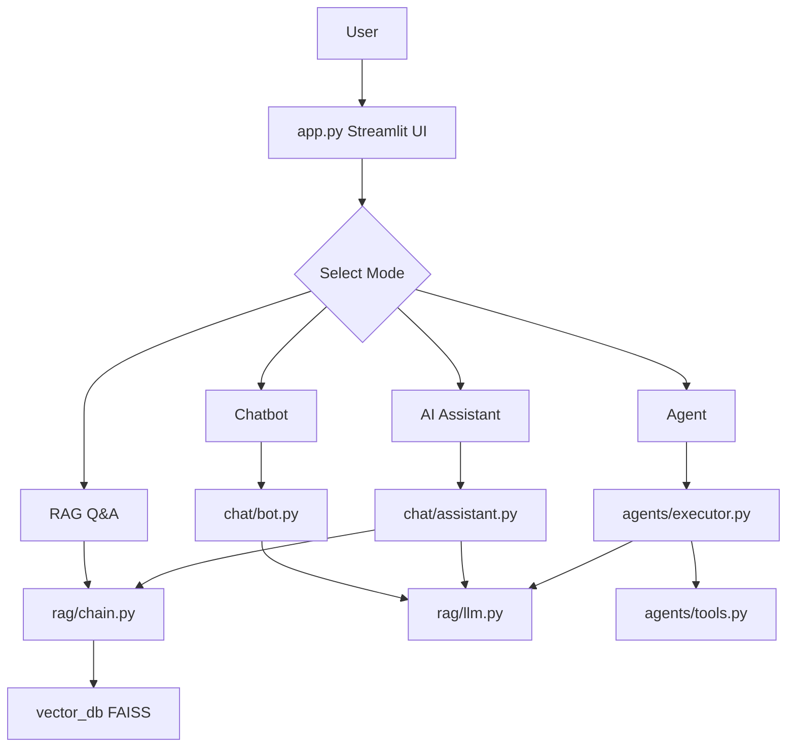
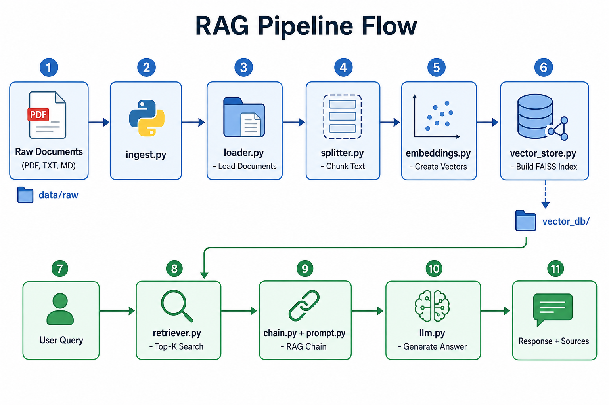
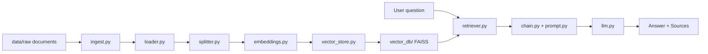
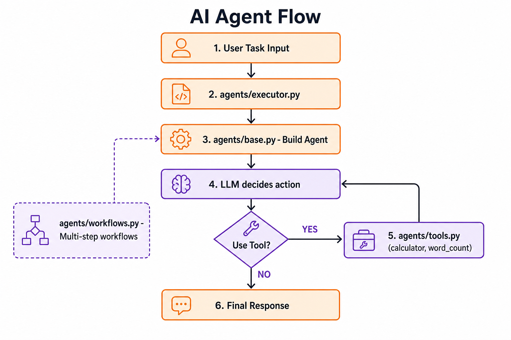
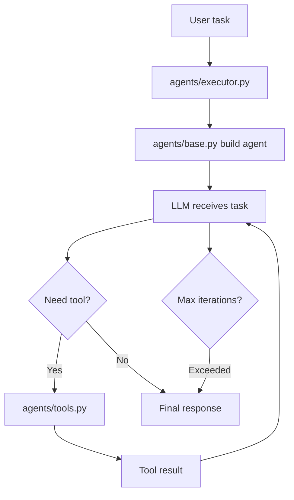
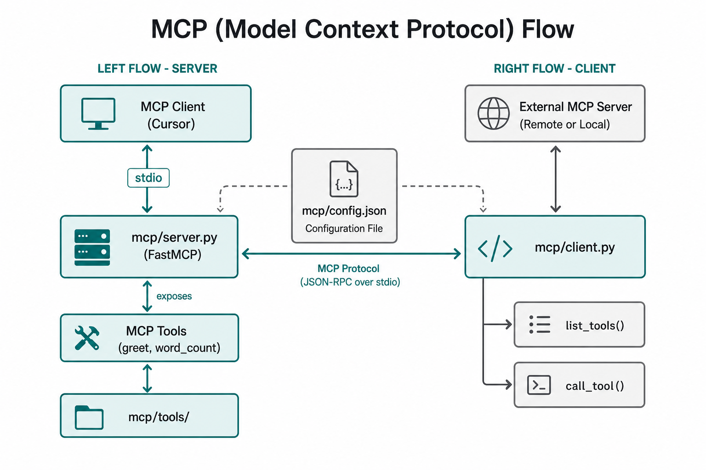
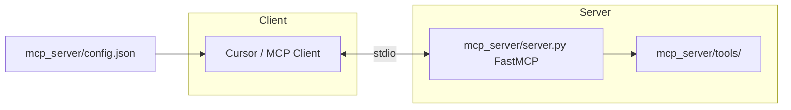
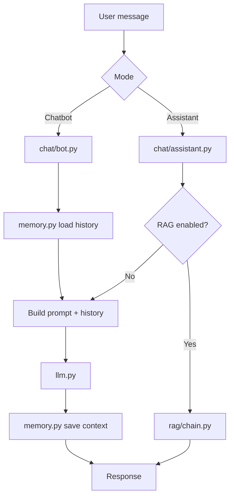
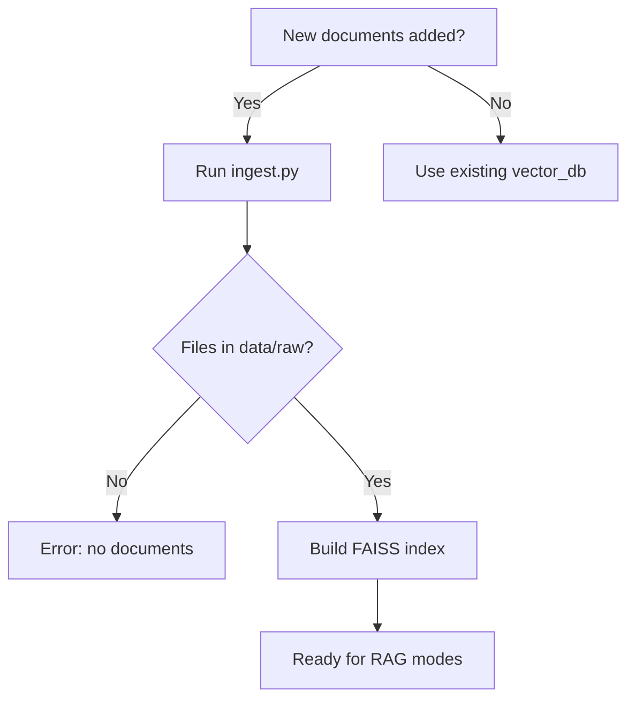
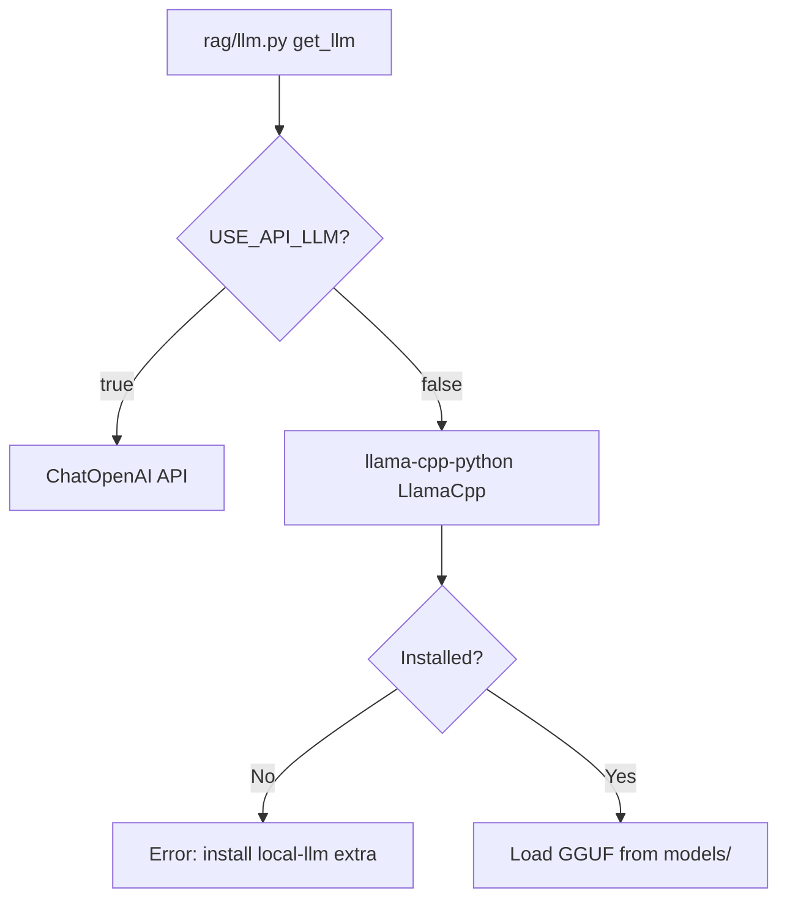

# Flow Diagrams

Step-by-step flows for each major capability. Each section includes a PNG diagram and a Mermaid flowchart (for editors that support it).

---

## 1. Overall application flow



---

## 2. RAG pipeline flow





### RAG ingestion steps

| Step | File | Action |
|------|------|--------|
| 1 | `ingest.py` | Entry point |
| 2 | `loader.py` | Load PDF/TXT/MD from `data/raw/` |
| 3 | `splitter.py` | Split into chunks (size/overlap from `.env`) |
| 4 | `embeddings.py` | Encode chunks with sentence-transformers |
| 5 | `vector_store.py` | Build and save FAISS index |

### RAG query steps

| Step | File | Action |
|------|------|--------|
| 1 | User | Submits question in RAG Q&A mode |
| 2 | `retriever.py` | Embed query, search top-K chunks |
| 3 | `prompt.py` | Inject context into template |
| 4 | `chain.py` | Run RetrievalQA chain |
| 5 | `llm.py` | Generate answer |
| 6 | UI | Display answer and source files |

---

## 3. Agent flow





### Agent loop

1. User submits task via Agent mode
2. `executor.py` builds agent from `base.py`
3. LLM decides whether to answer directly or call a tool
4. If tool needed: `tools.py` runs calculator or word_count
5. Tool result returns to LLM
6. Loop until final answer or `AGENT_MAX_ITERATIONS`

---

## 4. MCP flow





### MCP server lifecycle

1. Client reads `mcp_server/config.json`
2. Client spawns `uv run python mcp_server/server.py`
3. Server registers tools (`greet`, `word_count`)
4. Client calls `list_tools()` or `call_tool(name, args)`
5. Server executes and returns result

### MCP client usage

`mcp_server/client.py` can connect to **external** MCP servers:

```python
from mcp.client import list_tools
tools = await list_tools(["uv", "run", "python", "mcp_server/server.py"])
```

---

## 5. Chatbot & assistant flow



---

## 6. Document ingestion decision flow



---

## 7. LLM selection flow


