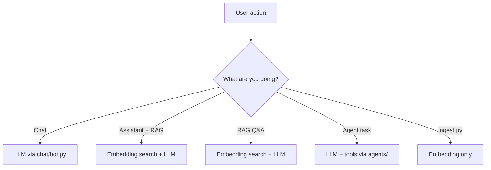

# Models Guide

Complete guide to **what models this project uses**, **where to get them**, and **all the ways to use them**.

---

## Table of contents

1. [Types of models in this project](#types-of-models-in-this-project)
2. [Where models live in the project](#where-models-live-in-the-project)
3. [Ways to use models (overview)](#ways-to-use-models-overview)
4. [Option 1: OpenAI API (cloud LLM)](#option-1-openai-api-cloud-llm)
5. [Option 2: Local GGUF model (on your machine)](#option-2-local-gguf-model-on-your-machine)
6. [Embedding models (for RAG)](#embedding-models-for-rag)
7. [Which model for which feature?](#which-model-for-which-feature)
8. [Where to download models](#where-to-download-models)
9. [Model size & hardware guide](#model-size--hardware-guide)
10. [Configuration reference](#configuration-reference)
11. [Examples: switch models](#examples-switch-models)
12. [Troubleshooting models](#troubleshooting-models)
13. [This laptop — system profile](#this-laptop--system-profile--recommended-models)

---

## Types of models in this project

This project uses **two kinds** of AI models:

| Type | Purpose | Config variable | Code module |
|------|---------|-----------------|-------------|
| **LLM** (Large Language Model) | Generate text answers, chat, agents | `USE_API_LLM`, `LLM_MODEL_PATH`, `OPENAI_API_KEY` | `rag/llm.py` |
| **Embedding model** | Convert text to vectors for RAG search | `EMBEDDING_MODEL` | `rag/embeddings.py` |

```
┌─────────────────────────────────────────────────────────────┐
│                     YOUR QUESTION                           │
└──────────────────────────┬──────────────────────────────────┘
                           │
         ┌─────────────────┴─────────────────┐
         │                                   │
         ▼                                   ▼
  EMBEDDING MODEL                         LLM MODEL
  (find relevant docs)                    (write the answer)
  sentence-transformers                   OpenAI API OR local GGUF
         │                                   │
         ▼                                   ▼
  vector_db (FAISS)                    Chat / RAG / Agent response
```

**LLM** = the "brain" that writes answers.  
**Embedding model** = the "search index" that finds relevant document chunks for RAG.

---

## Where models live in the project

| Location | What goes here | Git tracked? |
|----------|----------------|--------------|
| `models/` | Local GGUF LLM files (e.g. `.gguf`) | No (ignored — files are large) |
| `.env` | API keys, model paths, settings | No |
| HuggingFace cache | Embedding models (auto-downloaded) | Outside project |
| `vector_db/` | FAISS index built from embeddings | No (generated) |

**Default local LLM path:**

```
models/llama-3-8b-instruct.Q4_K_M.gguf
```

Set a custom path in `.env`:

```env
LLM_MODEL_PATH=models/your-model-name.gguf
```

---

## Ways to use models (overview)

There are **5 ways** models are used in this project:

| # | How | Entry point | Models used |
|---|-----|-------------|-------------|
| 1 | **Chatbot** | `app.py` → Chatbot mode | LLM only |
| 2 | **AI Assistant** | `app.py` → AI Assistant mode | LLM + optional embedding (RAG) |
| 3 | **RAG Q&A** | `app.py` → RAG Q&A mode | Embedding + LLM |
| 4 | **Agent** | `app.py` → Agent mode | LLM (API recommended) |
| 5 | **Ingestion** | `uv run python ingest.py` | Embedding only |

**Additional (no LLM):**

| How | Entry point | Models used |
|-----|-------------|-------------|
| MCP server | `uv run python mcp_server/server.py` | None (tool functions only) |
| Notebooks | `notebooks/experiments.ipynb` | Embedding (optional LLM) |

### Flow: which model runs when



---

## Option 1: OpenAI API (cloud LLM)

**Best for:** Agents, fast setup, no GPU, strong tool-calling.

### Where to get

1. Create an account at [https://platform.openai.com](https://platform.openai.com)
2. Go to **API Keys** → create a key
3. Copy the key (starts with `sk-`)

### Setup

```powershell
copy .env.example .env
```

Edit `.env`:

```env
USE_API_LLM=true
OPENAI_API_KEY=sk-your-key-here
LLM_TEMPERATURE=0.2
```

No file download needed — model runs on OpenAI servers.

### Install (no extra packages)

```powershell
uv sync --extra dev
```

`langchain-openai` is already included.

### Run

```powershell
uv run streamlit run app.py
```

### Default model

`rag/llm.py` uses LangChain's `ChatOpenAI` with the library default model (typically `gpt-4o-mini` or similar depending on LangChain version).

To use a specific model, extend `rag/llm.py` or add to `.env` (future):

```python
ChatOpenAI(model="gpt-4o", api_key=OPENAI_API_KEY, temperature=LLM_TEMPERATURE)
```

### Cost note

API calls are billed per token. RAG with large `TOP_K` or long documents uses more tokens.

---

## Option 2: Local GGUF model (on your machine)

**Best for:** Offline use, no API costs, full privacy.

### What is GGUF?

GGUF is a compressed format for running LLMs locally via `llama-cpp-python`. Files end in `.gguf`.

### Where to get GGUF models

| Source | URL | Notes |
|--------|-----|-------|
| **Hugging Face** | [https://huggingface.co/models?library=gguf](https://huggingface.co/models?library=gguf) | Largest collection |
| **TheBloke** (HF) | [https://huggingface.co/TheBloke](https://huggingface.co/TheBloke) | Many popular quantizations |
| **Meta Llama** | [https://huggingface.co/meta-llama](https://huggingface.co/meta-llama) | Official Llama weights (may need approval) |
| **Mistral** | [https://huggingface.co/mistralai](https://huggingface.co/mistralai) | Mistral family |
| **Qwen** | [https://huggingface.co/Qwen](https://huggingface.co/Qwen) | Strong open models |

### Recommended starter models (GGUF)

| Model | Size (approx.) | RAM needed | Good for |
|-------|----------------|------------|----------|
| `Llama-3.2-3B-Instruct-Q4_K_M.gguf` | ~2 GB | 4–8 GB | Laptops, quick tests |
| `llama-3-8b-instruct.Q4_K_M.gguf` | ~5 GB | 8–16 GB | Default in this project |
| `Mistral-7B-Instruct-v0.3-Q4_K_M.gguf` | ~4 GB | 8–16 GB | General chat/RAG |
| `Qwen2.5-7B-Instruct-Q4_K_M.gguf` | ~4 GB | 8–16 GB | Strong reasoning |

Look for **Q4_K_M** quantization — good balance of speed and quality.

### Download example (Hugging Face CLI)

```powershell
# Install HF CLI if needed
uv add huggingface-hub

# Download a model into models/
uv run huggingface-cli download TheBloke/Llama-3.2-3B-Instruct-GGUF `
  Llama-3.2-3B-Instruct-Q4_K_M.gguf `
  --local-dir models `
  --local-dir-use-symlinks False
```

Or download manually from the Hugging Face website → place file in `models/`.

### Setup

1. Place `.gguf` file in `models/`

2. Install local LLM support:

```powershell
uv sync --extra local-llm
```

On Windows this may require **Visual Studio Build Tools** for `llama-cpp-python`. If build fails, use OpenAI API instead.

3. Configure `.env`:

```env
USE_API_LLM=false
LLM_MODEL_PATH=models/Llama-3.2-3B-Instruct-Q4_K_M.gguf
LLM_N_CTX=4096
LLM_TEMPERATURE=0.2
```

4. Run:

```powershell
uv run streamlit run app.py
```

### Quantization labels (in filename)

| Label | Quality | Size | Speed |
|-------|---------|------|-------|
| Q4_K_M | Good | Smaller | Fast |
| Q5_K_M | Better | Medium | Medium |
| Q8_0 | High | Larger | Slower |
| F16 | Highest | Largest | Slowest |

---

## Embedding models (for RAG)

Embedding models are **separate from the LLM**. They power document search in RAG.

### Default model

```env
EMBEDDING_MODEL=sentence-transformers/all-MiniLM-L6-v2
```

- Size: ~80 MB (first run downloads from Hugging Face)
- Fast, good for most use cases
- Used by: `ingest.py`, RAG Q&A, AI Assistant (with RAG)

### Where to get / browse

| Source | URL |
|--------|-----|
| Hugging Face | [https://huggingface.co/sentence-transformers](https://huggingface.co/sentence-transformers) |
| MTEB leaderboard | [https://huggingface.co/spaces/mteb/leaderboard](https://huggingface.co/spaces/mteb/leaderboard) |

### Alternative embedding models

| Model | Size | Notes |
|-------|------|-------|
| `sentence-transformers/all-MiniLM-L6-v2` | Small | Default, fast |
| `sentence-transformers/all-mpnet-base-v2` | Medium | Better quality |
| `BAAI/bge-small-en-v1.5` | Small | Popular for RAG |
| `BAAI/bge-base-en-v1.5` | Medium | Higher retrieval quality |

Change in `.env`:

```env
EMBEDDING_MODEL=BAAI/bge-small-en-v1.5
```

**Important:** After changing embedding model, rebuild the index:

```powershell
uv run python ingest.py
```

### How embedding model is used

```powershell
# Step 1: ingest uses embeddings to build FAISS
uv run python ingest.py

# Step 2: RAG modes use same embedding model to search
uv run streamlit run app.py
```

Code path: `rag/embeddings.py` → `HuggingFaceEmbeddings(model_name=EMBEDDING_MODEL)`

---

## Which model for which feature?

| Feature | LLM required? | Embedding required? | Recommended LLM |
|---------|---------------|-------------------|-----------------|
| Chatbot | Yes | No | Local or API |
| AI Assistant (no RAG) | Yes | No | Local or API |
| AI Assistant (with RAG) | Yes | Yes (+ index) | Local or API |
| RAG Q&A | Yes | Yes (+ index) | Local or API |
| Agent | Yes | No | **OpenAI API** (tool calling) |
| ingest.py | No | Yes | — |
| MCP server | No | No | — |

### Agent + local model warning

Local GGUF models via `LlamaCpp` often **do not support tool calling** well. For Agent mode, use:

```env
USE_API_LLM=true
OPENAI_API_KEY=sk-your-key
```

---

## Where to download models

### Quick download checklist

| Model type | Where | Put file / setting |
|------------|-------|-------------------|
| Local LLM (GGUF) | Hugging Face | `models/*.gguf` + `LLM_MODEL_PATH` |
| OpenAI API | platform.openai.com | `OPENAI_API_KEY` in `.env` |
| Embeddings | Auto from Hugging Face | `EMBEDDING_MODEL` in `.env` |

### Hugging Face download (browser)

1. Go to a model page (e.g. TheBloke quantizations)
2. Click **Files and versions**
3. Download the `.gguf` file (pick Q4_K_M for balance)
4. Move to `C:\MY_SPACE\AI_ML_GENAI\models\`

### Hugging Face download (command line)

```powershell
uv add huggingface-hub
uv run huggingface-cli download <repo-id> <filename.gguf> --local-dir models
```

### Verify local model file

```powershell
dir models\
```

Ensure path in `.env` matches exactly:

```env
LLM_MODEL_PATH=models/Llama-3.2-3B-Instruct-Q4_K_M.gguf
```

---

## Model size & hardware guide

| Your RAM | Suggested GGUF | `LLM_N_CTX` |
|----------|----------------|-------------|
| 8 GB | 3B Q4_K_M | 2048–4096 |
| 16 GB | 7B–8B Q4_K_M | 4096 |
| 32 GB+ | 13B Q4_K_M or Q5 | 4096–8192 |

**GPU:** `llama-cpp-python` can use GPU if built with CUDA. Default Windows install uses CPU.

**Embedding models** are lightweight — default model runs on CPU with ~500 MB RAM during ingest.

---

## Configuration reference

All model settings in `.env`:

```env
# --- Embedding (RAG search) ---
EMBEDDING_MODEL=sentence-transformers/all-MiniLM-L6-v2

# --- Local LLM ---
USE_API_LLM=false
LLM_MODEL_PATH=models/llama-3-8b-instruct.Q4_K_M.gguf
LLM_N_CTX=4096
LLM_TEMPERATURE=0.2

# --- API LLM ---
USE_API_LLM=true
OPENAI_API_KEY=sk-your-key-here
```

| Variable | Description |
|----------|-------------|
| `EMBEDDING_MODEL` | HuggingFace model ID for vectors |
| `USE_API_LLM` | `true` = OpenAI, `false` = local GGUF |
| `LLM_MODEL_PATH` | Path to `.gguf` file (local only) |
| `LLM_N_CTX` | Context window (tokens) for local model |
| `LLM_TEMPERATURE` | Randomness: 0 = focused, 1 = creative |
| `OPENAI_API_KEY` | OpenAI API key (API mode only) |

Loaded in `config/settings.py`, used via `rag/llm.py` and `rag/embeddings.py`.

---

## Examples: switch models

### Switch to OpenAI API

```env
USE_API_LLM=true
OPENAI_API_KEY=sk-your-key
```

```powershell
uv run streamlit run app.py
```

### Switch to a different local GGUF

```env
USE_API_LLM=false
LLM_MODEL_PATH=models/Mistral-7B-Instruct-v0.3-Q4_K_M.gguf
```

```powershell
uv sync --extra local-llm
uv run streamlit run app.py
```

### Switch embedding model

```env
EMBEDDING_MODEL=BAAI/bge-small-en-v1.5
```

```powershell
uv run python ingest.py
uv run streamlit run app.py
```

### Use models in Python directly

```python
from rag.llm import get_llm
from rag.embeddings import get_embeddings

llm = get_llm()
response = llm.invoke("Hello, how are you?")

embeddings = get_embeddings()
vectors = embeddings.embed_documents(["Hello world", "Another sentence"])
```

---

## Troubleshooting models

| Problem | Solution |
|---------|----------|
| `llama-cpp-python is not installed` | `uv sync --extra local-llm` or `USE_API_LLM=true` |
| Build fails on Windows | Use API mode or install VS Build Tools |
| `Model path does not exist` | Check `LLM_MODEL_PATH` and file in `models/` |
| Slow local inference | Use smaller model (3B Q4) or lower `LLM_N_CTX` |
| Agent errors with local model | Set `USE_API_LLM=true` |
| Poor RAG results | Change `EMBEDDING_MODEL`, re-run `ingest.py` |
| Embedding download slow | First run only — cached after |
| OpenAI auth error | Check `OPENAI_API_KEY` in `.env` |

See also [Troubleshooting](troubleshooting.md).

---

## This laptop — system profile & recommended models

Profile captured for the development machine used with this project (**Windows 11**, **July 2026**). Use this as a reference for which models run smoothly on **this laptop** without slowness.

### Detected hardware

| Component | Specification |
|-----------|---------------|
| **OS** | Microsoft Windows 11 Pro (64-bit) |
| **CPU** | Intel Core Ultra 5 135H (14 cores / 18 threads) |
| **RAM** | 32 GB total |
| **GPU** | Intel Arc integrated graphics (~2 GB reported VRAM) |
| **NVIDIA GPU** | Not detected |
| **Disk (C:)** | ~153 GB free (of ~472 GB) |
| **Python** | 3.13.5 (project `.venv`) |
| **PyTorch** | `2.13.0+cpu` — CUDA **disabled** |
| **Inference** | **CPU-only** (default `llama-cpp-python` on Windows) |

### What this means on this laptop

- **No NVIDIA GPU** → local LLM runs on **CPU**, not CUDA.
- **Intel Arc** is present but **not used** by the default project stack.
- **32 GB RAM** supports small and medium GGUF models comfortably.
- **153 GB free disk** is enough for GGUF files and HuggingFace caches.

### Models that run smoothly (recommended)

| Use | Model | Verdict |
|-----|-------|---------|
| **Embeddings (RAG)** | `sentence-transformers/all-MiniLM-L6-v2` | Fast on CPU — use default |
| **Local LLM (fast)** | `Llama-3.2-3B-Instruct-Q4_K_M.gguf` | **Best for speed** on this laptop |
| **Local LLM (alt)** | `Qwen2.5-3B-Instruct-Q4_K_M.gguf` | Same class — fast, good quality |
| **Cloud LLM** | OpenAI API (`USE_API_LLM=true`) | **No local lag** — best for Agent mode |

These should run **without noticeable slowness** for chat and RAG on this laptop.

### Models that work but feel slower

| Model | On this laptop |
|-------|----------------|
| `llama-3-8b-instruct.Q4_K_M.gguf` (project default name) | Usable — slower than 3B |
| `Mistral-7B-Instruct-v0.3-Q4_K_M.gguf` | Usable for Q&A |
| `Qwen2.5-7B-Instruct-Q4_K_M.gguf` | Good balance — not instant on CPU |

Expect roughly **3–8 tokens/sec** for 7B–8B models on CPU on this chip.

### Avoid on this laptop

| Model / setup | Why |
|---------------|-----|
| **13B+ GGUF** | Too slow on CPU |
| **Q8 / F16** quantizations | Large and slow — use **Q4_K_M** |
| **Agent + local GGUF** | Tool-calling unreliable — use OpenAI API |

### Recommended `.env` for this laptop (fast local)

```env
EMBEDDING_MODEL=sentence-transformers/all-MiniLM-L6-v2
USE_API_LLM=false
LLM_MODEL_PATH=models/Llama-3.2-3B-Instruct-Q4_K_M.gguf
LLM_N_CTX=4096
LLM_TEMPERATURE=0.2
```

**Setup commands:**

```powershell
cd C:\MY_SPACE\AI_ML_GENAI
uv sync --extra local-llm
uv add huggingface-hub
uv run huggingface-cli download TheBloke/Llama-3.2-3B-Instruct-GGUF `
  Llama-3.2-3B-Instruct-Q4_K_M.gguf `
  --local-dir models
uv run python ingest.py
uv run streamlit run app.py
```

### Recommended `.env` for this laptop (smoothest overall)

Best when you want **Agent mode** or zero local inference wait:

```env
USE_API_LLM=true
OPENAI_API_KEY=sk-your-key-here
EMBEDDING_MODEL=sentence-transformers/all-MiniLM-L6-v2
LLM_TEMPERATURE=0.2
```

Embeddings still run locally (fast on this CPU); LLM runs in the cloud.

### Mode-by-mode on this laptop

| App mode | Smooth choice on this laptop |
|----------|------------------------------|
| **Chatbot** | 3B local GGUF or OpenAI API |
| **AI Assistant** | 3B local or API + MiniLM embeddings |
| **RAG Q&A** | MiniLM embeddings + 3B–7B LLM |
| **Agent** | **OpenAI API only** |
| **ingest.py** | MiniLM embeddings — no issue |

### RAM tip for this laptop

Total RAM is **32 GB**. If other apps are open and responses feel slow with a **7B–8B** model:

1. Close heavy apps (browser tabs, extra IDEs).
2. Prefer **3B Q4_K_M** for daily local use.
3. Or switch to **OpenAI API** for instant responses.

### Quick decision table

| Goal on this laptop | Use this |
|---------------------|----------|
| Fastest local, no slowness | `Llama-3.2-3B-Instruct-Q4_K_M` + `all-MiniLM-L6-v2` |
| Better answers, OK speed | `llama-3-8b-instruct.Q4_K_M` or `Qwen2.5-7B-Instruct-Q4_K_M` |
| Zero local lag + agents | OpenAI API + MiniLM embeddings |
| Avoid | 13B+, Q8/F16 quants, agents on local GGUF |

---

## Related docs

- [Run, Activate & Dependencies](run-and-dependencies.md)
- [Configuration](configuration.md)
- [User Manual](user-manual.md)
- [Architecture](architecture.md)
