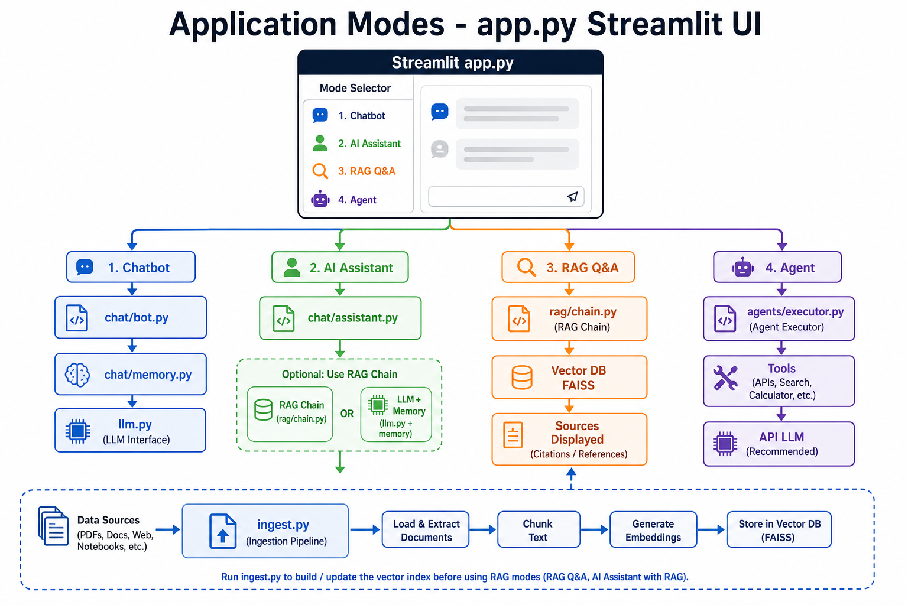

# User Manual

Complete guide for using the AI / ML / GenAI workspace.

## Table of contents

1. [Application overview](#application-overview)
2. [Mode: Chatbot](#mode-chatbot)
3. [Mode: AI Assistant](#mode-ai-assistant)
4. [Mode: RAG Q&A](#mode-rag-qa)
5. [Mode: Agent](#mode-agent)
6. [Document ingestion](#document-ingestion)
7. [MCP server](#mcp-server)
8. [Notebooks](#notebooks)
9. [Command reference](#command-reference)

---

## Application overview

The main entry point is `app.py`, a Streamlit web UI with four modes selectable from the sidebar:

| Mode | Module | Best for |
|------|--------|----------|
| Chatbot | `chat/bot.py` | Casual conversation with memory |
| AI Assistant | `chat/assistant.py` | Helpful assistant, optional RAG grounding |
| RAG Q&A | `rag/chain.py` | Questions strictly from your documents |
| Agent | `agents/executor.py` | Tasks requiring tools (math, workflows) |



---

## Mode: Chatbot

**Purpose:** Simple conversational chat with conversation history.

**How to use:**

1. Run `uv run streamlit run app.py`
2. Select **Chatbot** in the sidebar
3. Type a message and press Enter

**Behavior:**

- Remembers prior messages in the session via `chat/memory.py`
- Uses the configured LLM (`rag/llm.py`)
- Does **not** search your documents unless you use AI Assistant with RAG enabled

**Example prompts:**

- "Hello, what can you help me with?"
- "Remember that my project is about customer support."

---

## Mode: AI Assistant

**Purpose:** General-purpose assistant that can optionally ground answers in your documents.

**How to use:**

1. Select **AI Assistant** in the sidebar
2. Toggle **Use RAG** if you have built a vector index (`ingest.py`)
3. Ask your question

**Behavior:**

- With RAG enabled: searches `vector_db/` and answers from retrieved context
- Without RAG: behaves like a standard LLM assistant with memory
- Saves conversation history between turns

**When to use:**

- General help with optional document grounding
- Flexible assistant for mixed tasks

---

## Mode: RAG Q&A

**Purpose:** Answer questions **only** from documents in `data/raw/`.

**Prerequisites:**

1. Documents in `data/raw/`
2. Vector index built: `uv run python ingest.py`

**How to use:**

1. Select **RAG Q&A** in the sidebar
2. Ask a question about your documents
3. View the answer and expand **Sources** to see which files were used

**Behavior:**

- Retrieves top-K relevant chunks (`TOP_K` in `.env`, default 4)
- Shows source file paths in the Sources expander
- Says "I don't know" if context does not contain the answer (per prompt template)

**Example workflow:**

```powershell
# 1. Add report.pdf to data/raw/
# 2. Rebuild index
uv run python ingest.py
# 3. Ask: "What are the key findings in the report?"
```

---

## Mode: Agent

**Purpose:** Run an AI agent that can call tools to complete tasks.

**Prerequisites:**

- Set `USE_API_LLM=true` and `OPENAI_API_KEY` in `.env` (recommended)
- Local GGUF models may not support tool calling

**How to use:**

1. Select **Agent** in the sidebar
2. Describe a task, e.g. "Calculate 15% of 240 and count words in 'hello world'"

**Available tools** (`agents/tools.py`):

| Tool | Description |
|------|-------------|
| `calculator` | Evaluate math expressions |
| `word_count` | Count words in text |

**Multi-step workflows** (`agents/workflows.py`):

```python
from agents.workflows import research_and_summarize
result = research_and_summarize("renewable energy trends")
```

---

## Document ingestion

**Script:** `ingest.py`

**Pipeline:**

1. Load documents from `data/raw/` (`rag/loader.py`)
2. Split into chunks (`rag/splitter.py`)
3. Create embeddings (`rag/embeddings.py`)
4. Save FAISS index to `vector_db/` (`rag/vector_store.py`)

```powershell
uv run python ingest.py
```

**Re-run after:**

- Adding new documents
- Changing `CHUNK_SIZE` or `CHUNK_OVERLAP` in `.env`
- Changing `EMBEDDING_MODEL`

**Supported formats:** PDF, TXT, Markdown

---

## MCP server

**Purpose:** Expose project tools to external clients (Cursor, Claude Desktop, etc.) via Model Context Protocol.

**Start server:**

```powershell
uv run python mcp_server/server.py
```

**Built-in tools:**

| Tool | Description |
|------|-------------|
| `greet` | Return a greeting for a name |
| `word_count` | Count words in text |

**Cursor configuration** — reference `mcp_server/config.json`:

```json
{
  "mcpServers": {
    "ai-ml-genai": {
      "command": "uv",
      "args": ["run", "python", "mcp_server/server.py"],
      "cwd": "C:\\MY_SPACE\\AI_ML_GENAI"
    }
  }
}
```

**Add custom tools:** Register new functions in `mcp_server/server.py` or add helpers in `mcp_server/tools/`.

---

## Notebooks

**Location:** `notebooks/experiments.ipynb`

Use for:

- Testing chunk sizes before full ingestion
- Prototyping prompts
- Exploring retrieval quality

```powershell
uv run jupyter lab notebooks/
```

---

## Models

See **[Models Guide](models.md)** for:

- OpenAI API vs local GGUF
- Where to download models (Hugging Face, etc.)
- Embedding models for RAG
- Which model to use for each app mode

---

## Command reference

Full run/activate/dependency guide: **[Run, Activate & Dependencies](run-and-dependencies.md)**

### Activate virtual environment (optional)

```powershell
.\.venv\Scripts\Activate.ps1    # PowerShell
deactivate                      # When done
```

Or use `uv run` before any command — no activation needed.

### Run commands

| Command | Description |
|---------|-------------|
| `uv run streamlit run app.py` | Start web UI |
| `uv run python ingest.py` | Build vector index |
| `uv run python mcp_server/server.py` | Start MCP server |
| `uv run pytest` | Run tests |
| `uv run jupyter lab notebooks/` | Open notebooks |

### Setup & dependencies

| Command | Description |
|---------|-------------|
| `uv sync --extra dev` | Install core + dev dependencies |
| `uv sync --extra local-llm` | Add local GGUF support |
| `uv add <package>` | Add a new dependency |
| `uv remove <package>` | Remove a dependency |
| `uv sync` | Reinstall after pull or changes |
