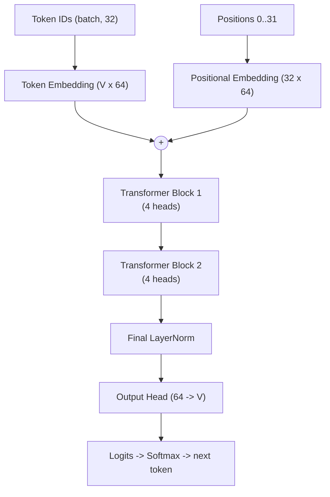
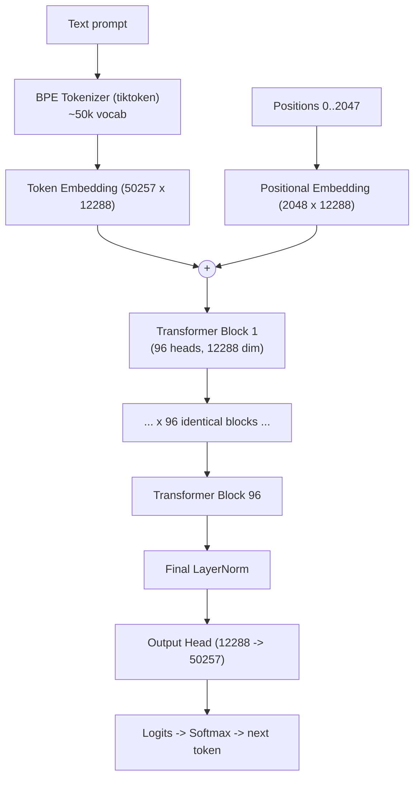
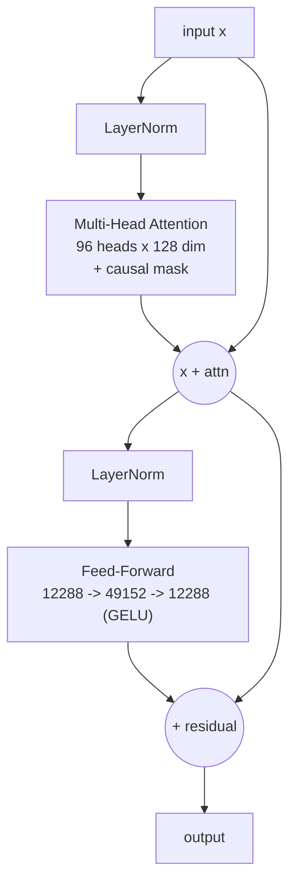
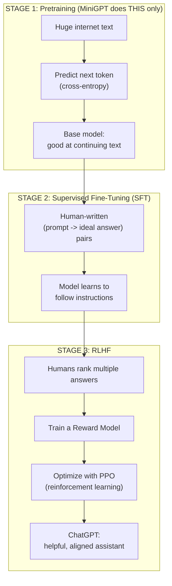

# MiniGPT vs. ChatGPT — Architecture Comparison

A complete side-by-side comparison of **your MiniGPT** and the **original ChatGPT**
(built on GPT-3.5 / GPT-4), so you understand what is the same, what is different,
and how the real thing is built.

> **TL;DR:** MiniGPT and ChatGPT share the **same core architecture** (a decoder-only
> Transformer). The differences are **scale**, **tokenizer**, and — most importantly —
> the **extra training stages** (SFT + RLHF) that make ChatGPT actually "chat".

---

## Table of Contents
1. [Quick verdict](#1-quick-verdict)
2. [Spec-by-spec comparison](#2-spec-by-spec-comparison)
3. [Similarities](#3-similarities-what-is-the-same)
4. [Dissimilarities](#4-dissimilarities-what-is-different)
5. [MiniGPT architecture diagram](#5-minigpt-architecture-diagram)
6. [ChatGPT architecture diagram](#6-original-chatgpt-architecture-diagram)
7. [The biggest difference: how ChatGPT is trained](#7-the-biggest-difference-how-chatgpt-is-trained)
8. [Component-by-component](#8-component-by-component-mapping)
9. [Summary](#9-summary)

---

## 1. Quick verdict

| Question | Answer |
|----------|--------|
| Same family of model? | ✅ Yes — both are **decoder-only Transformers** |
| Same core math (attention, FF, residuals)? | ✅ Yes, identical concepts |
| Same scale? | ❌ No — ChatGPT is ~1.5 **million times** bigger |
| Same tokenizer? | ❌ No — MiniGPT = word-level, ChatGPT = BPE |
| Same training? | ❌ No — ChatGPT adds **SFT + RLHF** on top of pretraining |
| Can MiniGPT "chat" like ChatGPT? | ❌ No — it only continues text; it was never aligned to follow instructions |

---

## 2. Spec-by-spec comparison

| Feature | **MiniGPT (yours)** | **GPT-3 (ChatGPT base)** | **GPT-4 (est.)** |
|---------|--------------------:|-------------------------:|-----------------:|
| Architecture | Decoder-only Transformer | Decoder-only Transformer | Decoder-only (MoE, est.) |
| Parameters | ~110 K | 175 B | ~1.8 T (est.) |
| Layers (blocks) | 2 | 96 | 120+ (est.) |
| Embedding dim | 64 | 12,288 | ~18,432 (est.) |
| Attention heads | 4 | 96 | 128+ (est.) |
| Head dimension | 16 | 128 | 128 (est.) |
| Feed-forward hidden | 256 | 49,152 | ~65,536 (est.) |
| Context length | 32 tokens | 2,048 tokens | 8K–128K tokens |
| Vocabulary | 71 words | 50,257 BPE tokens | ~100,277 BPE tokens |
| Tokenizer | Word-level (custom) | BPE (`tiktoken`) | BPE (`tiktoken`) |
| Training data | 1 song (~150 words) | ~500 B tokens | Trillions of tokens |
| Training hardware | 1 CPU, ~2 min | 1000s of GPUs, weeks | 10,000s of GPUs, months |
| Training stages | Pretraining only | Pretrain + SFT + RLHF | Pretrain + SFT + RLHF |

---

## 3. Similarities (what IS the same)

Both models use the **exact same building blocks**. This is why MiniGPT is a genuine
learning tool — you learn the real architecture, just small.

| Component | In MiniGPT | In ChatGPT | Same? |
|-----------|-----------|-----------|:-----:|
| Decoder-only design | ✅ | ✅ | ✅ |
| Token embeddings | `nn.Embedding` | Learned embeddings | ✅ |
| Positional embeddings | Learned | Learned (GPT-3) | ✅ |
| Multi-head self-attention | ✅ 4 heads | ✅ 96 heads | ✅ concept |
| Scaled dot-product attention | `QKᵀ/√d` | `QKᵀ/√d` | ✅ |
| **Causal masking** | ✅ | ✅ | ✅ |
| Residual connections | ✅ | ✅ | ✅ |
| Layer normalization (Pre-LN) | ✅ | ✅ | ✅ |
| Feed-forward network (MLP) | 64→256→64 | 12288→49152→12288 | ✅ concept |
| GELU activation | ✅ | ✅ | ✅ |
| Next-token prediction objective | ✅ | ✅ (pretraining) | ✅ |
| Cross-entropy loss | ✅ | ✅ | ✅ |
| Autoregressive generation | ✅ | ✅ | ✅ |
| Temperature + top-k sampling | ✅ | ✅ (+ top-p) | ✅ |

**Key insight:** If you understand `attention.py`, `transformer.py`, and `model.py`,
you understand the core of how ChatGPT's neural network works.

---

## 4. Dissimilarities (what IS different)

### 4a. Scale
The single most obvious difference. ChatGPT is not a *different kind* of model — it's the
same design scaled up by ~6 orders of magnitude, which unlocks emergent abilities.

### 4b. Tokenizer
| | MiniGPT | ChatGPT |
|---|---|---|
| Unit | Whole words | Subword pieces (BPE) |
| Unknown words | Become `<UNK>` | Split into known sub-pieces |
| Library | Custom `tokenizer.py` | `tiktoken` |

### 4c. Training stages (the reason it "chats")
MiniGPT does **only pretraining**. ChatGPT adds two more stages — see [section 7](#7-the-biggest-difference-how-chatgpt-is-trained).

### 4d. Engineering optimizations ChatGPT has (MiniGPT does not)
| Optimization | Purpose | In MiniGPT? |
|--------------|---------|:-----------:|
| KV-cache | Fast generation (reuse past keys/values) | ❌ |
| Flash Attention | Memory-efficient attention | ❌ |
| Dropout | Regularization | ❌ |
| Weight tying | Share embedding + output weights | ❌ |
| Mixed precision (fp16/bf16) | Faster training | ❌ |
| Model/tensor parallelism | Split across many GPUs | ❌ |
| Rotary / ALiBi position encodings | Better long-context (newer models) | ❌ (uses learned) |
| Safety / alignment filtering | Refuse harmful output | ❌ |

### 4e. Capabilities
| | MiniGPT | ChatGPT |
|---|---|---|
| Continues text | ✅ | ✅ |
| Follows instructions | ❌ | ✅ |
| Answers questions | ❌ | ✅ |
| Multi-turn memory | ❌ | ✅ |
| Refuses harmful requests | ❌ | ✅ |
| Multimodal (images) | ❌ | ✅ (GPT-4) |

---

## 5. MiniGPT architecture diagram



**2 blocks, 4 heads, 64 dims, ~110K parameters.**

---

## 6. Original ChatGPT architecture diagram

The **neural network** is the same shape — just far deeper and wider.



### Inside ONE ChatGPT block (identical structure to MiniGPT's block)



> Compare this with the block diagram in **NEURAL_NETWORK.md** — it is the **same graph**,
> only the numbers change (64→12288, 4→96 heads, 256→49152 FF).

---

## 7. The biggest difference: how ChatGPT is trained

This is what turns a plain text-predictor (like MiniGPT) into an assistant.



| Stage | Goal | Does MiniGPT do it? |
|-------|------|:-------------------:|
| 1. Pretraining | Learn language by predicting next token | ✅ Yes |
| 2. SFT | Learn to follow instructions | ❌ No |
| 3. RLHF | Align to human preferences | ❌ No |

**This is why MiniGPT only continues lyrics** ("twinkle" → "twinkle little star")
instead of answering questions. It has Stage 1 only.

---

## 8. Component-by-component mapping

| MiniGPT file / part | ChatGPT equivalent | Difference |
|---------------------|--------------------|-----------|
| `tokenizer.py` (word-level) | BPE via `tiktoken` | Subword vs word |
| `token_embedding` | Token embedding | Size: 64 vs 12,288 |
| `pos_embedding` | Positional embedding | 32 vs 2,048 positions |
| `attention.py` | Multi-head self-attention | 4 vs 96 heads, + KV-cache/Flash |
| `create_causal_mask` | Causal mask | Identical concept |
| `FeedForward` | MLP block | 256 vs 49,152 hidden |
| `TransformerBlock` | Transformer block | 2 vs 96 stacked |
| `model.py` forward | Forward pass | Same graph, bigger |
| `train.py` (pretraining) | Stage 1 only | ChatGPT adds SFT + RLHF |
| `generate.py` sampling | Decoding | + top-p, repetition penalties |

---

## 9. Summary

```
                 ┌───────────────────────────────────────────┐
                 │   SAME core architecture (decoder-only)   │
                 │   attention • residuals • LayerNorm • FF  │
                 └───────────────────────────────────────────┘
                                    │
        ┌───────────────────────────┴───────────────────────────┐
        ▼                                                         ▼
   ┌──────────┐                                          ┌──────────────┐
   │ MiniGPT  │                                          │   ChatGPT    │
   ├──────────┤                                          ├──────────────┤
   │ 110K params                                         │ 175B+ params │
   │ 2 layers │                                          │ 96+ layers   │
   │ word tok │                                          │ BPE tok      │
   │ pretrain │                                          │ +SFT +RLHF   │
   │ 1 song   │                                          │ internet     │
   └──────────┘                                          └──────────────┘
```

**What to take away:**
1. You already built the **real architecture** — the neural network is genuinely the same design.
2. The gap to ChatGPT is **scale + tokenizer + alignment training (SFT/RLHF)**, not a different model type.
3. To make MiniGPT more "ChatGPT-like", the next learning steps would be: switch to BPE, train on more data, then add instruction fine-tuning.

See also: **NEURAL_NETWORK.md** (neuron/parameter details) and **FLOW.md** (call flows).
