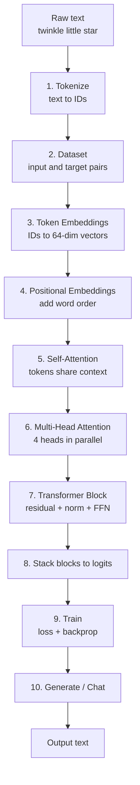

# How to Build an LLM — The 10 Steps (with Significance & Importance)

A single, complete walkthrough of how MiniGPT (and every GPT-style LLM) is built,
**step by step**. For each step you get:

- **What it is** — plain-English explanation
- **Why it matters** — its significance and importance
- **In MiniGPT** — where it lives in this project (works for both PyTorch & TensorFlow)

> Model specs used throughout: vocab = 120, embedding = 64, heads = 4, layers = 2,
> sequence length = 32 → **110,720 parameters**.

---

## The big picture

An LLM is fundamentally a **next-word predictor**. Everything below exists to make that
prediction accurate and context-aware.



> A rendered PNG of this diagram is in [`diagrams/`](diagrams/)
> (`HOW_TO_BUILD_AN_LLM__01__flowchart-td.png`).

---

## Step 1 — Tokenization

**What it is:** Convert text into integer IDs the model can process. MiniGPT uses a
word-level tokenizer with a fixed vocabulary plus special tokens (`<PAD>`, `<UNK>`,
`<BOS>`, `<EOS>`).

```
"twinkle little star"  →  [4, 9, 12]
```

**Why it matters:**
- Neural networks only do math on **numbers**, not text.
- The vocabulary defines what the model *can* express — its entire "alphabet".
- Tokenization choices control sequence length, memory, and how well rare words are handled.

**Significance:** This is the bridge between human language and the model. Get it wrong and
nothing else works. Real LLMs (GPT-3/4) use **BPE subword** tokenization so they can encode
*any* text; MiniGPT uses whole words for simplicity.

**In MiniGPT:** `common/tokenizer.py`

---

## Step 2 — Dataset (next-token pairs)

**What it is:** Turn the token stream into training samples. Each sample is a sliding
window; the target is the input shifted by one position.

```
Input : [t0, t1, t2, ..., t31]
Target: [t1, t2, t3, ..., t32]   ← "predict the next token"
```

**Why it matters:**
- This defines the **learning task**: given some words, predict the next one.
- It is *self-supervised* — no human labels needed; the text labels itself.

**Significance:** This simple "predict the next token" objective, scaled to the internet,
is the entire foundation of modern LLMs. It's how the model learns grammar, facts, and style.

**In MiniGPT:** `dataset.py` (PyTorch `DataLoader` / TensorFlow `tf.data`)

---

## Step 3 — Token Embeddings

**What it is:** Map each token ID to a learned dense vector (here, 64 numbers). A lookup
table of shape `(vocab, 64)`.

```
token 4  →  [0.12, -0.03, 0.88, ... ]   (64 numbers)
```

**Why it matters:**
- IDs like `4` and `9` have no inherent meaning or relationship. Embeddings give each token
  a position in a **continuous space** where similar words end up near each other.
- These vectors are **learned** during training — meaning emerges from data.

**Significance:** Embeddings are where the model stores "what each word means". This is the
first place learning happens.

**In MiniGPT:** `model.py` → `token_embedding`

---

## Step 4 — Positional Embeddings

**What it is:** Add a second learned vector that encodes **position** (0, 1, 2, …, 31), so
the model knows word order.

```
final input = token_embedding + positional_embedding
```

**Why it matters:**
- Attention (next step) looks at all tokens *simultaneously* — by itself it has **no sense
  of order**. "star little twinkle" would look identical to "twinkle little star".
- Positional embeddings inject the notion of sequence.

**Significance:** Order is meaning in language. Without positions, an LLM is just a bag of
words. This is essential for coherent output.

**In MiniGPT:** `model.py` → `pos_embedding`

---

## Step 5 — Self-Attention

**What it is:** For every token, compute three vectors — **Query (Q)**, **Key (K)**,
**Value (V)** — and let each token "look at" every previous token to decide what's relevant.

```
Attention(Q, K, V) = softmax(Q · Kᵀ / √d_k) · V
```

Plus a **causal mask** so a token can only attend to itself and earlier tokens (never the
future).

**Why it matters:**
- This is **how tokens share context**. The word "are" can look back at "you" to predict
  "what you are".
- The mask is what makes GPT *autoregressive* — it prevents "cheating" by peeking ahead.

**Significance:** Attention is *the* breakthrough behind transformers (the 2017 "Attention
Is All You Need" paper). It replaced RNNs and made large-scale language modeling possible.

**In MiniGPT:** `attention.py` → `scaled_dot_product_attention`, `create_causal_mask`

---

## Step 6 — Multi-Head Attention

**What it is:** Run several attention operations ("heads") in parallel — here 4 heads of
16 dims each — then combine them.

```
64-dim vector → 4 heads × 16 dims → attention each → concat → mix
```

**Why it matters:**
- One attention head can only focus on one kind of relationship at a time.
- Multiple heads let the model track **several patterns simultaneously** — e.g. rhyme,
  repetition, phrase boundaries, long-range context.

**Significance:** Multi-head attention gives the model *richer* understanding from the same
input. It's a key reason transformers are so expressive.

**In MiniGPT:** `attention.py` → `MultiHeadAttention`

---

## Step 7 — The Transformer Block

**What it is:** Wrap attention and a feed-forward network with **residual connections** and
**layer normalization**:

```
x → LayerNorm → Multi-Head Attention → + x   (residual)
  → LayerNorm → Feed-Forward Network  → + x   (residual)
```

The **feed-forward network** (64 → 256 → 64 with GELU) lets each token "think" about what it
learned from attention.

**Why it matters:**
- **Residual connections** (`x + sublayer(x)`) let gradients flow through deep networks —
  without them, deep models won't train.
- **Layer normalization** keeps activations stable, making training reliable.
- **Feed-forward** adds non-linear processing power (most of the model's parameters live here).

**Significance:** This block is the reusable "unit of computation". Stacking it is how LLMs
scale from tiny (2 blocks) to huge (GPT-3 has 96).

**In MiniGPT:** `transformer.py` → `TransformerBlock`, `FeedForward`

---

## Step 8 — Stack Blocks into the GPT Model

**What it is:** Chain multiple transformer blocks, then a final LayerNorm and an output
layer that projects back to vocabulary-sized scores (**logits**).

```
embeddings → Block 1 → Block 2 → LayerNorm → Linear(64 → vocab) → logits
```

**Why it matters:**
- Each block refines the representation a little more. **Depth = capacity** to model
  complex patterns.
- The final linear layer turns internal vectors into a score for every possible next word.

**Significance:** This is the assembled "brain". More layers generally means a more capable
model (this is a big part of why bigger LLMs are smarter).

**In MiniGPT:** `model.py` → `MiniGPT`

---

## Step 9 — Training (Loss + Backpropagation)

**What it is:** Teach the model by:
1. **Forward pass** → produce logits (predicted next-token scores)
2. **Cross-entropy loss** → measure how wrong the prediction is vs the true next token
3. **Backpropagation** → compute how each weight contributed to the error
4. **Optimizer step (AdamW)** → nudge weights to reduce the error
5. Repeat for many epochs

```
loss starts ~2.9  →  drops to ~0.04  (model has learned the song)
```

**Why it matters:**
- **Cross-entropy** is the standard objective for classification/next-token prediction.
- **Backpropagation** is the algorithm that actually makes learning happen — it distributes
  "blame" for the error across all 110,720 parameters.
- The **optimizer** decides how fast/stably the model learns.

**Significance:** This is where a random-initialized network *becomes* a language model.
Everything before is architecture; this is the learning.

**In MiniGPT:**
- PyTorch: `train.py` — manual loop (`zero_grad` → `backward` → `step`)
- TensorFlow: `train.py` — `model.compile()` + `model.fit()`

---

## Step 10 — Generation & Chat

**What it is:** Use the trained model to produce text one token at a time
(**autoregressive** decoding):

1. Feed the prompt → get logits for the next token
2. Apply **temperature** (randomness) and **top-k** (limit choices)
3. **Sample** the next token from the probability distribution
4. Append it and repeat

```
"twinkle" → "little" → "star" → "how" → "i" → "wonder" → ...
```

**Why it matters:**
- **Greedy vs sampling:** low temperature = safe/repetitive; high = creative/risky.
- **Top-k** avoids picking absurd low-probability tokens.
- Feeding output back as input is what lets an LLM write whole sentences.

**Significance:** This is the part users actually experience — it turns a next-token
predictor into something that *writes* and *chats*.

**In MiniGPT:** `generate.py` (generation), `chat.py` (interactive loop)

---

## Worked example — "how i wonder" → "what"

Here is a concrete trace of the prompt **"how i wonder"** flowing through the trained
model to predict the next word. This is exactly what `generate.py` does, one token at a time.


### Step-by-step with real values

| Stage | Value | Shape |
|-------|-------|-------|
| Prompt | `"how i wonder"` | text |
| After tokenize (+`<BOS>`) | `[2, 11, 8, 13]` | (4,) |
| After embeddings | 64-dim vectors | (4, 64) |
| After 2 transformer blocks | refined vectors | (4, 64) |
| After output head | scores per token | (4, vocab) |
| Last-position logits | scores for next word | (vocab,) |
| After softmax + sample | picks `"what"` | 1 token |
| Repeat | `"what" → "you" → "are" → ...` | grows |

**Result:**
```
You: how i wonder
MiniGPT: what you are up above the world so high like a diamond in the sky ...
```

Each generated token is fed back in as input to predict the next one — this feedback loop
is what "autoregressive" means.

---

## Summary table

| # | Step | Significance | File |
|---|------|--------------|------|
| 1 | Tokenization | Text → numbers; defines the vocabulary | `common/tokenizer.py` |
| 2 | Dataset | Defines the self-supervised task | `dataset.py` |
| 3 | Token embeddings | Learns what words mean | `model.py` |
| 4 | Positional embeddings | Adds word order | `model.py` |
| 5 | Self-attention | Tokens share context (+ causal mask) | `attention.py` |
| 6 | Multi-head attention | Multiple relationships at once | `attention.py` |
| 7 | Transformer block | Residuals + norm + feed-forward | `transformer.py` |
| 8 | Stack into GPT | Depth = capacity | `model.py` |
| 9 | Training | Cross-entropy + backprop = learning | `train.py` |
| 10 | Generation / chat | Autoregressive text output | `generate.py`, `chat.py` |

---

## What you learn by finishing all 10 steps

- How embeddings are learned
- How self-attention works and **why masking is needed**
- How multi-head attention adds richness
- Why **residual connections** and **layer normalization** make deep training possible
- What **feed-forward networks** contribute
- How **cross-entropy loss** and **backpropagation** train the model
- How **greedy vs sampling** generation differs

> Next steps to go beyond MiniGPT: switch to **BPE** tokenization, train on a larger corpus,
> then add **instruction fine-tuning (SFT)** and **RLHF** — the extra stages that turn a base
> model into an assistant like ChatGPT (see `COMPARISON.md`).
