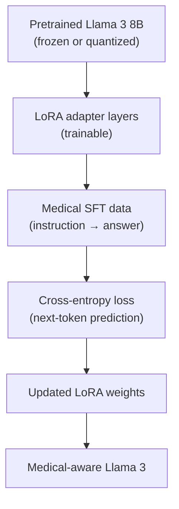
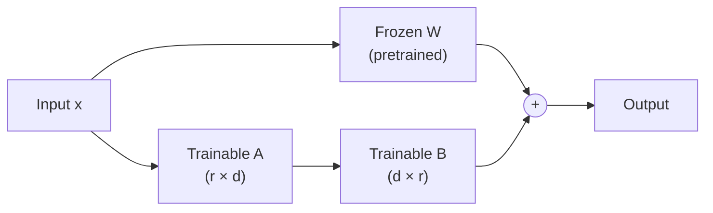
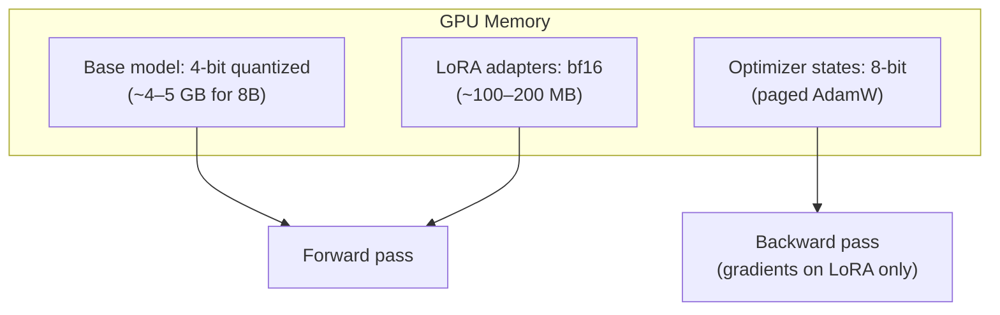
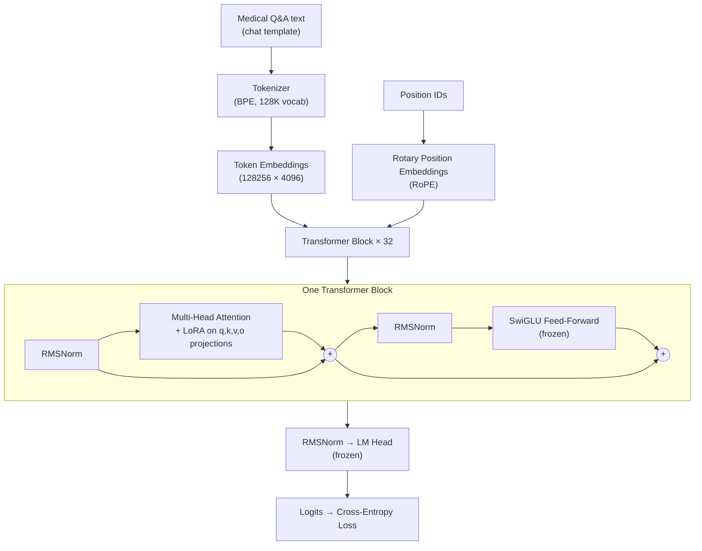

# Fine-Tuning Architecture — Llama 3 + QLoRA for Medical SFT

> **📖 All content is also in [COMPLETE_MANUAL.md](COMPLETE_MANUAL.md)** — Part III (sections 14–21) and Part IV diagrams.

How the model, LoRA adapters, and training objective fit together.

---

## Table of Contents

1. [Overview](#1-overview)
2. [Base model: Llama 3 8B Instruct](#2-base-model-llama-3-8b-instruct)
3. [LoRA (Low-Rank Adaptation)](#3-lora-low-rank-adaptation)
4. [QLoRA (Quantized LoRA)](#4-qlora-quantized-lora)
5. [SFT objective](#5-sft-objective)
6. [Architecture diagram](#6-architecture-diagram)
7. [What gets trained vs frozen](#7-what-gets-trained-vs-frozen)
8. [Parameter counts](#8-parameter-counts)
9. [Comparison with MiniGPT](#9-comparison-with-minigpt)

---

## 1. Overview



**Three key ideas:**

| Concept | Meaning |
|---------|---------|
| **Pretrained base** | Llama 3 already knows language, reasoning, and general knowledge |
| **LoRA** | Small trainable matrices injected into attention layers |
| **SFT** | Supervised learning on (question, answer) pairs |

---

## 2. Base model: Llama 3 8B Instruct

| Property | Value |
|----------|-------|
| Parameters | ~8 billion |
| Architecture | Decoder-only Transformer |
| Layers | 32 transformer blocks |
| Hidden size | 4096 |
| Attention heads | 32 |
| Context length | 8192 tokens |
| Chat format | User / assistant header tokens |

We use the **Instruct** variant because it already follows instructions — fine-tuning builds on that capability rather than teaching it from scratch.

**Source:** [meta-llama/Meta-Llama-3-8B-Instruct](https://huggingface.co/meta-llama/Meta-Llama-3-8B-Instruct)

---

## 3. LoRA (Low-Rank Adaptation)

Instead of updating all 8B weights, LoRA adds small **low-rank matrices** to specific layers.

### The math

For a frozen weight matrix **W** (d × d), LoRA adds:

```
W' = W + (B × A)
```

Where:
- **A** is (r × d) — down-projection
- **B** is (d × r) — up-projection
- **r** is the rank (default: 16, much smaller than d = 4096)

Only **A** and **B** are trained. **W** stays frozen.



### Target modules (in this project)

LoRA is applied to the **attention projection layers**:

| Module | Role |
|--------|------|
| `q_proj` | Query projection |
| `k_proj` | Key projection |
| `v_proj` | Value projection |
| `o_proj` | Output projection |

Configured in `config.py`:

```python
lora_target_modules = ["q_proj", "k_proj", "v_proj", "o_proj"]
lora_r = 16
lora_alpha = 32
```

**Scaling:** LoRA output is scaled by `lora_alpha / lora_r` (here: 32/16 = 2.0).

---

## 4. QLoRA (Quantized LoRA)

QLoRA loads the base model in **4-bit NormalFloat (NF4)** quantization, dramatically reducing VRAM:



| Method | Base model precision | Trainable params | VRAM (8B) |
|--------|---------------------|------------------|-----------|
| Full fine-tune | bf16 | 8B | ~80 GB |
| LoRA | bf16 | ~4–40M | ~16 GB |
| **QLoRA** | **4-bit NF4** | **~4–40M** | **~8 GB** |

Enabled by default in `train.py` via `BitsAndBytesConfig`.

---

## 5. SFT objective

**Supervised Fine-Tuning** teaches the model to produce the correct assistant response for a given user message.

### Training sample

```
User:      "What is hypertension?"
Assistant: "Hypertension is high blood pressure..."
```

### Loss

Standard **causal language modeling** loss (cross-entropy) on the assistant's tokens:


The model learns: given the user question (and all prior assistant tokens), predict the next token.

**Implemented by:** `SFTTrainer` from Hugging Face TRL in `train.py`.

---

## 6. Architecture diagram

Full stack during fine-tuning:



---

## 7. What gets trained vs frozen

| Component | Status during QLoRA |
|-----------|---------------------|
| Token embeddings | Frozen (4-bit) |
| Attention Q/K/V/O projections | **LoRA adapters trainable** |
| Feed-forward layers | Frozen (4-bit) |
| Layer normalization | Frozen |
| LM head (output) | Frozen (4-bit) |
| LoRA matrices (A, B) | **Trainable (bf16)** |

---

## 8. Parameter counts

Approximate for Llama 3 8B with default LoRA config (r=16, 4 target modules × 32 layers):

| | Parameters |
|--|------------|
| Full Llama 3 8B | ~8,000,000,000 |
| LoRA adapters (this config) | ~13,000,000 (~0.16%) |
| MiniGPT (for comparison) | ~110,000 |

The LoRA adapter file (`adapter_model.safetensors`) is typically **50–100 MB**, vs **~16 GB** for the full model.

---

## 9. Comparison with MiniGPT

| Aspect | MiniGPT | Llama 3 + QLoRA |
|--------|---------|----------------|
| Starting point | Random weights | Pretrained on trillions of tokens |
| Trainable params | 100% (110K) | ~0.16% (~13M) |
| Tokenizer | Word-level (120 vocab) | BPE (128K vocab) |
| Context | 32 tokens | 8192 tokens |
| Training data | 1 song | Medical Q&A JSONL |
| GPU needed | CPU OK | NVIDIA 8+ GB VRAM |
| Use case | Learn transformers | Domain adaptation |

Both use the **same core idea**: predict the next token with cross-entropy loss. The difference is **scale**, **pretraining**, and **efficiency** of adaptation.

---

## References

- [LoRA: Low-Rank Adaptation of Large Language Models](https://arxiv.org/abs/2106.09685)
- [QLoRA: Efficient Finetuning of Quantized LLMs](https://arxiv.org/abs/2305.14314)
- [Llama 3 Model Card](https://github.com/meta-llama/llama3/blob/main/MODEL_CARD.md)
- [Hugging Face PEFT](https://huggingface.co/docs/peft)
- [Hugging Face TRL SFTTrainer](https://huggingface.co/docs/trl/sft_trainer)
