# Llama 3 Medical Fine-Tuning — Complete Manual

**Single reference document** containing the user guide, architecture, flow diagrams, commands, configuration, and troubleshooting for fine-tuning an **existing pretrained Llama 3** model on medical data.

> **Disclaimer:** For **education and research only**. Not for clinical diagnosis, treatment, or any medical decision-making.

---

## Table of Contents

### Part I — Getting Started
1. [Overview](#1-overview)
2. [What you are building](#2-what-you-are-building)
3. [Folder structure](#3-folder-structure)
4. [Prerequisites](#4-prerequisites)
5. [Quick start (5 commands)](#5-quick-start-5-commands)
6. [Step-by-step user guide](#6-step-by-step-user-guide)

### Part II — Data & Training
7. [Medical dataset format](#7-medical-dataset-format)
8. [Training commands](#8-training-commands)
9. [Inference commands](#9-inference-commands)
10. [Configuration reference](#10-configuration-reference)
11. [Script reference](#11-script-reference)
12. [Understanding outputs](#12-understanding-outputs)
13. [Hyperparameter tuning](#13-hyperparameter-tuning)

### Part III — Architecture
14. [Architecture overview](#14-architecture-overview)
15. [Base model: Llama 3 8B Instruct](#15-base-model-llama-3-8b-instruct)
16. [LoRA explained](#16-lora-explained)
17. [QLoRA explained](#17-qlora-explained)
18. [SFT training objective](#18-sft-training-objective)
19. [What gets trained vs frozen](#19-what-gets-trained-vs-frozen)
20. [Parameter counts](#20-parameter-counts)
21. [Comparison with MiniGPT](#21-comparison-with-minigpt)

### Part IV — Flow Diagrams
22. [Diagram: Big picture](#22-diagram-big-picture)
23. [Diagram: File dependencies](#23-diagram-file-dependencies)
24. [Diagram: Training flow](#24-diagram-training-flow)
25. [Diagram: One training step](#25-diagram-one-training-step)
26. [Diagram: Inference flow](#26-diagram-inference-flow)
27. [Diagram: Data pipeline](#27-diagram-data-pipeline)
28. [Diagram: LoRA vs full fine-tuning](#28-diagram-lora-vs-full-fine-tuning)
29. [Diagram: End-to-end lifecycle](#29-diagram-end-to-end-lifecycle)
30. [Diagram: MiniGPT vs Llama 3 fine-tune](#30-diagram-minigpt-vs-llama-3-fine-tune)
31. [Diagram: LoRA math](#31-diagram-lora-math)
32. [Diagram: QLoRA memory](#32-diagram-qlora-memory)
33. [Diagram: Full model stack](#33-diagram-full-model-stack)
34. [Diagram: SFT overview](#34-diagram-sft-overview)
35. [Diagram: Training sequence](#35-diagram-training-sequence)

### Part V — Support
36. [Troubleshooting](#36-troubleshooting)
37. [Safety & compliance](#37-safety--compliance)
38. [Supported pretrained models](#38-supported-pretrained-models)
39. [References & next steps](#39-references--next-steps)

---

# Part I — Getting Started

## 1. Overview

This project fine-tunes an **existing, pretrained Meta Llama 3 8B Instruct** model on medical Q&A data using **QLoRA** (Quantized Low-Rank Adaptation).

```
Existing Llama 3 (pretrained)  +  Medical Q&A data  →  Fine-tuned medical Llama 3
     8B params (frozen)              your JSONL           LoRA adapter (~13M params)
```

| | **MiniGPT** (`../pytorch/`) | **This project** (`finetune/`) |
|--|------------------------------|--------------------------------|
| Model | 110K params, built from scratch | **Llama 3 8B, pretrained by Meta** |
| Method | Train all weights on tiny text | **LoRA adapters on frozen base** |
| Data | One song (~150 words) | Medical Q&A JSONL |
| GPU | CPU is fine | **NVIDIA GPU required** |
| Purpose | Learn transformer internals | **Adapt Llama 3 to medical Q&A** |

**This does NOT train a model from scratch.** It downloads existing Llama 3 weights from Hugging Face, freezes them, and trains small adapter layers on your medical data.

---

## 2. What you are building

You are performing **Supervised Fine-Tuning (SFT)** with **LoRA** on a pretrained Llama 3 model.

**You are NOT:**
- Training a model from scratch (that is what MiniGPT does)
- Replacing all 8 billion parameters (LoRA only trains small adapter matrices)
- Building a certified medical product

**You ARE:**
- Downloading an existing Llama 3 model pretrained by Meta
- Teaching it to answer medical questions in the style of your dataset
- Learning the industry-standard fine-tuning workflow used in production

---

## 3. Folder structure

```
finetune/
├── COMPLETE_MANUAL.md     ← THIS FILE (all docs, diagrams, user guide)
├── README.md              ← short overview (links here)
├── USER_GUIDE.md          ← user guide (also in this manual, Part I–II)
├── FLOW.md                ← flow diagrams (also in this manual, Part IV)
├── ARCHITECTURE.md        ← architecture (also in this manual, Part III)
│
├── config.py              ← default hyperparameters
├── dataset.py             ← JSONL loader + Llama 3 chat template
├── train.py               ← fine-tune existing Llama 3 (QLoRA)
├── inference.py           ← chat with fine-tuned model
├── merge_lora.py          ← merge LoRA into full model (optional)
├── setup_check.py         ← verify GPU + Hugging Face + model access
├── validate_data.py       ← validate JSONL before training
├── render_diagrams.py     ← export diagrams to PNG
├── requirements.txt       ← Python dependencies
├── .env.example           ← Hugging Face token template
│
├── data/
│   └── medical_sft.jsonl  ← sample medical Q&A (20 pairs)
├── output/                ← fine-tuned LoRA adapters saved here
│   └── llama3-medical-lora/
└── diagrams/              ← rendered PNG flowcharts
    └── README.md
```

---

## 4. Prerequisites

### Hardware

| Setup | VRAM | Notes |
|-------|------|-------|
| **QLoRA (default)** | 8 GB+ | Recommended — 4-bit quantization |
| **LoRA fp16** | 16 GB+ | Use `--no-4bit` flag |
| **CPU only** | — | **Not supported** for Llama 3 8B |

### Software

- Python 3.10 or 3.11
- CUDA toolkit (NVIDIA GPU)
- pip

### Accounts

1. [Hugging Face account](https://huggingface.co/join)
2. Accept license: [Meta Llama 3 8B Instruct](https://huggingface.co/meta-llama/Meta-Llama-3-8B-Instruct)
3. Create [access token](https://huggingface.co/settings/tokens) (Read permission)

### Python packages (installed via requirements.txt)

| Package | Purpose |
|---------|---------|
| `torch` | Deep learning framework |
| `transformers` | Load existing Llama 3 model |
| `peft` | LoRA adapter layers |
| `trl` | SFTTrainer for fine-tuning |
| `datasets` | Dataset loading |
| `bitsandbytes` | 4-bit quantization (QLoRA) |
| `accelerate` | Multi-GPU / memory management |

---

## 5. Quick start (5 commands)

```bash
cd finetune
pip install -r requirements.txt
huggingface-cli login
python setup_check.py
python train.py
python inference.py
```

**What `train.py` does:**
1. Downloads **existing** Llama 3 8B weights from Hugging Face (~16 GB, first run only)
2. **Freezes** all 8 billion pretrained parameters
3. Attaches trainable LoRA adapters
4. Trains on `data/medical_sft.jsonl`
5. Saves adapters to `output/llama3-medical-lora/`

---

## 6. Step-by-step user guide

### Step 1 — Open the finetune folder

```bash
cd finetune
```

### Step 2 — Create virtual environment (recommended)

```bash
# Windows
python -m venv .venv
.venv\Scripts\activate

# Linux / macOS
python3 -m venv .venv
source .venv/bin/activate
```

### Step 3 — Install dependencies

```bash
pip install -r requirements.txt
```

### Step 4 — Log in to Hugging Face

```bash
huggingface-cli login
```

Paste your access token when prompted.

### Step 5 — Run setup check

```bash
python setup_check.py
```

Verifies: Python packages, GPU, HF login, Llama 3 model access.

### Step 6 — Validate dataset (optional)

```bash
python validate_data.py
python validate_data.py --data data/my_custom_data.jsonl
```

### Step 7 — Fine-tune

```bash
python train.py
```

### Step 8 — Chat with fine-tuned model

```bash
python inference.py
python inference.py --prompt "What is hypertension?"
```

### Step 9 — Export diagram PNGs (optional)

```bash
python render_diagrams.py
```

PNG files are saved to `diagrams/`.

---

# Part II — Data & Training

## 7. Medical dataset format

Each line in your `.jsonl` file is one JSON object:

```json
{"instruction": "What is hypertension?", "input": "", "output": "Hypertension is high blood pressure..."}
{"instruction": "Interpret this lab result", "input": "HbA1c: 8.2%", "output": "An HbA1c of 8.2% indicates..."}
```

| Field | Required | Description |
|-------|----------|-------------|
| `instruction` | **Yes** | The question or task |
| `input` | No | Extra context (lab results, symptoms, etc.) |
| `output` | **Yes** | The ideal answer the model should learn |

### Tips for good medical data

| Do | Don't |
|----|-------|
| Use accurate, sourced medical content | Include patient names or IDs (HIPAA) |
| Write clear, complete answers | Use one-word answers |
| Cover diverse medical topics | Rely on only 5–10 examples |
| Include disclaimers when appropriate | Present as definitive diagnosis |
| Aim for 500+ examples for real improvement | Expect production quality from 20 demos |

**Included sample:** `data/medical_sft.jsonl` has 20 Q&A pairs (hypertension, diabetes, stroke, asthma, etc.) for learning the workflow.

---

## 8. Training commands

### Basic

```bash
python train.py
```

### Custom data and output

```bash
python train.py --data data/my_medical_data.jsonl --output-dir output/my-run
```

### Hyperparameters

```bash
python train.py --epochs 5 --lr 1e-4 --batch-size 2 --lora-r 16
```

### Different existing pretrained model

```bash
python train.py --base-model meta-llama/Llama-3.2-3B-Instruct
```

### Full fp16 LoRA (no 4-bit)

```bash
python train.py --no-4bit
```

### All CLI flags

| Flag | Default | Description |
|------|---------|-------------|
| `--base-model` | `meta-llama/Meta-Llama-3-8B-Instruct` | Existing pretrained model on Hugging Face |
| `--data` | `data/medical_sft.jsonl` | Training data path |
| `--output-dir` | `output/llama3-medical-lora` | Where to save LoRA adapters |
| `--epochs` | `3` | Training epochs |
| `--batch-size` | `2` | Batch size per GPU |
| `--lr` | `2e-4` | Learning rate |
| `--max-seq-length` | `512` | Max token length per sample |
| `--no-4bit` | off | Disable QLoRA (use fp16 LoRA) |
| `--lora-r` | `16` | LoRA rank |
| `--seed` | `42` | Random seed |

### Expected training time (~20 examples, 3 epochs)

| GPU | Time |
|-----|------|
| RTX 3060 (12 GB) | ~5–15 min |
| RTX 4090 (24 GB) | ~3–8 min |
| A100 (40 GB) | ~2–5 min |

---

## 9. Inference commands

### Interactive chat

```bash
python inference.py
```

### Single question

```bash
python inference.py --prompt "What are the symptoms of diabetes?"
```

### Specific adapter folder

```bash
python inference.py --adapter-dir output/my-run
```

### Merge LoRA into standalone model (deployment)

```bash
python merge_lora.py \
  --adapter-dir output/llama3-medical-lora \
  --merged-dir output/llama3-medical-merged
```

---

## 10. Configuration reference

All defaults are in `config.py`:

| Setting | Default | Description |
|---------|---------|-------------|
| `base_model` | `meta-llama/Meta-Llama-3-8B-Instruct` | Existing pretrained model |
| `use_4bit` | `True` | QLoRA 4-bit quantization |
| `data_path` | `data/medical_sft.jsonl` | Training data |
| `max_seq_length` | `512` | Max tokens per sample |
| `val_split` | `0.1` | 10% held out for validation |
| `lora_r` | `16` | LoRA rank |
| `lora_alpha` | `32` | LoRA scaling factor |
| `lora_dropout` | `0.05` | LoRA dropout |
| `lora_target_modules` | `q_proj, k_proj, v_proj, o_proj` | Layers with LoRA |
| `num_train_epochs` | `3` | Full passes over data |
| `per_device_train_batch_size` | `2` | Batch size |
| `gradient_accumulation_steps` | `4` | Effective batch = 2 × 4 = 8 |
| `learning_rate` | `2e-4` | Optimizer learning rate |
| `warmup_ratio` | `0.05` | LR warmup fraction |
| `logging_steps` | `10` | Print loss every N steps |
| `eval_steps` | `50` | Run validation every N steps |
| `save_steps` | `100` | Save checkpoint every N steps |

---

## 11. Script reference

| Script | Command | What it does |
|--------|---------|--------------|
| **Setup check** | `python setup_check.py` | Verify GPU, HF login, Llama 3 access |
| **Validate data** | `python validate_data.py` | Check JSONL format before training |
| **Train** | `python train.py` | Download Llama 3 + fine-tune with QLoRA |
| **Inference** | `python inference.py` | Chat with fine-tuned model |
| **Merge LoRA** | `python merge_lora.py` | Bake adapters into full model |
| **Render diagrams** | `python render_diagrams.py` | Export Mermaid diagrams to PNG |

---

## 12. Understanding outputs

After `python train.py`, check `output/llama3-medical-lora/`:

| File | Purpose |
|------|---------|
| `adapter_config.json` | LoRA settings (rank, alpha, target modules) |
| `adapter_model.safetensors` | Learned LoRA weight deltas (~50–100 MB) |
| `tokenizer.json` | Tokenizer vocabulary |
| `tokenizer_config.json` | Tokenizer settings |
| `run_info.json` | Training metadata (epochs, LR, sample counts) |
| `checkpoint-*/` | Intermediate checkpoints during training |

The base Llama 3 weights are **not** copied here — only the small LoRA adapter. At inference time, the base model is loaded from Hugging Face and the adapter is applied on top.

---

## 13. Hyperparameter tuning

| Parameter | When to change |
|-----------|----------------|
| `--epochs` | More data → fewer epochs; tiny data → watch overfitting |
| `--lr` | Lower (1e-5) if model forgets general knowledge |
| `--batch-size` | Increase if you have VRAM headroom |
| `--lora-r` | Higher (32–64) for complex domains; lower (8) to save VRAM |
| `--max-seq-length` | Increase for long medical explanations |

**Signs of overfitting:**
- Training loss drops but validation loss rises
- Model repeats exact training phrases
- Fails on rephrased questions

**Fix:** Reduce epochs, add more data, lower learning rate.

---

# Part III — Architecture

## 14. Architecture overview

**Three key ideas:**

| Concept | Meaning |
|---------|---------|
| **Pretrained base** | Llama 3 already knows language, reasoning, general knowledge |
| **LoRA** | Small trainable matrices injected into attention layers |
| **SFT** | Supervised learning on (question, answer) pairs |

---

## 15. Base model: Llama 3 8B Instruct

| Property | Value |
|----------|-------|
| Parameters | ~8 billion |
| Architecture | Decoder-only Transformer |
| Layers | 32 transformer blocks |
| Hidden size | 4096 |
| Attention heads | 32 |
| Context length | 8192 tokens |
| Tokenizer | BPE, ~128K vocabulary |
| Source | [meta-llama/Meta-Llama-3-8B-Instruct](https://huggingface.co/meta-llama/Meta-Llama-3-8B-Instruct) |

We use the **Instruct** variant because it already follows instructions — fine-tuning adapts it to medical Q&A rather than teaching language from scratch.

**Loaded in `train.py` via:**
```python
model = AutoModelForCausalLM.from_pretrained("meta-llama/Meta-Llama-3-8B-Instruct")
```

---

## 16. LoRA explained

Instead of updating all 8B weights, LoRA adds small **low-rank matrices** to attention layers.

### The math

For a frozen weight matrix **W** (d × d), LoRA adds:

```
W' = W + (B × A)
```

- **A** = (r × d) down-projection — **trainable**
- **B** = (d × r) up-projection — **trainable**
- **W** = pretrained weights — **frozen**
- **r** = rank (default 16, much smaller than d = 4096)

**Scaling:** output scaled by `lora_alpha / lora_r` = 32/16 = 2.0

### Target modules

| Module | Role |
|--------|------|
| `q_proj` | Query projection |
| `k_proj` | Key projection |
| `v_proj` | Value projection |
| `o_proj` | Output projection |

---

## 17. QLoRA explained

QLoRA loads the base model in **4-bit NF4** quantization:

| Method | Base precision | Trainable params | VRAM (8B) |
|--------|---------------|------------------|-----------|
| Full fine-tune | bf16 | 8B | ~80 GB |
| LoRA | bf16 | ~13M | ~16 GB |
| **QLoRA (default)** | **4-bit NF4** | **~13M** | **~8 GB** |

---

## 18. SFT training objective

**Supervised Fine-Tuning** teaches the model to produce correct assistant responses.

```
User:      "What is hypertension?"
Assistant: "Hypertension is high blood pressure..."
```

**Loss:** cross-entropy on assistant tokens (next-token prediction).

Implemented by `SFTTrainer` from Hugging Face TRL in `train.py`.

---

## 19. What gets trained vs frozen

| Component | Status during QLoRA |
|-----------|---------------------|
| Token embeddings | Frozen (4-bit) |
| Attention Q/K/V/O | **LoRA adapters trainable** |
| Feed-forward layers | Frozen (4-bit) |
| Layer normalization | Frozen |
| LM head (output) | Frozen (4-bit) |
| LoRA matrices (A, B) | **Trainable (bf16)** |

---

## 20. Parameter counts

| | Parameters |
|--|------------|
| Full Llama 3 8B | ~8,000,000,000 |
| LoRA adapters (default config) | ~13,000,000 (~0.16%) |
| MiniGPT (comparison) | ~110,000 |

Adapter file: ~50–100 MB. Full model: ~16 GB.

---

## 21. Comparison with MiniGPT

| Aspect | MiniGPT | Llama 3 + QLoRA |
|--------|---------|----------------|
| Starting point | Random weights | **Pretrained on trillions of tokens** |
| Trainable params | 100% (110K) | ~0.16% (~13M) |
| Tokenizer | Word-level (120 vocab) | BPE (128K vocab) |
| Context | 32 tokens | 8192 tokens |
| Training data | 1 song | Medical Q&A JSONL |
| GPU | CPU OK | NVIDIA 8+ GB VRAM |

Both use the same core idea: **predict the next token** with cross-entropy loss.

---

# Part IV — Flow Diagrams

> Diagrams render in GitHub, Cursor, and most Markdown viewers.
> Export as PNG: `python render_diagrams.py` → saves to `diagrams/`

---

## 22. Diagram: Big picture

Train once, use many times.

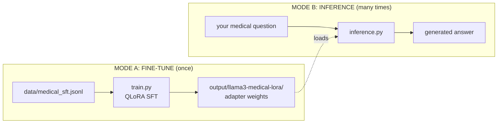

---

## 23. Diagram: File dependencies

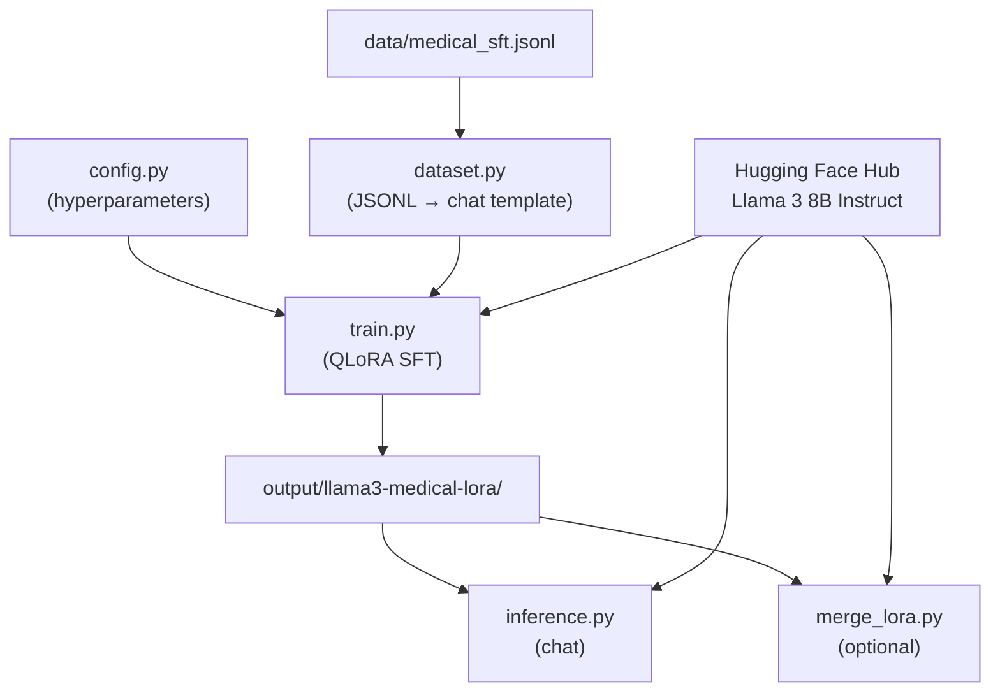

---

## 24. Diagram: Training flow

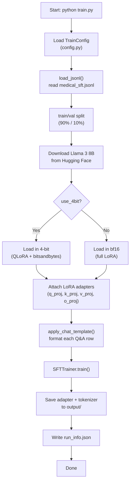

---

## 25. Diagram: One training step

```mermaid
sequenceDiagram
    participant Batch as Batch (Q&A text)
    participant Model as Llama 3 + LoRA
    participant Loss as Cross-Entropy Loss
    participant Opt as Optimizer

    Batch->>Model: Token IDs (input window)
    Model->>Model: Embeddings → Transformer blocks → logits
    Note over Model: Only LoRA weights receive gradients
    Model->>Loss: Predicted vs actual next token
    Loss->>Opt: Backpropagation
    Opt->>Model: Update LoRA weights only
```

---

## 26. Diagram: Inference flow

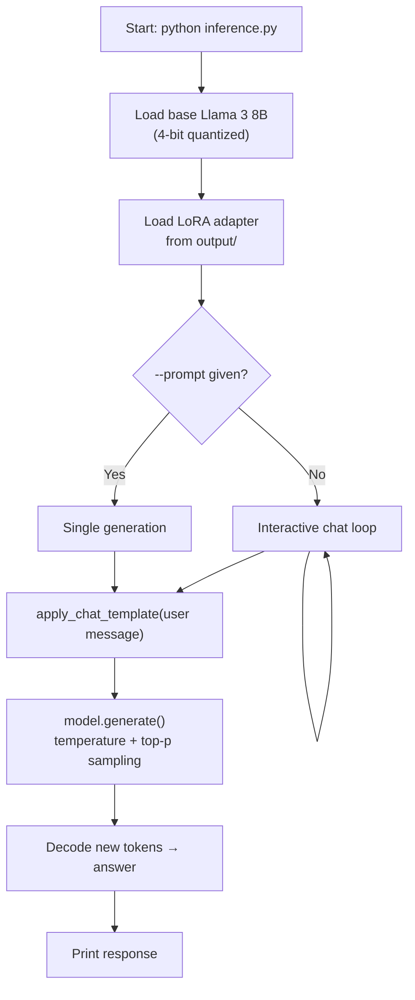

---

## 27. Diagram: Data pipeline


**Example:**
```
INPUT:  {"instruction": "What is hypertension?", "output": "Hypertension is..."}
OUTPUT: Llama 3 chat template with user + assistant header tokens
```

---

## 28. Diagram: LoRA vs full fine-tuning

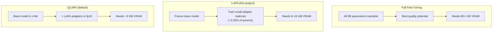

---

## 29. Diagram: End-to-end lifecycle

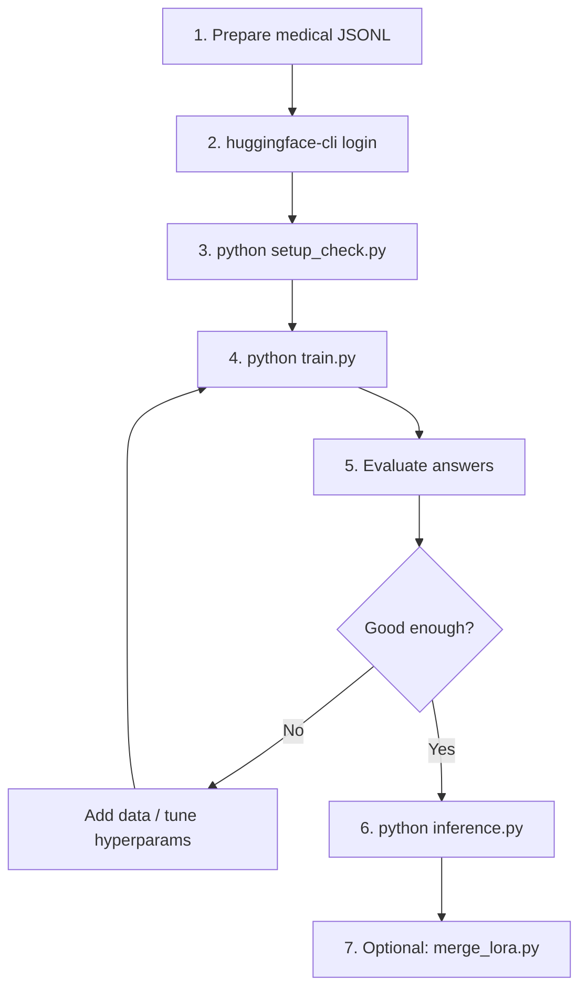

---

## 30. Diagram: MiniGPT vs Llama 3 fine-tune

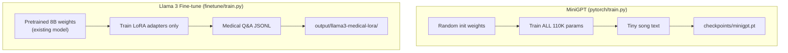

---

## 31. Diagram: LoRA math

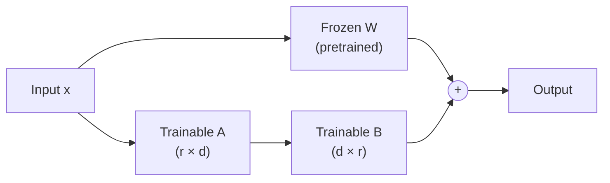

---

## 32. Diagram: QLoRA memory

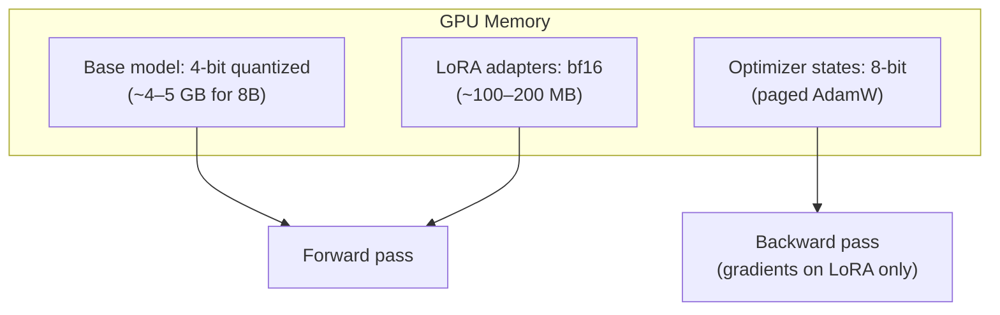

---

## 33. Diagram: Full model stack

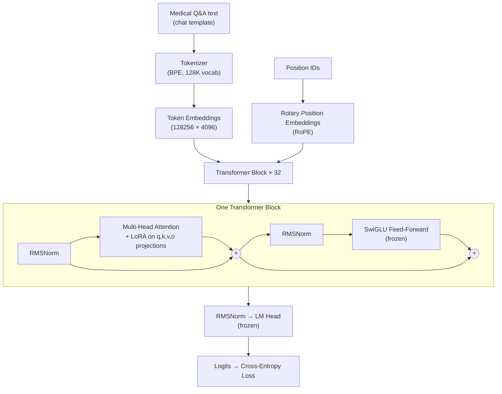

---

## 34. Diagram: SFT overview

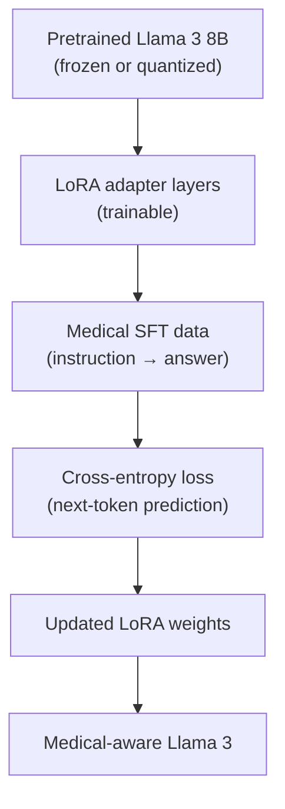

---

## 35. Diagram: Training sequence

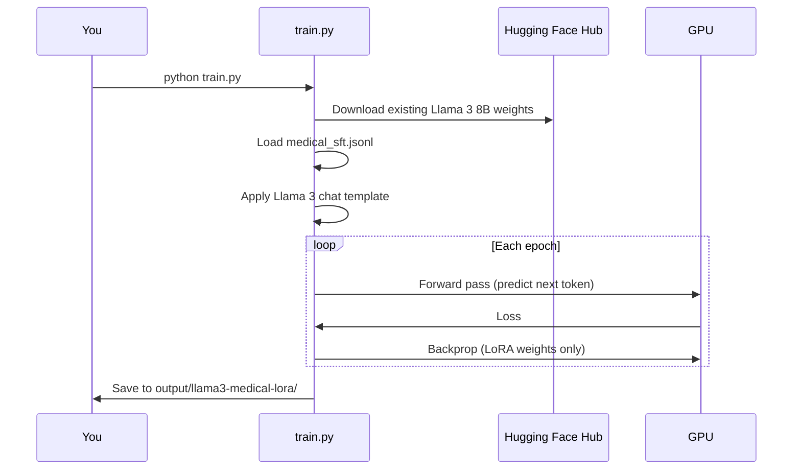

---

# Part V — Support

## 36. Troubleshooting

### Cannot access Llama 3 model

```
OSError: meta-llama/Meta-Llama-3-8B-Instruct is not a local folder
```

**Fix:**
1. Run `huggingface-cli login`
2. Accept license at https://huggingface.co/meta-llama/Meta-Llama-3-8B-Instruct
3. Wait for approval if pending
4. Run `python setup_check.py`

### CUDA out of memory

```bash
python train.py --batch-size 1
python train.py --lora-r 8
python train.py --max-seq-length 256
```

### bitsandbytes errors on Windows

QLoRA has limited Windows support. Options:
1. Use **WSL2** (Linux + CUDA)
2. Use `--no-4bit` with 16+ GB VRAM GPU
3. Use cloud GPU (Google Colab, RunPod, Lambda Labs)

### Model gives wrong medical answers

- Add more training data (100+ examples minimum)
- Train more epochs or tune learning rate
- Validate JSONL: `python validate_data.py`
- 20 demo examples teach the **workflow**, not production quality

### SFTTrainer / processing_class errors

```bash
pip install --upgrade transformers trl peft
```

### No GPU detected

```bash
python -c "import torch; print(torch.cuda.is_available())"
```

Llama 3 8B fine-tuning requires an NVIDIA GPU. Use a smaller model:
```bash
python train.py --base-model meta-llama/Llama-3.2-3B-Instruct
```

---

## 37. Safety & compliance

1. **Not medical advice** — include disclaimers in any user-facing app
2. **No PHI** — never use real patient data without de-identification and legal approval
3. **Hallucinations** — LLMs can invent plausible but wrong medical facts
4. **Regulatory** — clinical use may require FDA/CE or local regulatory review
5. **Human oversight** — qualified healthcare professionals must review outputs

---

## 38. Supported pretrained models

All are **existing pretrained models** — you only fine-tune, never train from scratch.

| Model | Hugging Face ID | VRAM (QLoRA) |
|-------|-----------------|--------------|
| **Llama 3 8B Instruct** (default) | `meta-llama/Meta-Llama-3-8B-Instruct` | ~8 GB |
| Llama 3.1 8B Instruct | `meta-llama/Meta-Llama-3.1-8B-Instruct` | ~8 GB |
| Llama 3.2 3B Instruct | `meta-llama/Llama-3.2-3B-Instruct` | ~4 GB |
| Mistral 7B Instruct | `mistralai/Mistral-7B-Instruct-v0.3` | ~8 GB |

```bash
python train.py --base-model meta-llama/Llama-3.2-3B-Instruct
```

---

## 39. References & next steps

### References

- [LoRA paper](https://arxiv.org/abs/2106.09685)
- [QLoRA paper](https://arxiv.org/abs/2305.14314)
- [Llama 3 Model Card](https://github.com/meta-llama/llama3/blob/main/MODEL_CARD.md)
- [Hugging Face PEFT](https://huggingface.co/docs/peft)
- [Hugging Face TRL SFTTrainer](https://huggingface.co/docs/trl/sft_trainer)
- [MiniGPT vs ChatGPT](../common/COMPARISON.md)

### Next steps

- [ ] Expand `data/medical_sft.jsonl` with curated medical content
- [ ] Run `python setup_check.py` before first training
- [ ] Evaluate on [MedQA](https://github.com/jind11/MedQA) or [PubMedQA](https://pubmedqa.github.io/)
- [ ] Add system prompt in `inference.py` for disclaimers
- [ ] Export diagrams: `python render_diagrams.py`
- [ ] Explore RLHF for further alignment (advanced)

---

*End of Complete Manual — `finetune/COMPLETE_MANUAL.md`*
