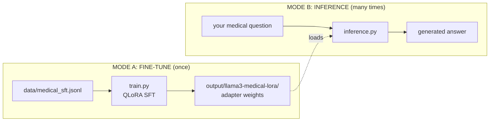
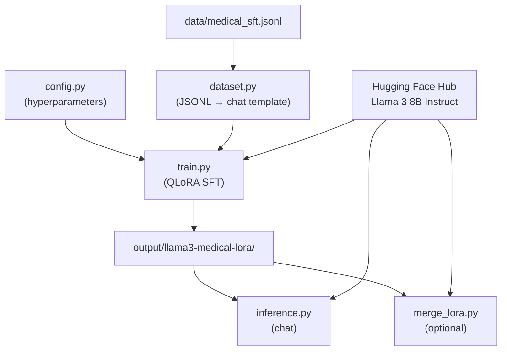
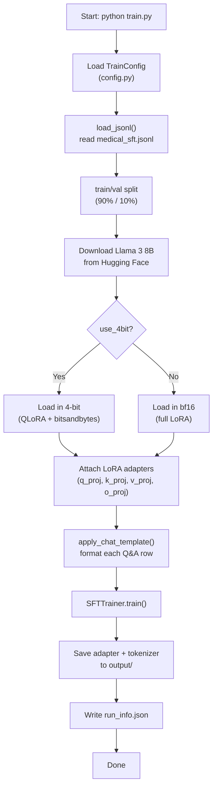
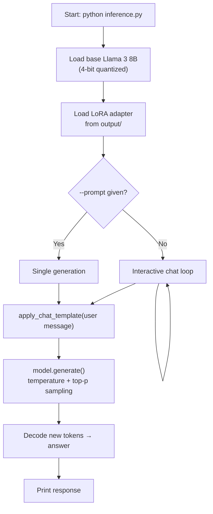
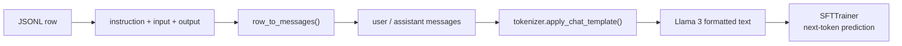
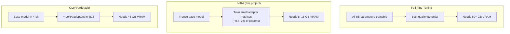
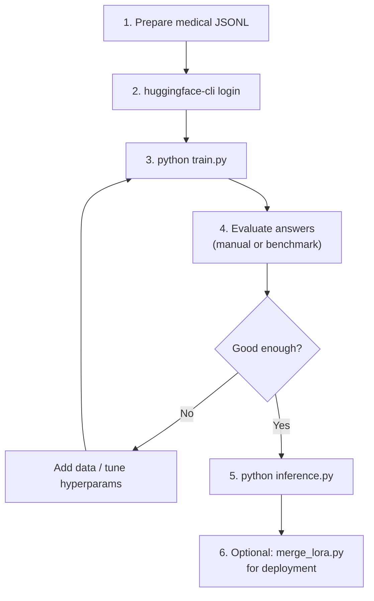
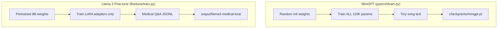

# Fine-Tuning Flow Diagrams

> **📖 All diagrams are also in [COMPLETE_MANUAL.md](COMPLETE_MANUAL.md)** — Part IV (sections 22–35).

How data and code flow through the Llama 3 medical fine-tuning pipeline.

Diagrams use [Mermaid](https://mermaid.js.org/) and render in GitHub, Cursor, and most Markdown viewers.
Export PNGs with `python render_diagrams.py`.

---

## 1. Big picture — train once, use many times



---

## 2. File dependency graph



---

## 3. Training flow (`python train.py`)



---

## 4. What one training step does

```mermaid
sequenceDiagram
    participant Batch as Batch (Q&A text)
    participant Model as Llama 3 + LoRA
    participant Loss as Cross-Entropy Loss
    participant Opt as Optimizer

    Batch->>Model: Token IDs (input window)
    Model->>Model: Embeddings → Transformer blocks → logits
    Note over Model: Only LoRA weights receive gradients
    Model->>Loss: Predicted vs actual next token
    Loss->>Opt: Backpropagation
    Opt->>Model: Update LoRA weights only
```

---

## 5. Inference flow (`python inference.py`)



---

## 6. Data pipeline — JSONL to training text



Example transformation:

```
INPUT (JSONL):
  instruction: "What is hypertension?"
  output:      "Hypertension is high blood pressure..."

OUTPUT (chat template text):
  <|begin_of_text|><|start_header_id|>user<|end_header_id|>
  What is hypertension?<|eot_id|>
  <|start_header_id|>assistant<|end_header_id|>
  Hypertension is high blood pressure...<|eot_id|>
```

---

## 7. LoRA vs full fine-tuning



---

## 8. End-to-end lifecycle



---

## 9. Comparison with MiniGPT training


