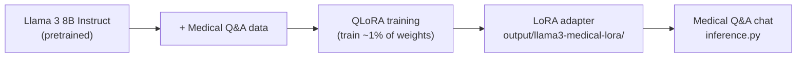
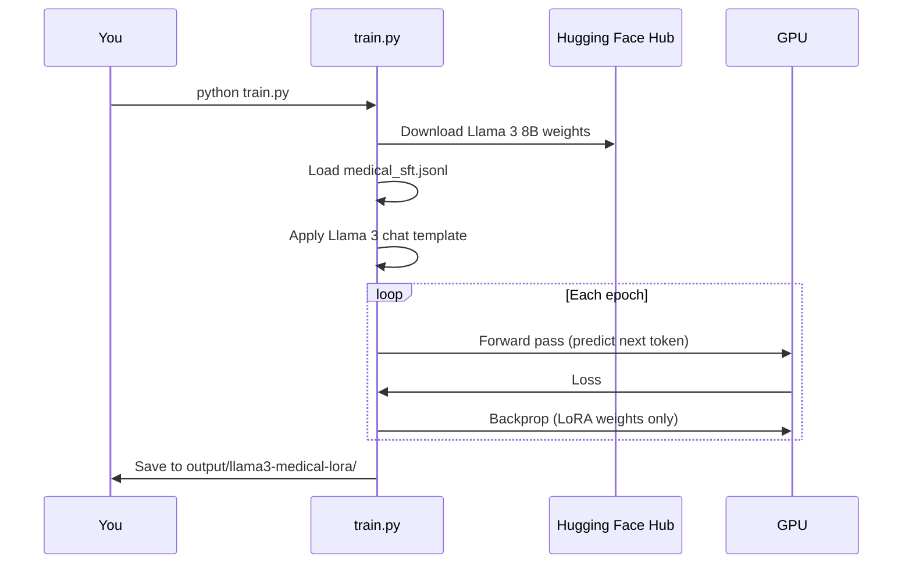

# User Guide — Llama 3 Medical Fine-Tuning

> **📖 All content is also in [COMPLETE_MANUAL.md](COMPLETE_MANUAL.md)** — the single master file with user guide, architecture, diagrams, and commands.

A complete walkthrough for setting up, training, and using the medical fine-tuned Llama 3 model in this folder.

---

## Table of Contents

1. [What you are building](#1-what-you-are-building)
2. [Prerequisites](#2-prerequisites)
3. [Step-by-step setup](#3-step-by-step-setup)
4. [Preparing medical data](#4-preparing-medical-data)
5. [Training](#5-training)
6. [Running inference](#6-running-inference)
7. [Understanding outputs](#7-understanding-outputs)
8. [Hyperparameter tuning](#8-hyperparameter-tuning)
9. [Troubleshooting](#9-troubleshooting)
10. [Safety & compliance](#10-safety--compliance)

---

## 1. What you are building

You are performing **Supervised Fine-Tuning (SFT)** with **LoRA** on a pretrained Llama 3 model:



**You are NOT:**
- Training a model from scratch (that is what MiniGPT does)
- Replacing all 8 billion parameters (LoRA only trains small adapter matrices)
- Building a certified medical product

**You ARE:**
- Teaching Llama 3 to answer medical questions in the style of your dataset
- Learning the industry-standard fine-tuning workflow used in production

---

## 2. Prerequisites

### Hardware

| Setup | VRAM | Notes |
|-------|------|-------|
| **QLoRA (default)** | 8 GB+ | Recommended — uses 4-bit quantization |
| **LoRA fp16** | 16 GB+ | Use `--no-4bit` flag |
| **CPU only** | — | Not supported for Llama 3 8B |

### Software

- **Python 3.10 or 3.11**
- **CUDA** (for NVIDIA GPU) — install matching PyTorch CUDA build
- **Git** (optional, for cloning)

### Accounts

1. Create a [Hugging Face](https://huggingface.co/join) account
2. Request access to [Meta Llama 3 8B Instruct](https://huggingface.co/meta-llama/Meta-Llama-3-8B-Instruct) (approval usually within minutes to hours)
3. Create an [access token](https://huggingface.co/settings/tokens) with **Read** permission

---

## 3. Step-by-step setup

### Step 1 — Navigate to the finetune folder

```bash
cd finetune
```

### Step 2 — Create a virtual environment (recommended)

```bash
# Windows
python -m venv .venv
.venv\Scripts\activate

# Linux / macOS
python3 -m venv .venv
source .venv/bin/activate
```

### Step 3 — Install dependencies

```bash
pip install -r requirements.txt
```

This installs: `torch`, `transformers`, `peft`, `trl`, `datasets`, `bitsandbytes`, `accelerate`.

### Step 4 — Log in to Hugging Face

```bash
huggingface-cli login
```

Paste your HF access token when prompted.

### Step 5 — Verify GPU (optional)

```bash
python -c "import torch; print('CUDA:', torch.cuda.is_available()); print('GPU:', torch.cuda.get_device_name(0) if torch.cuda.is_available() else 'none')"
```

Expected output:
```
CUDA: True
GPU: NVIDIA GeForce RTX ...
```

---

## 4. Preparing medical data

### Format

Create a `.jsonl` file — one JSON object per line:

```json
{"instruction": "What is hypertension?", "input": "", "output": "Hypertension is high blood pressure..."}
{"instruction": "Interpret this lab result", "input": "HbA1c: 8.2%", "output": "An HbA1c of 8.2% indicates..."}
```

### Tips for good medical SFT data

| Do | Don't |
|----|-------|
| Use accurate, sourced medical content | Include patient identifiers (HIPAA violation) |
| Write clear, complete answers | Use one-word answers |
| Cover diverse topics (cardiology, endocrinology, etc.) | Rely on only 5–10 examples for production |
| Include disclaimers in outputs when appropriate | Present outputs as definitive diagnoses |
| Aim for 500+ examples for noticeable improvement | Expect miracles from 20 examples |

### Sample data included

`data/medical_sft.jsonl` contains **20 medical Q&A pairs** for demonstration. Replace or expand this for real use.

---

## 5. Training

### Basic training

```bash
python train.py
```

### What happens during training



### Custom training runs

```bash
# Custom data file
python train.py --data data/my_data.jsonl

# Custom output folder
python train.py --output-dir output/run-v2

# Longer training
python train.py --epochs 5 --lr 1e-4

# Smaller LoRA rank (less VRAM, less capacity)
python train.py --lora-r 8

# Full precision LoRA (needs more VRAM)
python train.py --no-4bit
```

### Expected training time

| GPU | ~20 examples, 3 epochs |
|-----|------------------------|
| RTX 3060 (12 GB) | ~5–15 minutes |
| RTX 4090 (24 GB) | ~3–8 minutes |
| A100 (40 GB) | ~2–5 minutes |

### Monitor progress

Training prints loss every `logging_steps` (default: 10). Validation runs every `eval_steps` (default: 50).

---

## 6. Running inference

### Interactive chat

```bash
python inference.py
```

```
You: What is hypertension?
Assistant: Hypertension, also called high blood pressure, is a chronic condition...
```

### Single question (non-interactive)

```bash
python inference.py --prompt "What are the symptoms of diabetes?"
```

### Use a specific adapter

```bash
python inference.py --adapter-dir output/my-run
```

---

## 7. Understanding outputs

After training, `output/llama3-medical-lora/` contains:

| File / Folder | Purpose |
|---------------|---------|
| `adapter_config.json` | LoRA configuration (rank, alpha, target modules) |
| `adapter_model.safetensors` | Learned LoRA weight deltas |
| `tokenizer.json` / `tokenizer_config.json` | Tokenizer files |
| `run_info.json` | Training metadata (epochs, LR, sample counts) |
| `checkpoint-*/` | Intermediate checkpoints (if saved during training) |

### Merge for deployment (optional)

To bake LoRA weights into a single model file:

```bash
python merge_lora.py \
  --adapter-dir output/llama3-medical-lora \
  --merged-dir output/llama3-medical-merged
```

---

## 8. Hyperparameter tuning

| Parameter | Default | When to change |
|-----------|---------|----------------|
| `--epochs` | 3 | More data → fewer epochs; tiny data → watch for overfitting |
| `--lr` | 2e-4 | Lower (1e-5) if model forgets general knowledge |
| `--batch-size` | 2 | Increase if you have VRAM headroom |
| `--lora-r` | 16 | Higher (32–64) for complex domains; lower (8) to save VRAM |
| `--max-seq-length` | 512 | Increase for long medical explanations |

**Signs of overfitting** (with small datasets):
- Training loss keeps dropping but validation loss rises
- Model repeats exact phrases from training data
- Model fails on slightly rephrased questions

**Fix:** Reduce epochs, add more diverse data, or lower learning rate.

---

## 9. Troubleshooting

### `OSError: meta-llama/Meta-Llama-3-8B-Instruct is not a local folder`

- Run `huggingface-cli login`
- Accept the Llama 3 license on the model page
- Wait for approval if pending

### `CUDA out of memory`

```bash
# Try smaller batch or disable 4-bit issues on Windows:
python train.py --batch-size 1
python train.py --lora-r 8
python train.py --max-seq-length 256
```

### `bitsandbytes` errors on Windows

QLoRA (4-bit) has limited Windows support. Options:
1. Use **WSL2** with Linux + CUDA
2. Use `--no-4bit` with a GPU that has 16+ GB VRAM
3. Use a cloud GPU (Google Colab, Lambda Labs, RunPod)

### Model gives generic / wrong medical answers

- Add more high-quality training examples (100+ minimum for noticeable improvement)
- Train for more epochs
- Check that your JSONL format is correct
- Remember: 20 demo examples are for learning the **workflow**, not production quality

### `SFTTrainer` / `processing_class` errors

Upgrade packages:
```bash
pip install --upgrade transformers trl peft
```

---

## 10. Safety & compliance

1. **Not medical advice** — Always include disclaimers in user-facing applications.
2. **No PHI** — Never put real patient data in training files without proper de-identification and legal approval.
3. **Hallucinations** — LLMs can invent plausible-sounding but wrong medical facts. Always verify with authoritative sources.
4. **Regulatory** — A fine-tuned model used in clinical settings may require FDA/CE or local regulatory review.
5. **Human oversight** — Keep a qualified healthcare professional in the loop for any health-related decisions.

---

## Next steps

- Expand `data/medical_sft.jsonl` with curated medical content
- Evaluate on [MedQA](https://github.com/jind11/MedQA) or [PubMedQA](https://pubmedqa.github.io/)
- Add a system prompt in `inference.py` for consistent disclaimers
- Explore [RLHF](../common/COMPARISON.md) for further alignment (advanced)
