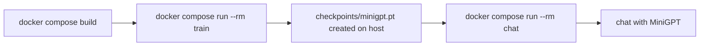

# MiniGPT — Docker Guide

Run MiniGPT anywhere without installing Python or PyTorch on your machine.
Everything runs inside a container.

---

## Why Dockerize?

| Benefit | Explanation |
|---------|-------------|
| No local setup | No need to install Python / PyTorch / dependencies |
| Reproducible | Same environment on any machine (Windows, Mac, Linux) |
| Isolated | Doesn't touch your system Python |
| Portable | Share one image; anyone can run it |

---

## Prerequisites

Install **Docker Desktop** (includes Docker Engine + Compose):
- Windows / Mac: https://www.docker.com/products/docker-desktop/
- Verify after install:
  ```bash
  docker --version
  docker compose version
  ```

> On Windows, run these in PowerShell **after** Docker Desktop is started.

---

## Files added for Docker

```
mini_gpt/
├── Dockerfile            # How to build the image (CPU-only PyTorch)
├── .dockerignore         # Files to exclude from the image
└── docker-compose.yml    # Short commands for train / chat
```

---

## Quick Start (using docker compose — recommended)

### 1. Build the image
```bash
docker compose build
```

### 2. Train the model
```bash
docker compose run --rm train
```
- Trains MiniGPT and saves `checkpoints/minigpt.pt` + `tokenizer.json`
- The `checkpoints/` folder is **mounted as a volume**, so the trained model
  appears on your host machine and persists.

### 3. Chat interactively
```bash
docker compose run --rm chat
```
```
You: twinkle
MiniGPT: twinkle little star
You: quit
```

> `--rm` removes the container after it exits (keeps things clean).
> Your trained model stays because it lives in the mounted `checkpoints/` folder.

---

## Alternative: plain Docker commands (no compose)

### Build
```bash
docker build -t minigpt .
```

### Train (mount checkpoints so the model persists on your host)
```bash
# PowerShell (Windows)
docker run --rm -v ${PWD}/checkpoints:/app/checkpoints minigpt python train.py

# Bash (Mac/Linux)
docker run --rm -v $(pwd)/checkpoints:/app/checkpoints minigpt python train.py
```

### Chat (interactive needs -it)
```bash
# PowerShell (Windows)
docker run --rm -it -v ${PWD}/checkpoints:/app/checkpoints minigpt python chat.py

# Bash (Mac/Linux)
docker run --rm -it -v $(pwd)/checkpoints:/app/checkpoints minigpt python chat.py
```

### One-shot generation
```bash
docker run --rm -v ${PWD}/checkpoints:/app/checkpoints minigpt python generate.py "twinkle"
```

### Custom training options
```bash
docker run --rm -v ${PWD}/checkpoints:/app/checkpoints minigpt python train.py --epochs 1000 --lr 0.001
```

---

## Key concepts explained

### Volumes (`-v`)
```
-v ${PWD}/checkpoints:/app/checkpoints
   └── host folder ──┘ └── container folder ┘
```
Links a folder on your computer to a folder inside the container. This is why the
trained model **survives** after the container stops — it's actually saved on your disk.

### Interactive flags (`-it`)
- `-i` keeps STDIN open (so `input("You: ")` works)
- `-t` allocates a terminal (nice prompt)
- Required for `chat.py`; not needed for `train.py` or `generate.py`.

### Why CPU-only PyTorch?
The `Dockerfile` installs the CPU build:
```dockerfile
RUN pip install --no-cache-dir torch --index-url https://download.pytorch.org/whl/cpu
```
MiniGPT is tiny and trains in ~2 minutes on CPU, so there is no need for the huge
GPU wheel (which would make the image several GB larger).

---

## Typical workflow



---

## Troubleshooting

| Problem | Solution |
|---------|----------|
| `docker: command not found` | Install Docker Desktop and restart your terminal |
| `Cannot connect to the Docker daemon` | Start Docker Desktop first |
| Chat exits immediately | Use `-it` (plain docker) or the `chat` compose service |
| `No trained model found` | Run the `train` step first |
| Model gone after restart | Make sure you mounted `-v .../checkpoints:/app/checkpoints` |
| Image too big | Ensure the CPU-only index URL is used (it is, in the Dockerfile) |

---

## Image size note

- Base `python:3.11-slim`: ~150 MB
- CPU-only PyTorch: ~200–300 MB
- **Total image: ~450–600 MB** (vs 2–3 GB for the GPU build)

---

## GPU support (optional, advanced)

MiniGPT does **not** need a GPU. If you still want one:
1. Install the NVIDIA Container Toolkit on the host.
2. Change the Dockerfile to install the CUDA PyTorch wheel (remove the CPU index URL).
3. Run with `--gpus all`.

For this learning project, **CPU is recommended** — it's simpler and fast enough.
