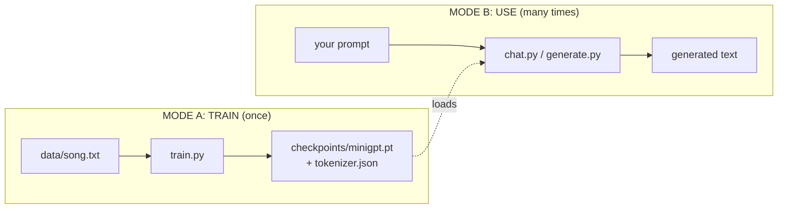
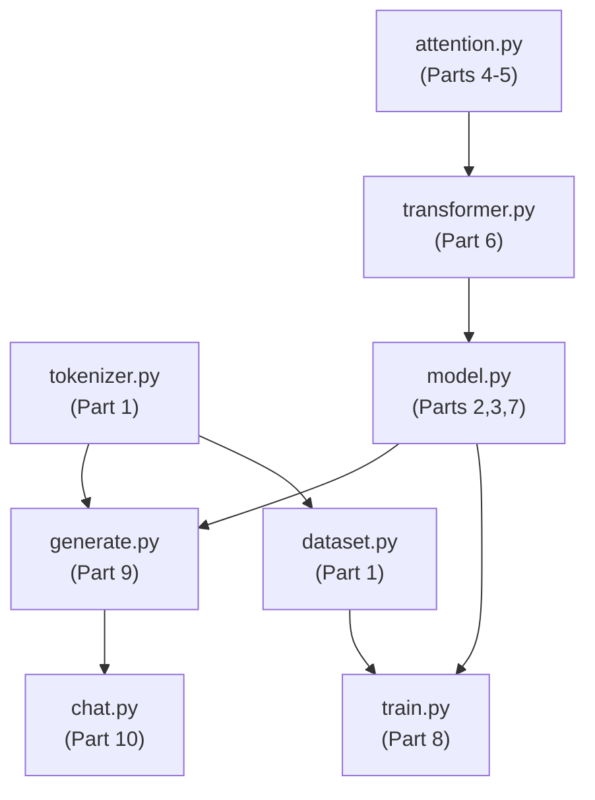
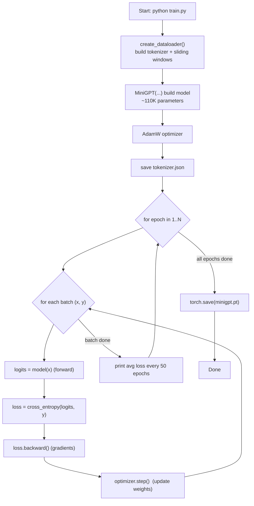
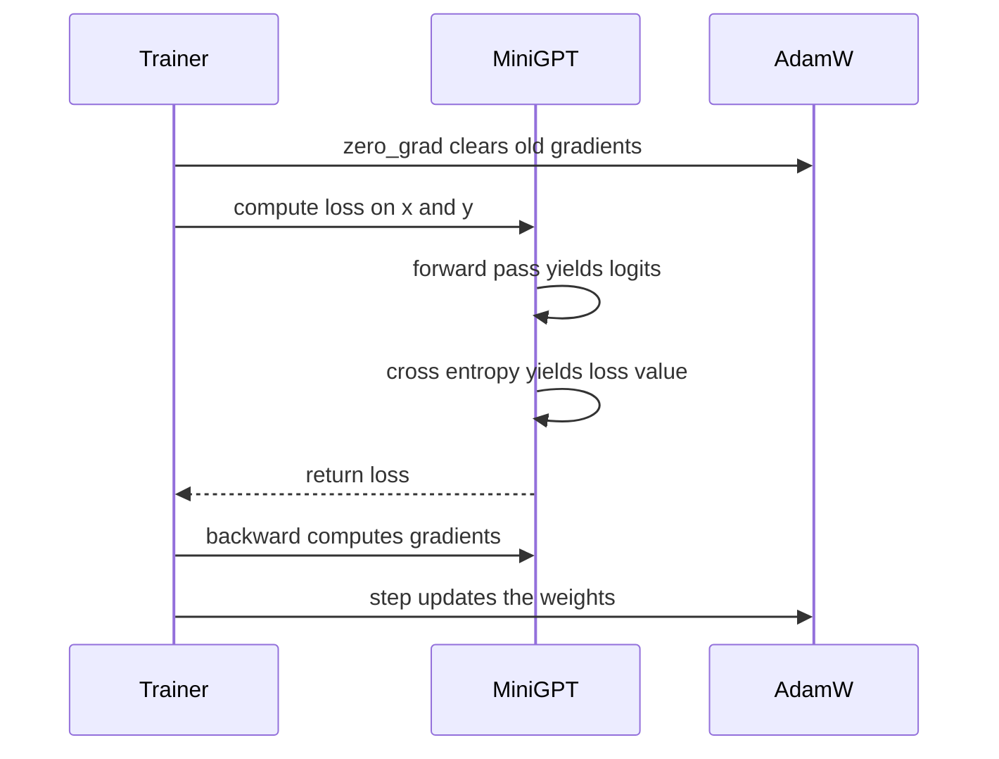
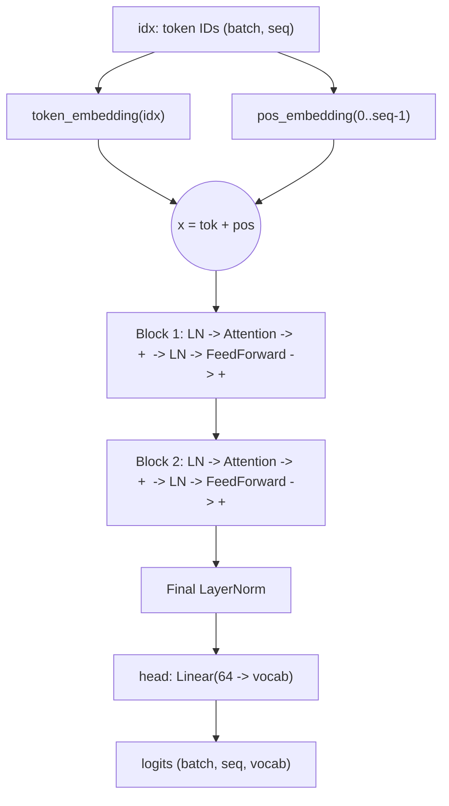
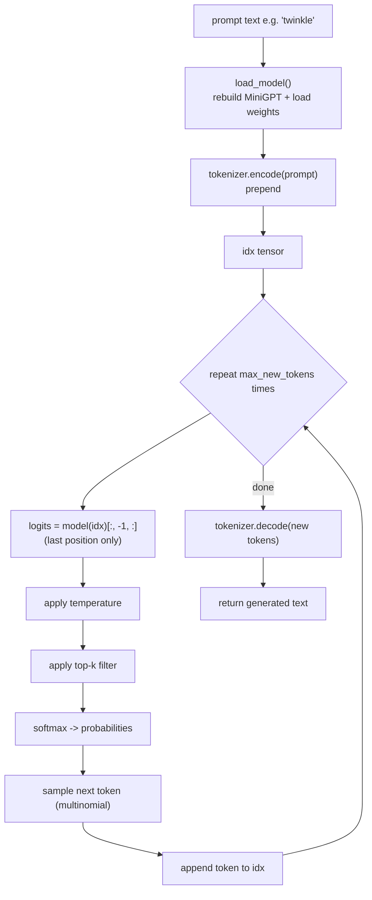
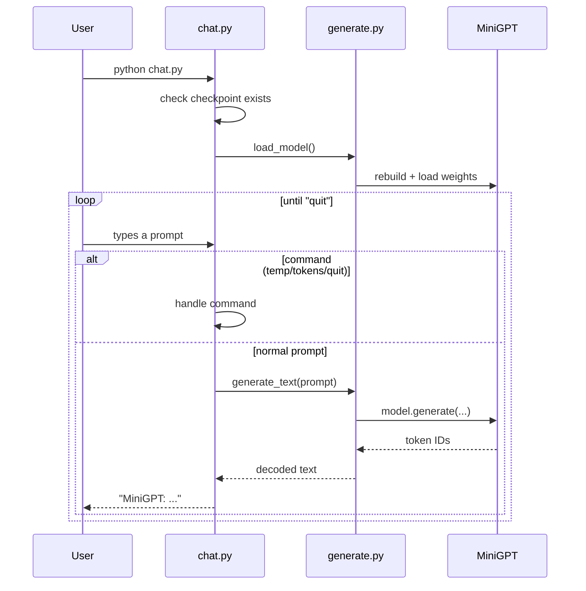
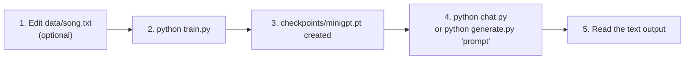

# MiniGPT — Flow & Call Diagrams

This document shows **how the code runs**: the high-level flow, the training path,
the inference/chat path, and which function calls which.

Diagrams use [Mermaid](https://mermaid.js.org/) and render automatically in Cursor,
GitHub, and most Markdown viewers.

---

## 1. Big picture — two modes

MiniGPT has exactly two ways it is used:



- **Train once** → produces a checkpoint.
- **Use many times** → loads that checkpoint to generate text.

---

## 2. File dependency graph (who imports whom)



---

## 3. TRAINING flow (`python train.py`)



### What one training step actually does



---

## 4. FORWARD PASS flow (`model(x)`)

This is the heart of the network — used in BOTH training and generation.



---

## 5. GENERATION / USE flow (`generate.py`, `chat.py`)



### Autoregressive loop (token-by-token)

```
Step 1:  [BOS] twinkle              -> predicts "twinkle"
Step 2:  [BOS] twinkle twinkle      -> predicts "little"
Step 3:  [BOS] twinkle twinkle little -> predicts "star"
...each new token is fed back in to predict the next.
```

---

## 6. CHAT call flow (`python chat.py`)



---

## 7. Data transformation summary (shapes at each stage)

| Stage | Example | Shape |
|-------|---------|-------|
| Raw text | `"twinkle little star"` | string |
| After `encode()` | `[2, 4, 9, 12]` | list[int] |
| Batched tensor | `[[2, 4, 9, 12]]` | (batch=1, seq=4) |
| After embeddings | vectors | (1, 4, 64) |
| After 2 blocks | vectors | (1, 4, 64) |
| After output head | logits | (1, 4, V) |
| After softmax + sample | next token id | (1, 1) |
| After `decode()` | `"how"` | string |

---

## 8. End-to-end quick reference



See **README.md** for the exact commands and **NEURAL_NETWORK.md** for the neuron/parameter details.
