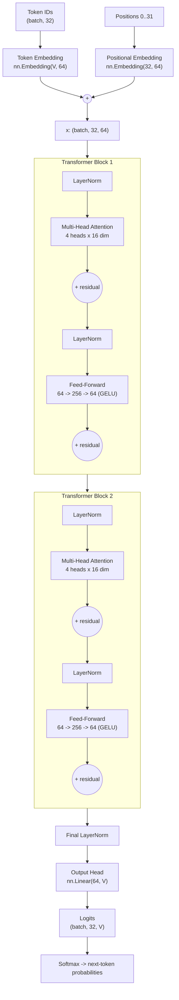
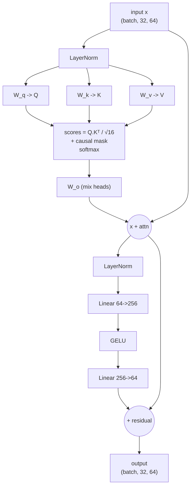

# MiniGPT — Neural Network Architecture & Neuron Count

This document explains **exactly** what neural network is inside MiniGPT, how many
neurons and parameters it has, and how the layers connect together.

> **Verified numbers**: all counts below were printed directly from the running model
> (`model.named_parameters()`), not estimated.

---

## 1. Is this a neural network? Yes — a Transformer

MiniGPT is a **decoder-only Transformer neural network** (same family as GPT-2/3/4).
It is built from these neural-network layer types:

| Layer type | Used for | PyTorch class |
|------------|----------|---------------|
| Embedding (lookup table) | Turn token IDs & positions into vectors | `nn.Embedding` |
| Linear (fully-connected / "dense") | Q,K,V,O projections, feed-forward, output head | `nn.Linear` |
| LayerNorm | Stabilize activations | `nn.LayerNorm` |
| GELU | Non-linear activation | `nn.GELU` |
| Softmax | Attention weights + output probabilities | `F.softmax` |

There are **no convolutions and no RNNs** — attention replaces them.

---

## 2. Configuration (the model you trained)

| Hyperparameter | Symbol | Value |
|----------------|--------|-------|
| Vocabulary size | V | 120 (max) / 71 (learned from the song) |
| Embedding size | E | 64 |
| Attention heads | H | 4 |
| Head dimension | E/H | 16 |
| Transformer layers (blocks) | L | 2 |
| Sequence length (context) | T | 32 |
| Feed-forward hidden size | F | 256 |

---

## 3. How many NEURONS?

In deep learning, a **neuron** = one output unit of a layer (it produces one activation
number, computed as `activation(weights · inputs + bias)`).

Below is the neuron count **per token position** (each of the 32 positions runs the same
neurons in parallel).

### 3a. Neurons per single Transformer block

| Sub-layer | Neurons (output units) |
|-----------|------------------------|
| Query projection `W_q` | 64 |
| Key projection `W_k` | 64 |
| Value projection `W_v` | 64 |
| Output projection `W_o` | 64 |
| **Feed-forward hidden layer** (the classic "neurons") | **256** |
| Feed-forward output layer | 64 |
| **Block total** | **576** |

*(LayerNorm re-scales existing values, so it adds no new neurons.)*

### 3b. Whole-model neuron count (per token position)

| Stage | Neurons |
|-------|---------|
| Token + positional embedding | 64 |
| Transformer block 1 | 576 |
| Transformer block 2 | 576 |
| Output head (→ vocabulary) | 120 |
| **Total per token position** | **1,336** |

### 3c. Total activations for one forward pass

Because all `T = 32` positions are processed together:

```
1,336 neurons/position  ×  32 positions  =  42,752 neuron activations per forward pass
```

**Headline numbers:**
- **1,336 neurons** per token position
- **512 "hidden" feed-forward neurons** total (256 × 2 blocks) — these are the classic dense neurons
- **42,752 activations** produced in a single forward pass over a full 32-token window

---

## 4. How many PARAMETERS (learnable weights)?

Parameters are the numbers that actually get **learned** during training
(weights + biases). This is different from neurons.

### 4a. Exact breakdown (printed from the model, V = 71)

| Component | Shape | Parameters |
|-----------|-------|-----------:|
| Token embedding | (71, 64) | 4,544 |
| Positional embedding | (32, 64) | 2,048 |
| **Block 0** — LayerNorm1 (w+b) | (64)+(64) | 128 |
| **Block 0** — Attention W_q | (64, 64) | 4,096 |
| **Block 0** — Attention W_k | (64, 64) | 4,096 |
| **Block 0** — Attention W_v | (64, 64) | 4,096 |
| **Block 0** — Attention W_o | (64, 64) | 4,096 |
| **Block 0** — LayerNorm2 (w+b) | (64)+(64) | 128 |
| **Block 0** — FF layer 1 (w+b) | (256,64)+(256) | 16,640 |
| **Block 0** — FF layer 2 (w+b) | (64,256)+(64) | 16,448 |
| **Block 1** (identical to Block 0) | — | 49,728 |
| Final LayerNorm (w+b) | (64)+(64) | 128 |
| Output head | (71, 64) | 4,544 |
| **TOTAL (V = 71)** | | **110,720** |

*(Each transformer block = **49,728** parameters. Two blocks = 99,456.)*

### 4b. Totals for both vocab settings

| Vocabulary | Total trainable parameters |
|------------|---------------------------:|
| V = 71 (learned from the song) | **110,720** |
| V = 120 (the max cap) | **116,992** |

> Difference is only in the token-embedding and output-head tables:
> extra `(120-71) × 64 × 2 = 6,272` parameters.

---

## 5. Architecture diagram (layer graph)



---

## 6. Inside ONE Transformer block (detailed)



---

## 7. Multi-head attention (why 4 heads?)

The 64-dim vector is split into **4 heads of 16 dims each**. Each head learns to focus
on different relationships in the lyrics:

```
Embedding (64) ──split──> Head1(16) Head2(16) Head3(16) Head4(16)
                              │        │        │        │
                          attention attention attention attention   (run in parallel)
                              │        │        │        │
                           concat back to 64 ──> W_o ──> output(64)
```

| Head | Might learn to track... |
|------|-------------------------|
| 1 | Repeated words ("twinkle twinkle") |
| 2 | Rhyme pairs ("star" ↔ "are") |
| 3 | Line / phrase boundaries |
| 4 | Long-range context |

*(The actual roles are learned automatically — this is just intuition.)*

---

## 8. Causal masking (why the model can't cheat)

During training the model sees a whole 32-token window at once, but each position must
predict the **next** token using **only past tokens**. The causal mask enforces this:

```
        can attend to →   t0   t1   t2   t3
   token t0 (predict t1)   ✓    ✗    ✗    ✗
   token t1 (predict t2)   ✓    ✓    ✗    ✗
   token t2 (predict t3)   ✓    ✓    ✓    ✗
   token t3 (predict t4)   ✓    ✓    ✓    ✓
```

Blocked cells are set to `-inf` before softmax, so their attention weight becomes 0.

---

## 9. Parameter distribution (where the weights live)

```
Feed-forward networks ......... 66,176   (59.8%)   ← largest part
Attention (Q,K,V,O) ........... 32,768   (29.6%)
Token embedding ...............  4,544    (4.1%)
Output head ...................  4,544    (4.1%)
Positional embedding ..........  2,048    (1.8%)
LayerNorms ....................    640    (0.6%)
                                -------
TOTAL ......................... 110,720  (V = 71)
```

**Takeaway:** most of the "knowledge" capacity lives in the **feed-forward layers**,
while attention handles **routing information between tokens**.

---

## 10. Comparison to real GPT models

| Feature | MiniGPT | GPT-2 Small | GPT-3 |
|---------|--------:|------------:|------:|
| Parameters | ~110 K | 124 M | 175 B |
| Layers (blocks) | 2 | 12 | 96 |
| Embedding dim | 64 | 768 | 12,288 |
| Heads | 4 | 12 | 96 |
| FF hidden | 256 | 3,072 | 49,152 |
| Context length | 32 | 1,024 | 2,048 |

MiniGPT runs the **exact same math**, just small enough to read every number.
