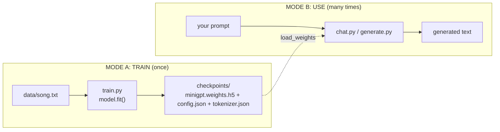
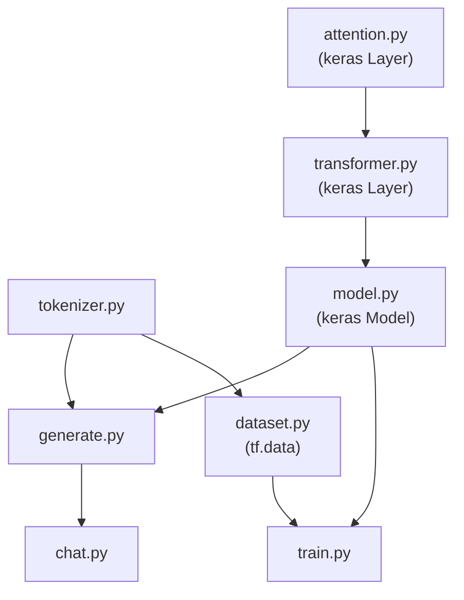
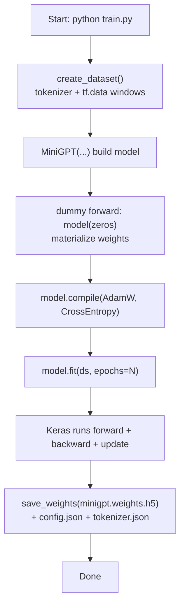
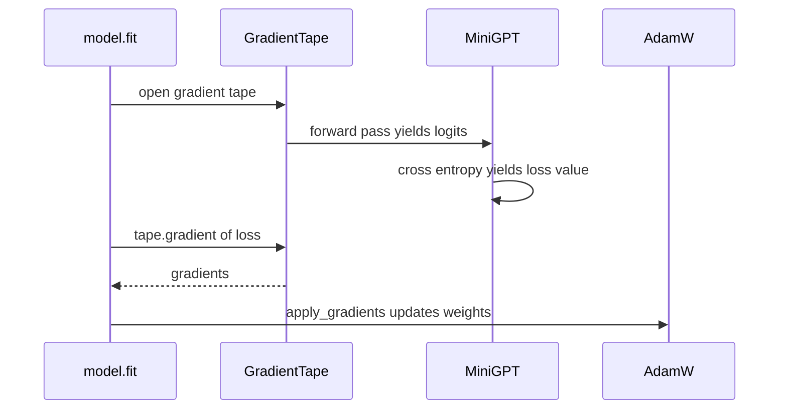
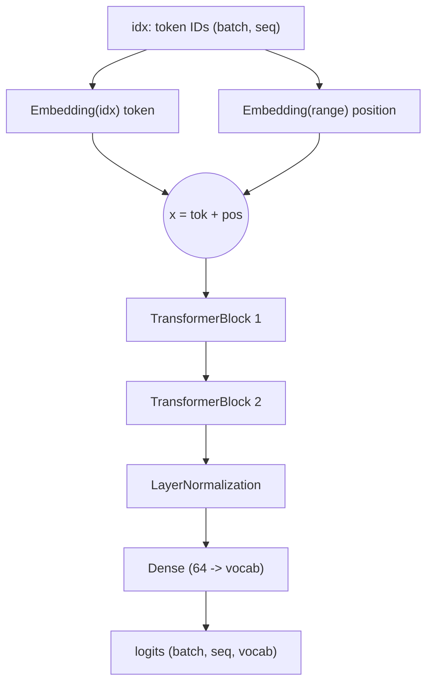
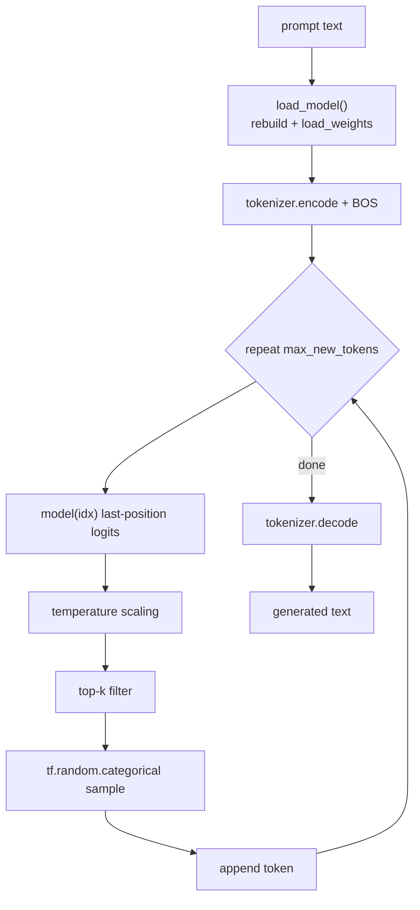
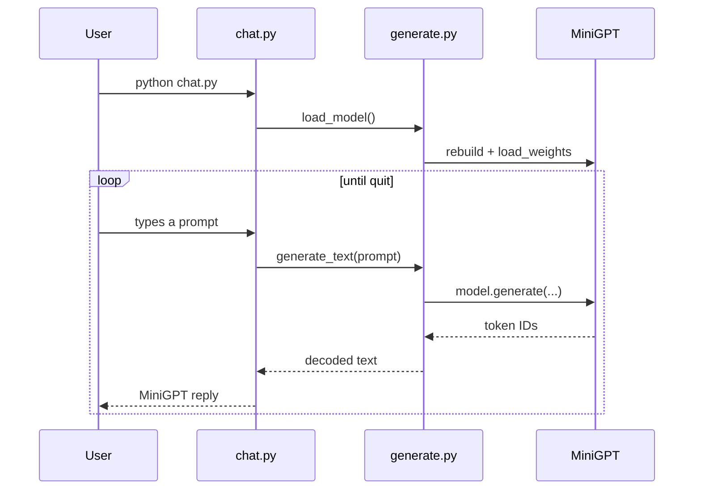

# MiniGPT (TensorFlow) — Flow & Call Diagrams

How the TensorFlow/Keras code runs: training with `model.fit()`, the `tf.data` pipeline,
generation, and chat. Mermaid diagrams render in Cursor/GitHub preview.

---

## 1. Big picture — two modes

---

## 2. File dependency graph

---

## 3. TRAINING flow (`python train.py`)

### What `model.fit()` does internally per step

> In PyTorch you write this loop by hand (`zero_grad` / `backward` / `step`).
> Keras `fit()` does it for you using a `GradientTape` under the hood.

---

## 4. FORWARD PASS flow (`model(idx)`)

---

## 5. GENERATION flow

---

## 6. CHAT call flow

---

## 7. Data shapes at each stage

| Stage | Example | Shape |
|-------|---------|-------|
| Raw text | `"twinkle little star"` | string |
| After `encode()` | `[2, 4, 9, 12]` | list[int] |
| Batched tensor | `[[2, 4, 9, 12]]` | (1, 4) int32 |
| After embeddings | vectors | (1, 4, 64) |
| After 2 blocks | vectors | (1, 4, 64) |
| After Dense head | logits | (1, 4, V) |
| After categorical sample | next token id | (1, 1) |
| After `decode()` | `"how"` | string |
