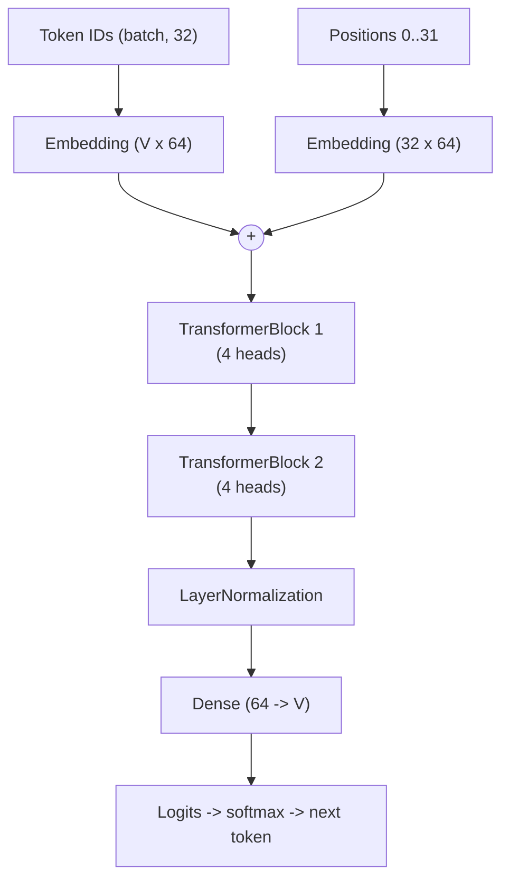
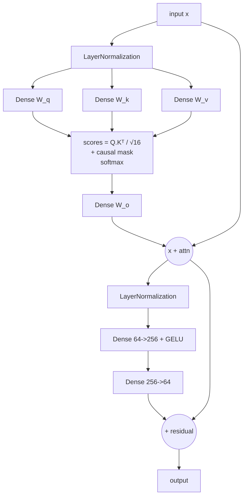

# MiniGPT (TensorFlow) — Neural Network Architecture & Neuron Count

This is the TensorFlow/Keras twin of the PyTorch `NEURAL_NETWORK.md`.
The architecture and all counts are **identical** — only the layer class names differ
(Keras `Dense`/`Embedding`/`LayerNormalization`).

> **Verified numbers**: printed directly from the running Keras model
> (`model.weights` / `model.count_params()`), not estimated.

---

## 1. It's a decoder-only Transformer (built with Keras)

| Layer type | Keras class | PyTorch equivalent |
|------------|-------------|--------------------|
| Embedding | `tf.keras.layers.Embedding` | `nn.Embedding` |
| Fully-connected | `tf.keras.layers.Dense` | `nn.Linear` |
| Normalization | `tf.keras.layers.LayerNormalization` | `nn.LayerNorm` |
| Activation | `activation="gelu"` | `nn.GELU` |
| Softmax | `tf.nn.softmax` | `F.softmax` |

---

## 2. Configuration

| Hyperparameter | Symbol | Value |
|----------------|--------|-------|
| Vocabulary size | V | 120 (max) / 71 (learned) |
| Embedding size | E | 64 |
| Attention heads | H | 4 |
| Head dimension | E/H | 16 |
| Transformer layers | L | 2 |
| Sequence length | T | 32 |
| Feed-forward hidden | F | 256 |

---

## 3. How many NEURONS?

A **neuron** = one output unit of a layer (produces one activation).
Counts below are **per token position** (all 32 positions run in parallel).

### 3a. Neurons per transformer block

| Sub-layer | Neurons |
|-----------|--------:|
| Query projection (`Dense`) | 64 |
| Key projection (`Dense`) | 64 |
| Value projection (`Dense`) | 64 |
| Output projection (`Dense`) | 64 |
| **Feed-forward hidden** (`Dense`, GELU) | **256** |
| Feed-forward output (`Dense`) | 64 |
| **Block total** | **576** |

### 3b. Whole-model neurons (per token position)

| Stage | Neurons |
|-------|--------:|
| Token + positional embedding | 64 |
| Transformer block 1 | 576 |
| Transformer block 2 | 576 |
| Output head (→ vocab) | 120 |
| **Total per token position** | **1,336** |

### 3c. Total activations per forward pass

```
1,336 neurons/position  ×  32 positions  =  42,752 activations per forward pass
```

**Headline numbers (identical to PyTorch):**
- **1,336 neurons** per token position
- **512 feed-forward hidden neurons** total (256 × 2 blocks)
- **42,752 activations** per forward pass over a 32-token window

---

## 4. How many PARAMETERS?

### 4a. Exact breakdown (printed from the Keras model, V = 71)

| Component | Keras weight | Shape | Parameters |
|-----------|--------------|-------|-----------:|
| Token embedding | `embeddings` | (71, 64) | 4,544 |
| Positional embedding | `embeddings` | (32, 64) | 2,048 |
| Block 0 — LayerNorm1 | `gamma`+`beta` | (64)+(64) | 128 |
| Block 0 — Attention W_q | `kernel` | (64, 64) | 4,096 |
| Block 0 — Attention W_k | `kernel` | (64, 64) | 4,096 |
| Block 0 — Attention W_v | `kernel` | (64, 64) | 4,096 |
| Block 0 — Attention W_o | `kernel` | (64, 64) | 4,096 |
| Block 0 — LayerNorm2 | `gamma`+`beta` | (64)+(64) | 128 |
| Block 0 — FF layer 1 | `kernel`+`bias` | (64,256)+(256) | 16,640 |
| Block 0 — FF layer 2 | `kernel`+`bias` | (256,64)+(64) | 16,448 |
| Block 1 (identical) | — | — | 49,728 |
| Final LayerNorm | `gamma`+`beta` | (64)+(64) | 128 |
| Output head | `kernel` | (64, 71) | 4,544 |
| **TOTAL (V = 71)** | | | **110,720** |

*(Each transformer block = **49,728** parameters. Two blocks = 99,456.)*

> **Note on Dense weight shape:** Keras `Dense` stores its weight (`kernel`) as
> `(in_features, out_features)`, whereas PyTorch `nn.Linear` stores `(out, in)`.
> Same number of parameters, transposed layout.

### 4b. Totals

| Vocabulary | Total parameters |
|------------|-----------------:|
| V = 71 (learned) | **110,720** |
| V = 120 (cap) | **116,992** |

---

## 5. Architecture diagram



## 6. Inside one block



---

## 7. Parameter distribution

```
Feed-forward networks ......... 66,176   (59.8%)
Attention (Q,K,V,O) ........... 32,768   (29.6%)
Token embedding ...............  4,544    (4.1%)
Output head ...................  4,544    (4.1%)
Positional embedding ..........  2,048    (1.8%)
LayerNorms ....................    640    (0.6%)
                                -------
TOTAL ......................... 110,720  (V = 71)
```

Identical distribution to the PyTorch version — the framework does not change the math.
